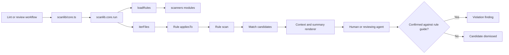
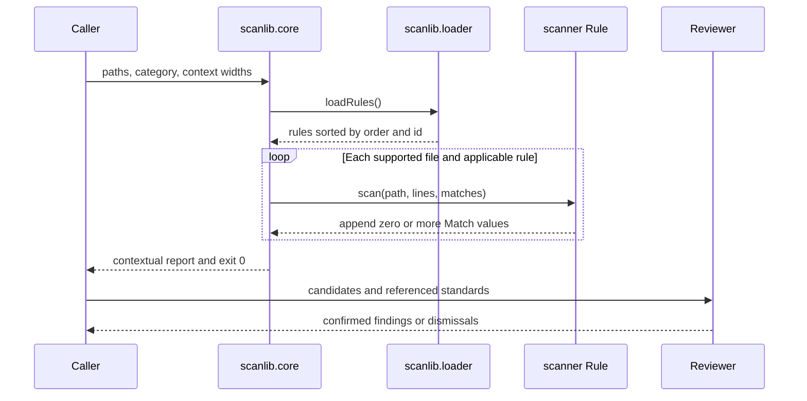

# Marketplace architecture

The marketplace shares a native harness contract across Claude Code, Codex, and Grok Build; OpenCode V1 consumes a generated adapter projection. The coding plugin also provides an advisory review scanner.

## Native harness resolution

[`scripts/harness_contract.ts`](scripts/harness_contract.ts) owns root-variable precedence; hook commands and Essential's [`resolve_harness`](plugins/essential/hooks/scripts/context.sh) derive their order from it. Native Codex and Grok variables precede the Claude compatibility alias.

Shell fallback expansion selects the first nonempty variable, not the first distinct path. Codex can set both `PLUGIN_ROOT` and `CLAUDE_PLUGIN_ROOT` to the same directory. Either order then locates the plugin, but a resolver that checks Claude first labels the session `claude`. The Codex-only [`validate-plan-stop`](plugins/essential/hooks/scripts/validate-plan-stop) consequently exits 0 before validation, producing no corrective feedback. Grok's compatibility alias can similarly select the wrong feedback envelope.

A path-only reorder does not repair harness identification. Keep the canonical contract, identity resolver, and derived consumers aligned. Regression coverage must exercise native-only environments and native variables alongside Claude aliases, asserting harness identity and emitted feedback—not just the resolved directory. Existing executable coverage lives in [native hook contracts](plugins/essential/hooks/pretooluse_hook_contracts.spec.ts) and [Codex Stop contracts](plugins/essential/hooks/scripts/validate-plan-stop.spec.ts).

OpenCode V1 remains an adapter, not another native fallback. Its projected hook-child environment is isolated from native harness identity; support limits belong in [COMPATIBILITY.md](COMPATIBILITY.md).

## Advisory scanner

The coding plugin ships an advisory scanner that finds mechanically recognizable review candidates before semantic lint or code review. It never decides that code violates a standard: candidate counts do not affect the status of a completed scan, and a human or reviewing agent must confirm each candidate against the referenced rule guide.

### Components

```text
plugins/coding/scripts/
├── scanlib                      # discovery, file selection, execution, and rendering
│   ├── core.ts                  # command-line entry point, contract, and scan pipeline
│   ├── jsdoc.ts                 # shared JSDoc token and prose extraction
│   ├── loader.ts                # automatic RULE and RULES module discovery
│   ├── predicates.ts            # reusable file applicability gates
│   ├── prefixes.ts              # live standard rule-prefix discovery
│   └── rule.ts                  # scanner extension interface
└── scanners                     # one independently loadable module per candidate rule
```

- **Engine and command-line entry point** (`plugins/coding/scripts/scanlib/core.ts`): parses arguments, walks supported source files, applies rules, and renders contextual matches plus a summary; run directly, it sets the process exit code from that status.
- **Loader** (`plugins/coding/scripts/scanlib/loader.ts`): imports every public module under `scanners` and isolates a broken module so one extension cannot disable the advisory pass.
- **Predicates** (`plugins/coding/scripts/scanlib/predicates.ts`): centralizes language, test, index, and suffix selection.
- **Rule modules** (`plugins/coding/scripts/scanners/*.ts`): recognize one mechanically detectable candidate shape and append `Match` values.
- **Test suite** (`plugins/coding/scripts/scanlib/core.spec.ts`): exercises rule behavior directly and uses golden fixtures where the rendered command-line interface is the behavior under test.

### Pipeline



Candidate generation and violation decisions are deliberately separate. A scanner may trade precision for recall when its label and rule guide make the review requirement explicit. For example, the `TST-CORE-10` scanner flags static file reads in test files because they often precede assertions over checked-in prose; reading a generated output file can be valid and must be dismissed after review.

### Invocation lifecycle



### Extension interfaces

Every scanner module exports `RULE` or `RULES`. The loader discovers modules automatically, so adding a scanner requires no dispatcher edit.

```typescript
export const RULE: Rule = {
  id: "stable-category-name",
  label: "Reviewer-facing candidate label",
  scan,
  order: 100,
  appliesTo: candidateFiles,
  ruleRefs: ["TST-CORE-10"],
};
```

The interfaces are:

| Interface | Contract |
|---|---|
| `Rule.id` | Unique stable command-line category |
| `Rule.label` | Heading that describes the candidate without prejudging it |
| `Rule.scan` | Callable receiving `path`, complete `lines`, and a mutable `matches` list |
| `Rule.order` | Deterministic report ordering; ties resolve by ID |
| `Rule.appliesTo` | Path predicate evaluated before the file is read for that rule |
| `Rule.honorNoTests` | Whether `--no-tests` suppresses the rule for spec files |
| `Rule.ruleRefs` | Traceability to standards; metadata only, never an engine verdict |
| `Match` | Immutable `path`, one-based `lineno`, and source `line` rendered with context |

`scan` functions must not edit files, execute project code, or raise findings. They append candidates only. The engine catches file-read errors, isolates module import failures, and returns zero after a completed scan regardless of its match count. Invalid arguments and other operational failures remain errors.

### Command-line contract

```text
bun run scanlib/core.ts [paths ...]
  [--category all|<rule-id>]
  [--before <lines>]
  [--after <lines>]
  [--no-tests]
```

Paths may name files or directories. The engine scans supported JavaScript, TypeScript, Python, and Rust suffixes while excluding generated, dependency, cache, coverage, and version-control directories. Output is grouped by rule, includes source context, and ends with match and file counts.

### Adding a scanner

1. Add one kebab-case TypeScript module under `plugins/coding/scripts/scanners` that exports a `Rule`.
2. Reuse or add a narrow predicate in `plugins/coding/scripts/scanlib/predicates.ts`.
3. Test candidates as structured `Match` values. Add a golden fixture only when changing the rendered command-line interface itself.
4. Reference the owning standard in `ruleRefs` and list the rule as scanner-backed in its `scan.md`.
5. Run the scanner spec, then the fixture-excluded repository suite — both with the Vitest command canonicalized in the Validation section of the root `AGENTS.md`.

Prefer a mechanical signal that is cheap to explain and verify. If recognizing the condition requires semantic interpretation, keep that decision in review rather than encoding a brittle verdict in the scanner.
