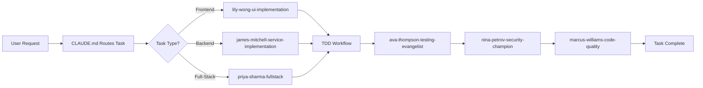

# 🤖 Claude Code Multi-Agent System

> A sophisticated AI-powered development system leveraging 30+ specialized agents working in parallel to deliver high-quality TypeScript applications with 100% test coverage and strict compliance gates.

## 🎯 Overview

This repository hosts an advanced multi-agent development system designed for enterprise-scale TypeScript monorepo development. The system combines:

- **30 specialized AI agents** with distinct expertise domains
- **Strict constitution-based workflows** ensuring quality and consistency
- **Parallel execution capabilities** for maximum development velocity
- **100% test coverage requirement** with TDD enforcement
- **Security-first design** with mandatory security reviews

## 🏗️ Architecture

### Agent Orchestration Layers

```
┌─────────────────────────────────────────────────┐
│         User Approval & High-Level Direction    │
└─────────────────────┬───────────────────────────┘
                      │
┌─────────────────────▼───────────────────────────┐
│    CLAUDE.md Gateway (Task Routing & Rules)     │
├─────────────────────┬───────────────────────────┤
│  Global Settings    │    Project Constitution   │
│  (~/.claude/)       │    (./.claude/)           │
└─────────────────────┼───────────────────────────┘
                      │
┌─────────────────────▼───────────────────────────┐
│        30 Specialized Agents (Parallel)         │
├─────────────────────────────────────────────────┤
│ • Frontend (React/Next.js)                      │
│ • Backend (Node/TypeScript)                     │
│ • Architecture & Design                         │
│ • Security & Quality                            │
│ • DevOps & Infrastructure                       │
└─────────────────────┬───────────────────────────┘
                      │
┌─────────────────────▼───────────────────────────┐
│    Constitution Workflows (Mandatory)            │
├─────────────────────────────────────────────────┤
│ • TDD Development    • Code Review              │
│ • Git Workflows      • Security Gates           │
│ • Quality Standards  • Documentation            │
└─────────────────────────────────────────────────┘
```

## 🤖 Agent Roster

### Development Teams

#### Frontend Excellence

- **`lily-wong-ui-implementation`** - React/Next.js UI implementation expert
- **`leo-yamamoto-ux-designer`** - UX/UI design and user research
- **`sophie-laurent-design-systems`** - Design systems and component libraries

#### Backend Engineering

- **`james-mitchell-service-implementation`** - Node.js/TypeScript services
- **`ethan-kumar-data-architect`** - Database design and optimization
- **`casey-murphy-integration-specialist`** - API integrations and webhooks

#### Full-Stack & Architecture

- **`priya-sharma-fullstack`** - Full-stack TypeScript development
- **`alex-chen-architect`** - System architecture and technical strategy
- **`jordan-lee-api-designer`** - RESTful and GraphQL API design

#### Quality & Security

- **`ava-thompson-testing-evangelist`** - TDD and test coverage champion
- **`nina-petrov-security-champion`** - Security reviews and threat modeling
- **`marcus-williams-code-quality`** - Code reviews and refactoring

#### Infrastructure & Operations

- **`felix-anderson-devops`** - CI/CD and automation
- **`luna-park-sre`** - Site reliability and monitoring
- **`isabella-costa-cloud-architect`** - Cloud infrastructure design

#### Innovation & Research

- **`phoenix-wright-innovation-catalyst`** - Innovation and rapid prototyping
- **`nova-chen-research-engineer`** - Technology evaluation
- **`oliver-singh-data-scientist`** - Machine learning and analytics

### [View All 30 Agents →](.claude/agents/)

## 📋 Constitution System

The constitution directory contains the single source of truth for all development practices:

### Directory Structure

```
constitutions/
├── workflows/      # HOW to do things (step-by-step)
│   ├── coding/
│   │   ├── prepare-coding.md
│   │   └── write-code-tdd.md
│   ├── frontend/
│   │   └── build-component.md
│   ├── backend/
│   │   ├── build-service.md
│   │   └── verify-auth-scope.md
│   └── quality/
│       ├── review-code.md
│       └── approve-pr.md
├── standards/      # WHAT the rules are
│   ├── typescript-standards.md
│   ├── react-patterns.md
│   └── api-design.md
├── patterns/       # Templates and examples
│   ├── component-template.tsx
│   └── service-template.ts
└── references/     # Quick lookup info
    ├── commit-examples.md
    └── tech-stack.md
```

## 🚀 Getting Started

### Prerequisites

- Node.js 22 LTS
- pnpm 9.x
- TypeScript ≥5.8
- Claude Code CLI

### Installation

```bash
# Clone the repository
git clone <repository-url>
cd <repository-name>

# Install dependencies
pnpm install

# Initialize constitution compliance
pnpm constitution:init
```

### Basic Usage

1. **Start with a high-level objective:**

   ```
   "Build a user authentication service with OAuth2 support"
   ```

2. **The system will:**
   - Route to appropriate agents automatically
   - Present a comprehensive plan for approval
   - Execute in parallel with multiple specialized agents
   - Enforce TDD with 100% test coverage
   - Perform security and quality reviews
   - Report completion with summary

3. **You approve major decisions only:**
   - Architectural choices
   - External dependencies
   - Security-critical implementations

## 🔄 Workflow Example



## 🛡️ Quality Gates

### Mandatory Compliance

- ✅ **TDD Required** - Tests before implementation
- ✅ **100% Coverage** - No untested code
- ✅ **TypeScript Strict** - No `any` types
- ✅ **Security Review** - All code reviewed for vulnerabilities
- ✅ **Constitution Compliance** - All workflows followed

### Automatic Enforcement

```typescript
// Before any code execution:
if (!workflowSelected) throw new Error("STOP: No workflow selected");
if (!constitutionCompliant) throw new Error("STOP: Constitution violation");
if (testCoverage < 100) throw new Error("STOP: Insufficient test coverage");
```

## 📊 Tech Stack

### Core Technologies

- **Language**: TypeScript ≥5.8 (ESM only)
- **Runtime**: Node.js 22 LTS
- **Package Manager**: pnpm workspaces
- **Testing**: Vitest with 100% coverage

### Frontend

- **Framework**: Next.js ≥15
- **UI Library**: React ≥19
- **Styling**: Tailwind CSS 4
- **State**: Zustand/TanStack Query

### Backend

- **Framework**: Express/Fastify
- **Database**: PostgreSQL with Prisma
- **Authentication**: Supabase Auth
- **Infrastructure**: Pulumi (IaC)

## 🤝 Contributing

### Development Process

1. **Plan** - Agents create comprehensive plan
2. **Approve** - User approves high-level approach
3. **Execute** - Agents work in parallel
4. **Review** - Quality and security gates
5. **Complete** - Summary and merge

### Agent Collaboration

Agents follow the collaboration framework defined in:

- [`.claude/agents/collaboration-framework.md`](.claude/agents/collaboration-framework.md)
- [`.claude/agents/escalation-paths.md`](.claude/agents/escalation-paths.md)

## 📚 Documentation

### Key Documents

- **[CLAUDE.md](./CLAUDE.md)** - Project constitution and rules
- **[Collaboration Framework](.claude/agents/collaboration-framework.md)** - How agents work together
- **[Constitution Workflows](constitutions/workflows/)** - Step-by-step processes
- **[Tech Standards](constitutions/standards/)** - Technical requirements

### Agent-Specific Docs

Each agent has detailed documentation in `.claude/agents/`:

- Capabilities and limitations
- Tool access and models
- Collaboration patterns
- Example interactions

## 🎯 Use Cases

### Optimal For:

- ✅ Large-scale TypeScript applications
- ✅ Microservices architecture
- ✅ Full-stack web applications
- ✅ High-quality, tested codebases
- ✅ Security-critical systems

### Not Recommended For:

- ❌ Quick prototypes (too much overhead)
- ❌ Non-TypeScript projects
- ❌ Projects without testing requirements
- ❌ Single-file scripts

## 📈 Performance Metrics

### System Capabilities

- **Parallel Agents**: Up to 10 concurrent
- **Code Quality**: 100% test coverage enforced
- **Security**: Mandatory security reviews
- **Compliance**: 100% constitution adherence
- **Velocity**: 3-5x faster than sequential development

## 🔒 Security

### Built-in Security Features

- Mandatory security reviews by `nina-petrov-security-champion`
- Threat modeling for all new features
- Secure coding standards enforcement
- Automated vulnerability scanning
- No secrets in code policy

## 📞 Support

### Getting Help

- **Issues**: Report at [GitHub Issues](https://github.com/anthropics/claude-code/issues)
- **Documentation**: Check constitution files first
- **Agent Help**: Ask any agent about their capabilities
- **Escalation**: Follow paths in collaboration framework

## 📄 License

This project is licensed under the terms specified in the LICENSE file.

---

<div align="center">
Built with 🤖 by 30+ specialized AI agents working in perfect harmony
</div>
