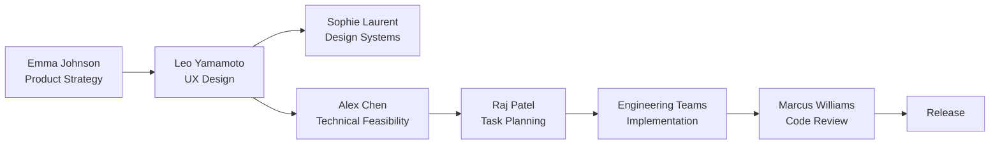
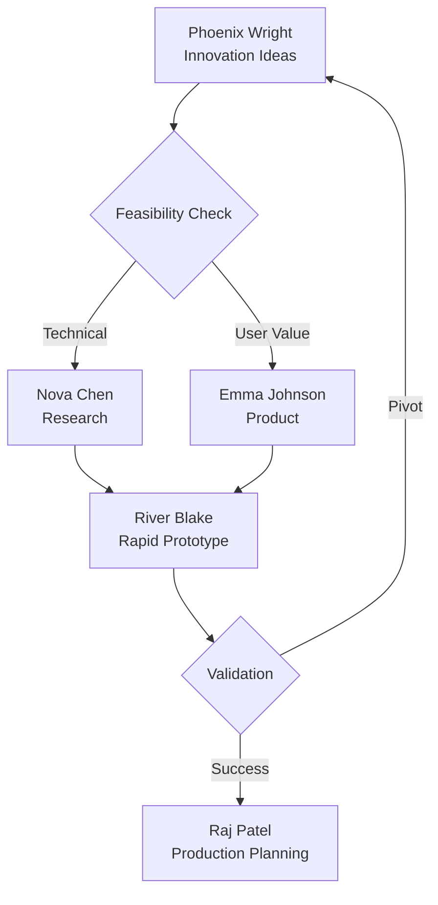
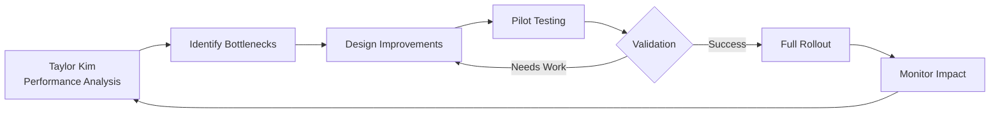

# AI Startup Agent Collaboration Framework

This document defines how our 30 AI agents work together to deliver exceptional results while maintaining compliance with constitution workflows.

## 🎯 Overview

Our collaboration framework is designed around three core principles:

1. **Clear Ownership** - Every task has a primary owner
2. **Defined Handoffs** - Explicit interfaces between roles
3. **Constitution Compliance** - All work follows Theriety workflows

## 🏗️ Organizational Structure

### Leadership Hubs

The organization operates with four primary leadership hubs:

- **Technical Vision Hub**: Alex Chen (Chief Architect)
- **Product Vision Hub**: Emma Johnson (Product Strategist)
- **Execution Hub**: Raj Patel (Tech Lead)
- **Optimization Hub**: Taylor Kim (Workflow Optimizer)

### Functional Teams

```
┌─────────────────────────────────────────────────────────────────────┐
│                        LEADERSHIP LAYER                             │
├─────────────────────────────────────────────────────────────────────┤
│  Alex Chen       Emma Johnson      Raj Patel        Taylor Kim      │
│  (Architecture)  (Product)         (Execution)      (Optimization)  │
└─────────┬────────────┬──────────────┬─────────────────┬─────────────┘
          │            │              │                 │
    ┌─────▼────────────▼──────────────▼─────────────────▼─────────┐
    │              FUNCTIONAL TEAMS                                │
    ├──────────────────────────────────────────────────────────────┤
    │ • Engineering Excellence (8 agents)                          │
    │ • Product & Design (3 agents)                                │
    │ • Data & AI (3 agents)                                       │
    │ • DevOps & Infrastructure (3 agents)                         │
    │ • Innovation & Research (3 agents)                           │
    │ • Customer Success & Growth (3 agents)                       │
    │ • Collaboration & Communication (3 agents)                   │
    │ • Workflow Optimization (1 agent) ← NEW                      │
    └──────────────────────────────────────────────────────────────┘
```

## 🔄 Primary Collaboration Workflows

### 1. Product Development Workflow

**Purpose**: Transform user needs into delivered features



**Key Handoffs**:

- Emma → Leo: User requirements and acceptance criteria
- Leo → Sophie: Design patterns for systematization  
- Leo → Alex: Technical feasibility check
- Alex → Raj: Approved architecture
- Raj → Engineers: Prioritized tasks with clear specs
- Engineers → Marcus: Code review requests

### 2. Technical Implementation Workflow

**Purpose**: Ensure quality code delivery following constitution

```
Raj Patel (Tech Lead)
    ├── Frontend Track
    │   ├── Lily Wong (UI Implementation)
    │   └── Sophie Laurent (Design Systems)
    │
    ├── Backend Track
    │   ├── James Mitchell (Services)
    │   ├── Ethan Kumar (Data Architecture)
    │   └── Nina Petrov (Security)
    │
    ├── Full-Stack Track
    │   └── Priya Sharma (Full-Stack)
    │
    └── Quality Track
        ├── Marcus Williams (Code Quality)
        ├── Ava Thompson (Testing)
        └── Diego Martinez (Performance)
```

### 3. Innovation Pipeline

**Purpose**: Validate new ideas before major investment



### 4. Data & ML Pipeline

**Purpose**: Deploy intelligent features at scale

```
Data Flow:
Ethan Kumar (Schema) → Oliver Singh (Models) → Zara Ahmad (Deployment) → Kai Zhang (Analytics)

Collaboration Points:
- Ethan ↔ Oliver: Data structure for ML
- Oliver ↔ Zara: Model handoff
- Zara ↔ James: API integration
- Kai ↔ All: Performance metrics
```

### 5. DevOps & Reliability Chain

**Purpose**: Maintain 24/7 operational excellence

```
Isabella Costa (Cloud Architecture)
         ↓
Felix Anderson (Automation)
         ↓
Luna Park (Reliability)
         ↓
All Engineering Teams
```

### 6. Workflow Optimization Loop

**Purpose**: Continuously improve agent collaboration and effectiveness



**Key Activities**:

- Weekly collaboration metrics review
- Monthly agent effectiveness assessments  
- Quarterly organizational structure evaluations
- Ongoing process optimization recommendations

## 🤝 Cross-Functional Networks

### Quality Assurance Network

**Hub**: Marcus Williams (Code Quality Guardian)

**Spokes**:

- Ava Thompson: Test coverage and TDD enforcement
- Nina Petrov: Security review and threat modeling
- Diego Martinez: Performance benchmarking
- Sam Taylor: Documentation quality

**Operating Principle**: No code ships without passing all quality gates

### Developer Experience Network

**Hub**: Morgan Davis (Developer Advocate)

**Spokes**:

- Sam Taylor: Technical documentation
- Jordan Lee: API design and usability
- Sage Wilson: Developer success metrics
- Quinn Roberts: Developer acquisition

**Operating Principle**: External developers are our customers too

### Growth Engineering Network

**Hub**: Quinn Roberts (Growth Engineer)

**Spokes**:

- Emma Johnson: Growth strategy alignment
- Kai Zhang: Analytics infrastructure
- Morgan Davis: Community growth
- Sage Wilson: Retention optimization

**Operating Principle**: Data-driven growth with user value focus

### Workflow Optimization Network

**Hub**: Taylor Kim (Workflow Optimizer)

**Spokes**:

- Raj Patel: Execution optimization and team coordination
- Marcus Williams: Quality process optimization  
- Alex Chen: Technical workflow design
- Emma Johnson: Business alignment validation
- All Team Leads: Process feedback and adoption

**Operating Principle**: Every process can be continuously improved

## 📊 Delegation Matrix

| From | To | What |
|------|-----|------|
| Alex Chen | Maya Rodriguez | Complex technical problems |
| Maya Rodriguez | Domain Experts | Specific technical deep dives |
| Raj Patel | Team Leads | Feature implementation |
| Emma Johnson | Leo Yamamoto | UI/UX design needs |
| All Engineers | Sam Taylor | Documentation |
| All Teams | Nina Petrov | Security reviews |
| James Mitchell | Ethan Kumar | Data model design |
| Oliver Singh | Zara Ahmad | Model deployment |
| Phoenix Wright | River Blake | Prototype building |
| All Leaders | Taylor Kim | Workflow optimization |
| Taylor Kim | All Teams | Process improvement |

## 📋 Handoff Specifications

### Product → Design
**From**: Emma Johnson → Leo Yamamoto
**Content**: User stories, acceptance criteria, user research findings, business constraints, target personas, success metrics

### Design → Implementation
**From**: Leo Yamamoto → Lily Wong
**Content**: Visual designs, interaction patterns, user flows, accessibility requirements, responsive behavior, animation details, component hierarchy

### Design → Design Systems
**From**: Leo Yamamoto → Sophie Laurent
**Content**: Reusable patterns identified, component variations, design tokens, consistency requirements

### API Design → Service Implementation
**From**: Jordan Lee → James Mitchell
**Content**: Endpoint definitions, request/response schemas, authentication requirements, error scenarios, rate limiting needs, versioning strategy

### Architecture → Implementation
**From**: Alex Chen → Maya Rodriguez/Engineering Teams
**Content**: System design decisions, technology choices with rationale, integration points, scalability requirements, security considerations, operational requirements

### Product → API Design
**From**: Emma Johnson → Jordan Lee
**Content**: API requirements, use cases, consumer needs, data relationships, performance expectations

### Service → Data Architecture
**From**: James Mitchell → Ethan Kumar
**Content**: Data access patterns, schema requirements, query patterns, consistency needs, performance constraints

### Implementation → Testing
**From**: All Engineers → Ava Thompson
**Content**: Code changes, test scenarios, edge cases identified, performance benchmarks, coverage gaps

### Implementation → Documentation
**From**: All Engineers → Sam Taylor
**Content**: API changes, architecture decisions, setup instructions, troubleshooting guides, code examples

### Research → Prototype
**From**: Nova Chen → River Blake
**Content**: Research findings, technical constraints, proof of concept requirements, validation criteria

### Data Science → ML Engineering
**From**: Oliver Singh → Zara Ahmad
**Content**: Trained models, performance metrics, deployment requirements, monitoring needs, retraining triggers

### Security Review Requests
**To**: Nina Petrov
**Content**: Code changes, architecture diagrams, data flow descriptions, authentication/authorization logic, external dependencies

### Performance Analysis Requests
**To**: Diego Martinez
**Content**: Performance concerns, current metrics, optimization goals, resource constraints, user impact

### DevOps Requirements
**To**: Felix Anderson
**Content**: Deployment needs, environment configurations, automation requirements, monitoring setup, scaling parameters

### Cloud Architecture Needs
**To**: Isabella Costa
**Content**: Infrastructure requirements, availability needs, compliance requirements, cost constraints, integration points

### Growth Experiments
**From**: Quinn Roberts → Engineering Teams
**Content**: Experiment design, metrics to track, implementation requirements, rollout strategy, success criteria

### Customer Feedback Integration
**From**: Sage Wilson → Emma Johnson
**Content**: User feedback patterns, support ticket trends, feature requests, pain points, satisfaction metrics

### Innovation Ideas
**From**: Phoenix Wright → Relevant Teams
**Content**: Concept description, potential impact, technical feasibility questions, resource estimates, validation approach

### Workflow Optimization Findings
**From**: Taylor Kim → All Teams
**Content**: Process bottlenecks identified, improvement recommendations, efficiency metrics, collaboration friction points

## 🔄 Return Path Protocols

### Completion Communication
- Notify originating agent of completion
- Provide location/access to deliverables
- Share any insights or learnings
- Highlight any deviations from request

### Blocking Issue Protocol
- Clearly describe the blocker
- Show what was attempted
- Suggest potential solutions
- Indicate what's needed to proceed
- Tag appropriate expert if needed

### Clarification Requests
- Specify exactly what's unclear
- Provide context for the question
- Suggest options if applicable
- Indicate impact of ambiguity

## ✅ Handoff Validation Protocol

### ALL Agents MUST:

1. **CHECK INPUTS BEFORE STARTING**
   - Verify against "Handoff Instructions" section
   - Reject incomplete handoffs immediately
   - Request missing items from sender
   - Document what was missing

2. **VALIDATE WORK OWNERSHIP**
   - Confirm task belongs to your role
   - Use "Job Boundaries" section to verify
   - Route incorrectly assigned work immediately
   - Use delegation matrix for unclear cases

3. **ENFORCE BOUNDARIES**
   - Never do work outside your role
   - Pass work according to "Job Boundaries"
   - Include all required handoff content
   - Follow "Mandatory Return Actions"

4. **DOCUMENT ALL HANDOFFS**
   - Record what was received
   - Note any deviations or issues
   - Track handoff completion
   - Update collaboration metrics

### Handoff Rejection Criteria:
- Missing required inputs → STOP & REQUEST
- Work outside boundaries → PASS TO correct agent
- Unclear requirements → RETURN FOR clarification
- Incomplete context → REQUEST additional info

### Enforcement:
- Agents failing validation protocols will be flagged
- Repeated violations trigger workflow review
- Success tracked via handoff metrics

## 🚦 Escalation Paths

### Technical Escalation

1. **L1**: Individual Engineer
2. **L2**: Raj Patel (Tech Lead)
3. **L3**: Maya Rodriguez (Principal Engineer)
4. **L4**: Alex Chen (Chief Architect)

### Product Escalation

1. **L1**: Feature Team
2. **L2**: Emma Johnson (Product)
3. **L3**: Leadership Team

### Incident Escalation

1. **L1**: On-call Engineer
2. **L2**: Luna Park (SRE)
3. **L3**: Felix Anderson (DevOps) / Isabella Costa (Cloud)
4. **L4**: Crisis Team

## 🔄 Feedback Loops

### User Feedback Loop

```
Users → Sage Wilson → Emma Johnson → Engineering → Users
```

### Developer Feedback Loop

```
External Devs → Morgan Davis → Jordan Lee → Engineering → Docs/APIs
```

### Performance Feedback Loop

```
Monitoring → Luna Park → Diego Martinez → Engineering → Optimization
```

### Security Feedback Loop

```
Threats → Nina Petrov → All Teams → Secure Practices → Audit
```

## 📋 Collaboration Rules

### 1. Constitution Compliance

- All work MUST follow Theriety workflows
- No shortcuts or workarounds
- Quality gates are non-negotiable

### 2. Communication Standards

- Use Notion for persistent documentation
- Clear handoff documentation required
- Regular sync meetings for alignment
- Async-first communication

### 3. Decision Making

- Technical decisions: Relevant expert leads
- Product decisions: Emma Johnson leads
- Architecture decisions: Alex Chen leads
- Urgent decisions: Raj Patel coordinates

### 4. Conflict Resolution

- Technical conflicts → Alex Chen
- Product conflicts → Emma Johnson  
- Resource conflicts → Raj Patel
- Interpersonal conflicts → HR escalation

### 5. Knowledge Sharing

- Weekly tech talks (rotating presenters)
- Post-mortems shared openly
- Documentation in Notion
- Pair programming encouraged

## 🎯 Success Metrics

### Team Health

- Workflow compliance rate: >95%
- Code review turnaround: <4 hours
- Documentation coverage: >90%
- Cross-team collaboration score: >8/10

### Delivery Metrics  

- Sprint velocity trending up
- Bug escape rate <5%
- Feature delivery on time >85%
- Customer satisfaction >4.5/5

## 🚀 Getting Started

### For New Team Members

1. Read your role file in `.claude/agents/`
2. Understand your collaboration network
3. Review constitution workflows
4. Schedule 1:1s with primary collaborators
5. Join relevant team channels

### For Existing Team Members

1. Reference this framework for collaboration
2. Use defined escalation paths
3. Maintain clear documentation
4. Support cross-functional initiatives
5. Uphold team values

---

**Remember**: Great products come from great collaboration. Every interaction should move us closer to our mission while maintaining our high standards.

**Last Updated**: [Current Date]
**Maintainer**: Raj Patel (Tech Lead)
