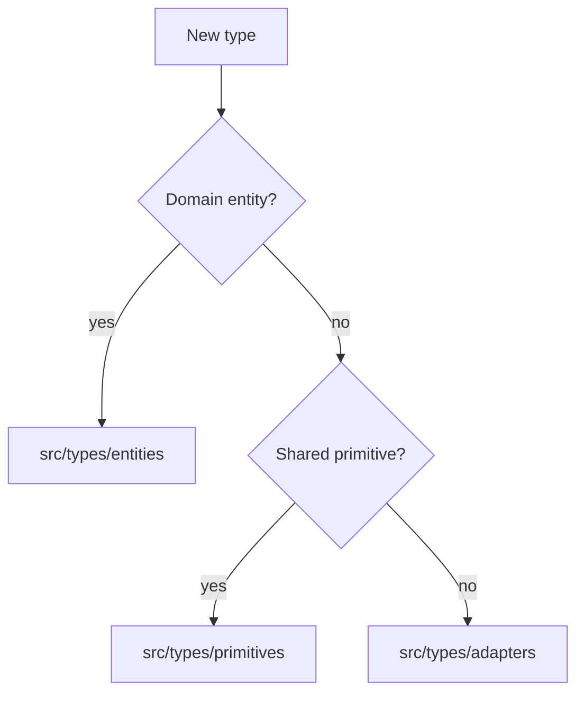
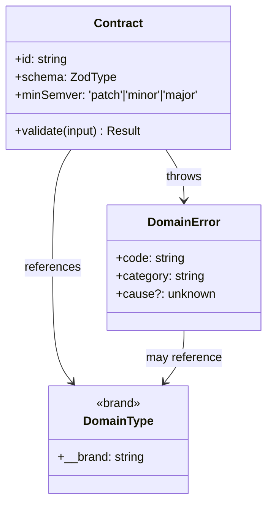

# @theriety/platform — ARCHITECTURE: core

<br/>

ARCHITECTURE = how it works. For usage/install, see the subsystem READMEs.

📌 **First paragraph:** The `core` subsystem is the contract floor of the `@theriety/platform` monorepo. It ships three packages — `core-types`, `core-errors`, `core-contracts` — that together define every shape that crosses a package boundary anywhere in the workspace. Core has zero runtime dependencies on its own: it is pure types, schemas, and discriminated error classes.

**Second paragraph:** See the [INDEX](./ARCHITECTURE.md) for monorepo-wide invariants and the other subsystem documents. Core is the only subsystem every other subsystem imports; changes here fan out through CI to every downstream package, which is why contract changes require a `minor` bump at minimum.

<br/>
<div align="center">

•&emsp;&emsp;💡 [Concepts](#-concepts)&emsp;&emsp;•&emsp;&emsp;🗂️ [Map](#-topology)&emsp;&emsp;•&emsp;&emsp;🧩 [Parts](#-components)&emsp;&emsp;•&emsp;&emsp;🔁 [Cycle](#-state--lifecycle)&emsp;&emsp;•&emsp;&emsp;🔌 [Extend](#-extension-points)&emsp;&emsp;•&emsp;&emsp;🛡️ [Rules](#-invariants)&emsp;&emsp;•

</div>
<br/>

---

## 💡 Concepts

| Concept | Role | Defined In |
| --- | --- | --- |
| `DomainType` | A branded TypeScript type describing a domain entity (User, Tenant, Job) | `packages/core/types/src/domain.ts` |
| `Contract` | A Zod schema paired with a semver marker that validates a wire payload | `packages/core/contracts/src/contract.ts` |
| `DomainError` | A discriminated error class with a stable `code` consumers can switch on | `packages/core/errors/src/domain-error.ts` |

---

## 🗂️ Topology

```plain
packages/core
├── types
│   ├── src
│   │   ├── domain.ts         # user, tenant, job, session
│   │   ├── brand.ts          # nominal typing helpers
│   │   ├── entities          # aggregate root types (one file per aggregate)
│   │   ├── primitives        # shared scalar/value-object types
│   │   ├── adapters          # types describing external-system shapes
│   │   └── index.ts          # barrel
│   └── package.json
├── errors
│   ├── src
│   │   ├── domain-error.ts  # base class
│   │   ├── taxonomy.ts      # error codes and categories
│   │   └── index.ts
│   └── package.json
└── contracts
    ├── src
    │   ├── contract.ts      # contract factory
    │   ├── schemas          # one file per domain aggregate
    │   └── index.ts
    └── package.json
```

---

## 🧩 Components

- **`DomainType` branding** (`packages/core/types/src/brand.ts`): nominal type helper that prevents string-typed ids from being confused across aggregates.
- **`DomainError` base** (`packages/core/errors/src/domain-error.ts`): superclass that every service and SDK catches on; carries `code`, `category`, and `cause`.
- **`Contract.of`** (`packages/core/contracts/src/contract.ts`): factory that wraps a Zod schema with the minimum semver marker, used by the import linter to detect unsafe changes.
- **Schema registry** (`packages/core/contracts/src/schemas`): one module per aggregate (user, tenant, job) that exports `requestSchema`, `responseSchema`, and `eventSchema`.

### Type Placement



---

## 🔁 State & Lifecycle

Contracts progress through a lifecycle that the release tool enforces before publish:



The class diagram captures the contract/error/type triangle — every wire payload is described by a `Contract`; every failure surfaces as a `DomainError`; both lean on branded `DomainType`s for identity.

---

## 🔌 Extension Points

- **New domain aggregate**: add a file under `packages/core/contracts/src/schemas`, export `requestSchema`/`responseSchema`, re-export from `index.ts`, and bump the contracts package minor.
- **New error code**: extend the `Category` union in `packages/core/errors/src/taxonomy.ts` and register a subclass of `DomainError`.
- **New branded id**: add a `Brand<'EntityId', string>` alias in `packages/core/types/src/brand.ts`.

---

## 🛡️ Invariants

| # | Rule | Why | Enforced By |
| --- | --- | --- | --- |
| 1 | Core never imports from `services` or `sdks` | Upward import would create a release cycle across tiers | `tools/lint-deps` |
| 2 | Every exported schema has a `minSemver` tag | Publish pipeline needs the tag to refuse unsafe version bumps | `Contract.of` runtime assert |
| 3 | Error codes are globally unique strings | Downstream consumers switch on `code` — collisions silently misroute | unit test `taxonomy.spec.ts` |

---

## 📦 Related Packages

- [`@theriety/core-types`](./packages/core/types): the branded domain types
- [`@theriety/core-errors`](./packages/core/errors): the error taxonomy
- [`@theriety/core-contracts`](./packages/core/contracts): the schema registry

---
