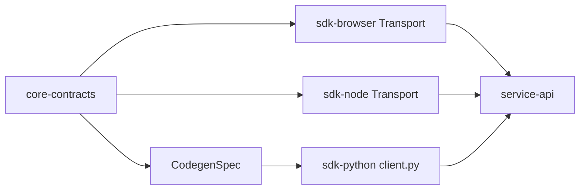
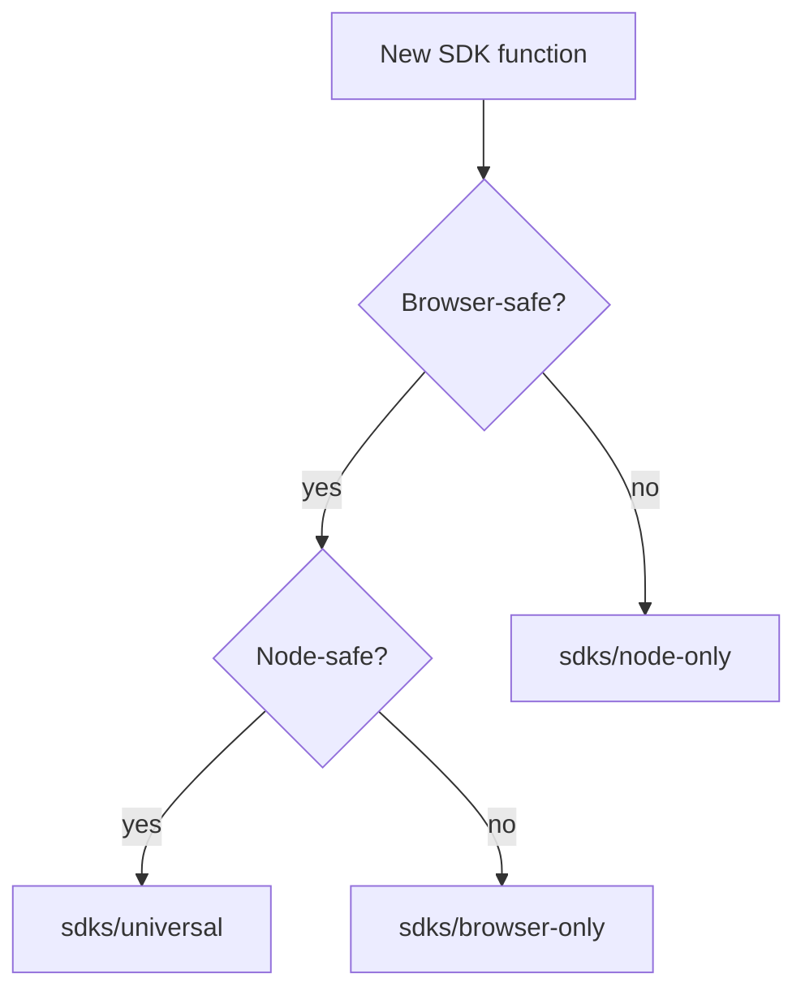

# @theriety/platform — ARCHITECTURE: sdks

<br/>

ARCHITECTURE = how it works. For usage/install, see the subsystem READMEs.

📌 **First paragraph:** The `sdks` subsystem packages the client-side access to `@theriety/platform` for three runtimes: `sdk-browser` (fetch-based, tree-shakeable), `sdk-node` (pooled HTTPS agent, retries), and `sdk-python` (codegen'd from `core-contracts`). All three SDKs speak the same contracts defined in `core`; only the transport differs.

**Second paragraph:** See the [INDEX](./ARCHITECTURE.md) for the monorepo-wide context and the sibling `core` and `services` architecture files. This document covers the transport abstraction, codegen pipeline, and per-runtime invariants.

<br/>
<div align="center">

•&emsp;&emsp;💡 [Concepts](#-concepts)&emsp;&emsp;•&emsp;&emsp;🗂️ [Map](#-topology)&emsp;&emsp;•&emsp;&emsp;🧩 [Parts](#-components)&emsp;&emsp;•&emsp;&emsp;🔄 [Flow](#-flow)&emsp;&emsp;•&emsp;&emsp;🔌 [Extend](#-extension-points)&emsp;&emsp;•&emsp;&emsp;🛡️ [Rules](#-invariants)&emsp;&emsp;•

</div>
<br/>

---

## 💡 Concepts

| Concept | Role | Defined In |
| --- | --- | --- |
| `Transport` | An interface that sends a contract-validated request and returns a contract-validated response | `packages/sdks/browser/src/transport.ts` |
| `ClientBuilder` | A fluent builder that binds a base URL, auth token, and transport to a client instance | `packages/sdks/node/src/builder.ts` |
| `CodegenSpec` | The JSON projection of `core-contracts` consumed by the Python codegen step | `tools/codegen/src/spec.ts` |

---

## 🗂️ Topology

```plain
packages/sdks
├── browser
│   └── src
│       ├── transport.ts     # fetch wrapper
│       ├── client.ts        # generated client surface
│       ├── auth.ts          # token refresh
│       └── index.ts         # barrel
├── node
│   └── src
│       ├── transport.ts     # undici pool wrapper
│       ├── client.ts        # generated client surface
│       ├── builder.ts       # ClientBuilder
│       └── index.ts
└── python
    ├── theriety             # codegen'd python package
    │   ├── __init__.py
    │   ├── client.py        # generated client
    │   └── transport.py     # requests wrapper
    └── pyproject.toml
```

---

## 🧩 Components

- **`Transport` (browser)** (`packages/sdks/browser/src/transport.ts`): thin wrapper over `fetch` that validates payloads against `core-contracts` on send and receive.
- **`Transport` (node)** (`packages/sdks/node/src/transport.ts`): pooled `undici` client with automatic retry on `DomainError` instances flagged `retryable`.
- **`ClientBuilder`** (`packages/sdks/node/src/builder.ts`): fluent API that produces a typed client bound to a transport.
- **Python codegen** (`tools/codegen/src/python.ts`): reads `CodegenSpec`, renders a Jinja template, and writes `packages/sdks/python/theriety/client.py`; run as a CI step on every contract change.

---

## 🔄 Flow



The flowchart shows that `core-contracts` is the single source of truth for every SDK. The TypeScript SDKs import it directly; the Python SDK consumes a codegen'd projection so it stays language-idiomatic without hand-written drift.

### Runtime Placement



---

## 🔌 Extension Points

- **New runtime**: add `packages/sdks/<runtime>` with a `Transport` implementation; register a codegen target in `tools/codegen` if the runtime is not TypeScript.
- **New auth scheme**: implement `AuthProvider` in `packages/sdks/browser/src/auth.ts` and register it on the `ClientBuilder`.
- **New operation**: operations are generated from `core-contracts`; adding a schema there regenerates the SDK surface.

---

## 🛡️ Invariants

| # | Rule | Why | Enforced By |
| --- | --- | --- | --- |
| 1 | No SDK imports from another SDK | Cross-SDK imports would couple runtimes and defeat tree-shaking | `tools/lint-deps` |
| 2 | Python SDK is never edited by hand | Hand edits drift from the contract; CI overwrites them on every run | codegen CI step |
| 3 | Every SDK exposes the same method names as `core-contracts` aggregates | Consumers expect parity across runtimes | codegen snapshot test |

---

## 📦 Related Packages

- [`@theriety/sdk-browser`](./packages/sdks/browser): the browser client
- [`@theriety/sdk-node`](./packages/sdks/node): the node client
- [`@theriety/sdk-python`](./packages/sdks/python): the codegen'd python client

---
