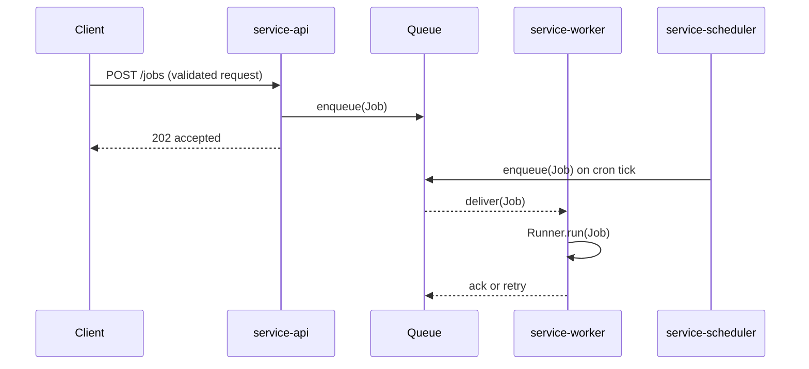
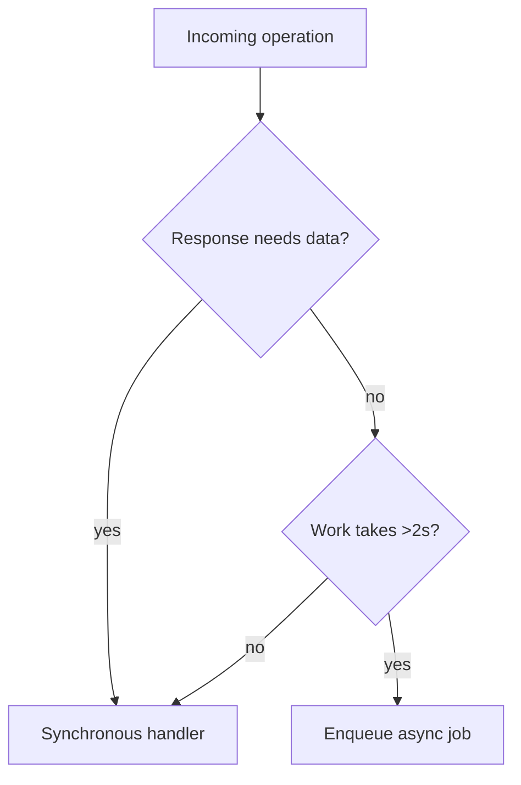

# @theriety/platform — ARCHITECTURE: services

<br/>

ARCHITECTURE = how it works. For usage/install, see the subsystem READMEs.

📌 **First paragraph:** The `services` subsystem hosts the long-running processes of `@theriety/platform`: `service-api` (REST + GraphQL gateway), `service-worker` (background job runner), and `service-scheduler` (cron and delayed dispatch). Every service depends on `core-contracts` for its wire format and on `core-errors` for its failure vocabulary; no service imports from another service's internals.

**Second paragraph:** See the [INDEX](./ARCHITECTURE.md) for cross-cutting patterns and the sibling `core` and `sdks` architecture files. This document dives into the services topology, inter-service call flow, and job lifecycle invariants.

<br/>
<div align="center">

•&emsp;&emsp;💡 [Concepts](#-concepts)&emsp;&emsp;•&emsp;&emsp;🗂️ [Map](#-topology)&emsp;&emsp;•&emsp;&emsp;🧩 [Parts](#-component-architecture)&emsp;&emsp;•&emsp;&emsp;🔄 [Flow](#-flow)&emsp;&emsp;•&emsp;&emsp;🔌 [Extend](#-extension-points)&emsp;&emsp;•&emsp;&emsp;🛡️ [Rules](#-invariants)&emsp;&emsp;•

</div>
<br/>

---

## 💡 Concepts

| Concept | Role | Defined In |
| --- | --- | --- |
| `Handler` | A function that validates a request against a `Contract`, invokes domain logic, and returns a validated response | `packages/services/api/src/handler.ts` |
| `Job` | An enqueued unit of work with `kind`, `payload`, and `attemptPolicy` | `packages/services/worker/src/job.ts` |
| `Schedule` | A cron or delay expression bound to a `kind` that the scheduler resolves into `Job`s | `packages/services/scheduler/src/schedule.ts` |
| `Queue` | Shared durable substrate (owned by `@platform/queue`) used for inter-service communication. Services never import each other; all cross-service dataflow passes through the queue | `packages/services/*/src/server.ts` (consumer) |

---

## 🗂️ Topology

```plain
packages/services
├── api
│   └── src
│       ├── handler.ts       # request pipeline
│       ├── routes           # one file per resource
│       ├── graphql          # resolvers
│       └── server.ts        # boot
├── worker
│   └── src
│       ├── job.ts           # Job type and policy
│       ├── runners          # one file per job kind
│       ├── dispatcher.ts    # queue consumer
│       └── server.ts        # boot
└── scheduler
    └── src
        ├── schedule.ts      # schedule type
        ├── resolver.ts      # cron → job generator
        └── server.ts        # boot
```

---

## 🧩 Component Architecture

- **`Handler`** (`packages/services/api/src/handler.ts`): wraps a resolver with contract validation on both request and response; the only entry point for HTTP traffic.
- **`Dispatcher`** (`packages/services/worker/src/dispatcher.ts`): long-poll consumer that reads jobs off the queue and dispatches to the correct `Runner`.
- **`Runner`** (`packages/services/worker/src/runners`): one per job kind; implements the domain-specific work and returns a success/failure verdict.
- **`Resolver`** (`packages/services/scheduler/src/resolver.ts`): walks active schedules, produces `Job` records, and enqueues them for the worker.

---

## 🔄 Flow



The queue is the only shared substrate between services. Each service is horizontally scalable and stateless; durability lives in the queue and in the domain database owned by each runner.

### Sync vs Async



---

## 🔌 Extension Points

- **New API route**: add a file under `packages/services/api/src/routes`, export `method`, `path`, `handler`; register in `server.ts`.
- **New job kind**: add a `Runner` under `packages/services/worker/src/runners`, declare its contract in `core-contracts`, and publish the kind constant.
- **New schedule**: insert a row into the `schedules` table with a `kind` that matches an existing runner; the scheduler picks it up on its next poll.

---

## 🛡️ Invariants

| # | Rule | Why | Enforced By |
| --- | --- | --- | --- |
| 1 | Every API request and response passes through `Contract.validate` | Untyped payloads silently corrupt the queue and downstream runners | `Handler` pipeline |
| 2 | A runner always returns within its `attemptPolicy.maxDurationMs` | Unbounded runners starve the queue and block other jobs | worker watchdog |
| 3 | Services never import from other services | Cross-service imports create hidden coupling and break independent deploys | `tools/lint-deps` |

---

## 📦 Related Packages

- [`@theriety/service-api`](./packages/services/api): the HTTP gateway
- [`@theriety/service-worker`](./packages/services/worker): the job runner
- [`@theriety/service-scheduler`](./packages/services/scheduler): the cron dispatcher

---
