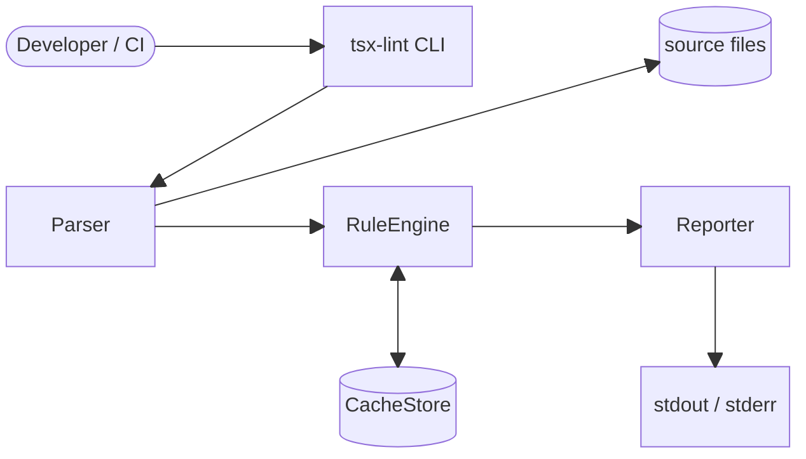
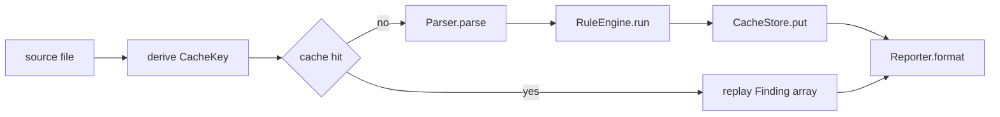
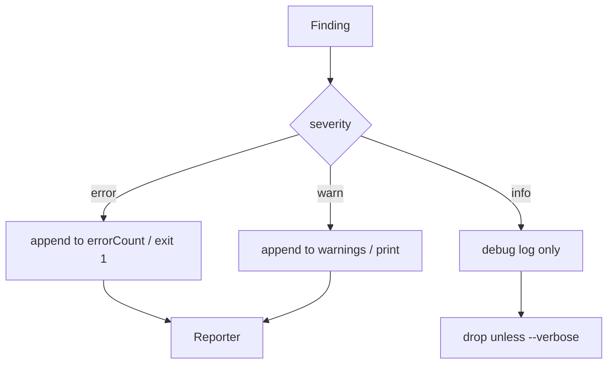
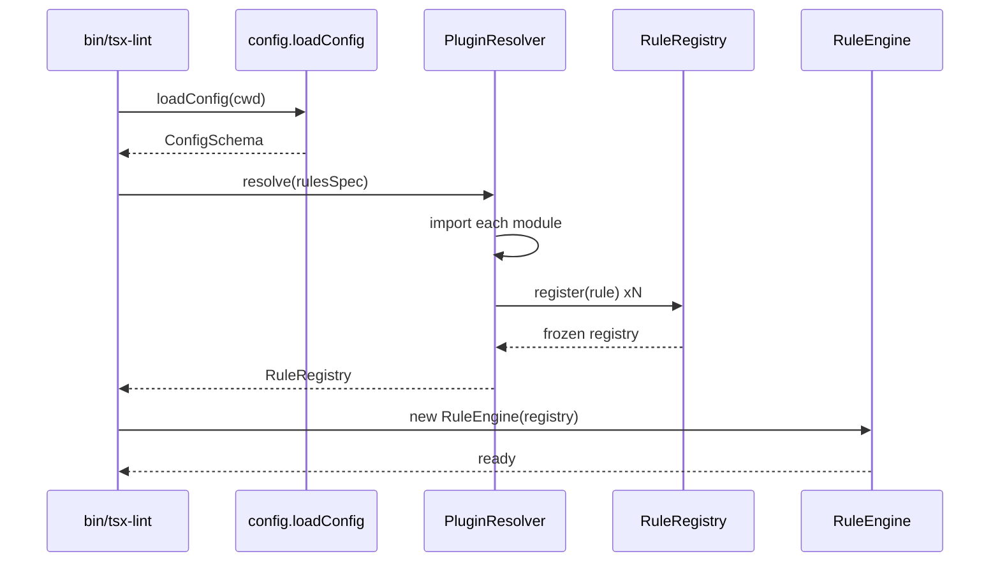

# @theriety/tsx-lint

<!-- ARCHITECTURE = how it works. For usage/install, see README.md. -->

<br/>

📌 **Architectural shape:** `@theriety/tsx-lint` is a **staged pipeline CLI** — `argv` is routed to one of three subcommand handlers, each of which drives a three-stage core loop (`Parse → RuleRun → Report`) around a content-addressed cache. The codebase splits into eight narrowly-scoped modules that fan out from a single `bin/tsx-lint.ts` entry.

**Why this shape:** linters are dominated by parse cost and rule-visit cost, so the pipeline is the only shape that lets us share a single AST across N rules without re-parsing. Isolating the rule registry, the reporter, and the cache store behind interfaces keeps the hot path under 400 LOC and makes the rule-author story (documented in the sibling `README.md`) independent of transport (CLI today, LSP later).

<br/>
<div align="center">

•&emsp;&emsp;💡 [Concepts](#-core-concepts)&emsp;&emsp;•&emsp;&emsp;🌐 [Context](#-system-context)&emsp;&emsp;•&emsp;&emsp;🗂️ [Parts](#-module-topology)&emsp;&emsp;•&emsp;&emsp;🔄 [Flow](#-data-flow)&emsp;&emsp;•&emsp;&emsp;🔁 [Cycle](#-state--lifecycle)&emsp;&emsp;•&emsp;&emsp;🔌 [Extend](#-extension-points)&emsp;&emsp;•

</div>
<br/>

---

## 💡 Core Concepts

The five concepts below are the entire vocabulary of the package. Every file reads as collaboration between these five roles.

| Concept | Role | Defined In |
| --- | --- | --- |
| `Rule` | pure visitor that walks an AST and emits `Finding`s; declares a `severity` and `fixable` flag | `src/rules/rule.ts` |
| `RuleEngine` | iterates the loaded rules over one parsed file and collects findings | `src/engine/rule-engine.ts` |
| `Finding` | frozen record of `{ ruleId, severity, message, range, fix? }` produced per rule violation | `src/engine/finding.ts` |
| `Reporter` | maps a `Finding[]` to stdout/stderr in pretty, json, or sarif form | `src/report/reporter.ts` |
| `CacheKey` | sha256 of `source + ruleSetHash + parserVersion`; gate for skipping work | `src/cache/cache-key.ts` |

---

## 🌐 System Context

The CLI is invoked by developers or CI runners, reads source files off the local filesystem, and writes findings to stdout/stderr. It does not open network sockets and has no persistent daemon. The only long-lived state is the on-disk cache under `TSX_LINT_CACHE_DIR`.



---

## 🗂️ Module Topology

```plain
src
├── bin       # argv entrypoint and subcommand router
├── cli       # subcommand handlers (lint, fix, init)
├── engine    # RuleEngine, Finding record, visitor driver
├── rules     # Rule interface and built-in rules
├── loader    # PluginResolver and RuleRegistry
├── report    # Reporter interface and pretty/json/sarif impls
├── cache     # CacheStore and CacheKey derivation
├── config    # config discovery and schema validation
└── index.ts  # programmatic barrel (lint, fix, init as async functions)
```

| Module | Path | Responsibility | Key Exports |
| --- | --- | --- | --- |
| `bin` | `src/bin/` | parse argv, route to a handler, set exit code | `main` |
| `cli` | `src/cli/` | orchestrate one subcommand end-to-end | `lintCommand`, `fixCommand`, `initCommand` |
| `engine` | `src/engine/` | run rules over one parsed file | `RuleEngine`, `Finding` |
| `rules` | `src/rules/` | define the rule contract and ship defaults | `Rule`, `defineRule` |
| `loader` | `src/loader/` | resolve plugin modules, freeze the registry | `PluginResolver`, `RuleRegistry` |
| `report` | `src/report/` | format findings for humans or tools | `Reporter`, `prettyReporter`, `jsonReporter`, `sarifReporter` |
| `cache` | `src/cache/` | skip re-work on unchanged inputs | `CacheStore`, `CacheKey` |
| `config` | `src/config/` | find and validate `tsx-lint.config.ts` | `loadConfig`, `ConfigSchema` |

---

## 🧩 Component Architecture

`RuleEngine` is the only stateful component on the hot path; `PluginResolver` is stateful but runs exactly once per process at startup. Everything downstream of `RuleEngine.run` is a pure transformation over `Finding[]`.

- **`Parser`** (`src/cli/parser-adapter.ts`): wraps `@theriety/tsx-parser` so the engine depends on an interface, not a concrete module; this is where error recovery for malformed input lives
- **`RuleEngine`** (`src/engine/rule-engine.ts`): iterates the frozen `RuleRegistry` over one AST, feeds each rule a shared `VisitorContext`, and concatenates their `Finding[]` outputs
- **`RuleLoader`** (`src/loader/plugin-resolver.ts`): resolves preset names and file paths to modules, validates each export against the `Rule` schema, and returns a frozen `RuleRegistry`
- **`Reporter`** (`src/report/reporter.ts`): formatter interface with three built-ins; `pretty` respects `NO_COLOR`, `json` streams one finding per line, `sarif` buffers to a single payload
- **`CacheStore`** (`src/cache/cache-store.ts`): read-through cache keyed by `CacheKey`; on hit returns the previous `Finding[]`, on miss records the engine output under the same key

---

## 🔄 Data Flow

A typical `lint` invocation walks each file through the pipeline independently. The flowchart below shows one file; the CLI parallelises across files but the per-file shape never changes.



Once findings exist, the engine routes them by `severity` before they reach the reporter. Fixable findings are additionally forwarded to the `fix` writer on the `fix` subcommand path.



---

## 🔁 State & Lifecycle

Plugin loading happens exactly once per process, before any file is parsed. The sequence below shows the startup path from CLI entry to a frozen `RuleRegistry` ready for the engine.



---

## 🧠 Design Patterns

| # | Pattern | Intent | Implemented In |
| --- | --- | --- | --- |
| 1 | Visitor | walk the TSX AST once per rule without coupling rules to node shapes | `src/rules/rule.ts` |
| 2 | Chain-of-Responsibility | route a `Finding` through severity handlers until one claims it | `src/engine/severity-router.ts` |
| 3 | Strategy | swap reporter output format without touching the engine | `src/report/reporter.ts` |
| 4 | Registry | resolve plugin modules once, freeze, then share across files | `src/loader/rule-registry.ts` |

---

## 🔌 Extension Points

Most external work happens as a custom `Rule` or a custom `Reporter`. Both surfaces are single-interface and bundle-free; there is no codegen step.

| Extension | Steps | Files Touched | Tests |
| --- | --- | --- | --- |
| Add a custom rule | 1. call `defineRule({ id, severity, visit })` in `rules/custom/<id>.ts`  2. export from the plugin entry  3. reference the plugin from `tsx-lint.config.ts` | `rules/custom/<id>.ts`, plugin entry | `spec/rules/<id>.spec.ts` |
| Add a custom reporter | 1. implement `Reporter.format(findings)` in `report/<name>.ts`  2. register it in `report/index.ts`  3. document the flag value in `README.md` | `report/<name>.ts`, `report/index.ts` | `spec/report/<name>.spec.ts` |

---

## 🛡️ Invariants & Contracts

| # | Rule | Why | Enforced By |
| --- | --- | --- | --- |
| 1 | the `RuleRegistry` is frozen before the first file is parsed | rules must not mutate across files, or cache keys lie | `Object.freeze` in `rule-registry.ts` + unit test |
| 2 | a `Rule.visit` function is pure w.r.t. its AST input | cache hits replay findings without re-running rules | type signature + lint rule in `rules/` banning module-level mutation |
| 3 | fix writes are atomic per file | a crash mid-run must not leave a file half-rewritten | temp-file + rename in `cli/fix-writer.ts` |
| 4 | `CacheKey` includes parser version | stale caches after a parser upgrade would report phantom findings | key derivation in `cache-key.ts` + integration test |
| 5 | exit code is `1` iff any `error`-severity finding was emitted | CI relies on this contract; warnings must never fail the build | final check in `bin/tsx-lint.ts` + CLI spec |

---

## 📦 Related Packages

- [`@theriety/tsx-parser`](../tsx-parser): the parser behind the `Parser` adapter; its AST node shapes are the contract for every `Rule.visit`
- [`@theriety/rules-recommended`](../rules-recommended): the default ruleset loaded by `--rules recommended`; a reference implementation of the plugin contract

---
