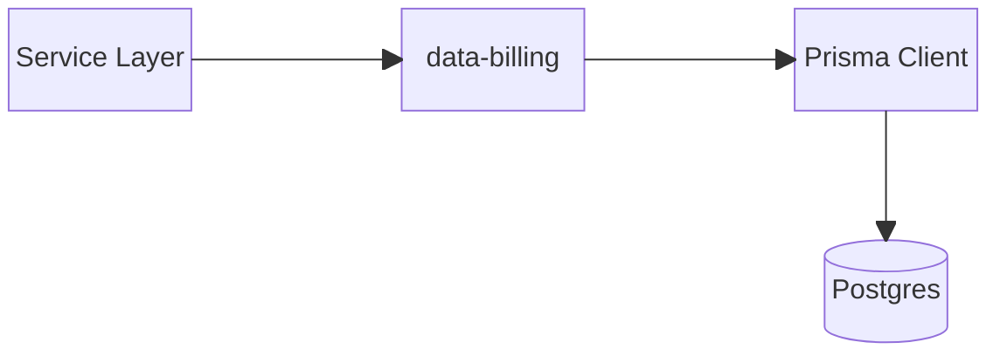
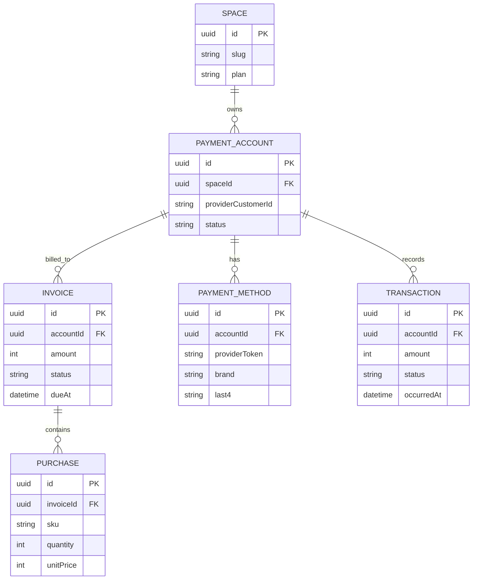
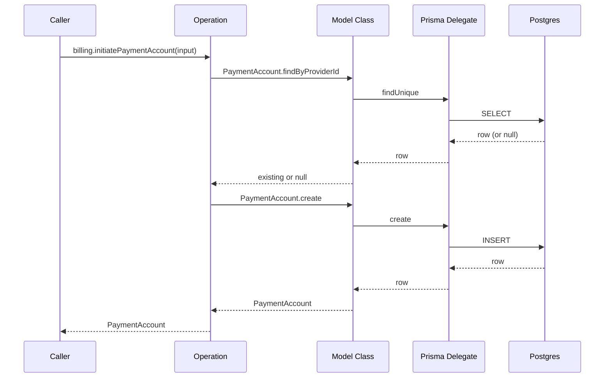
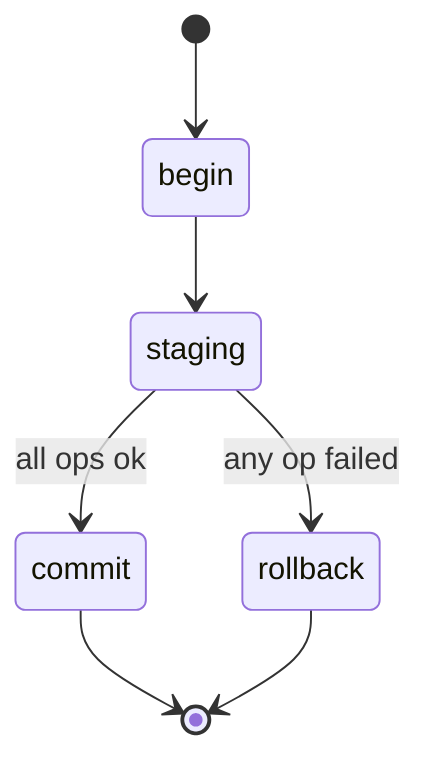
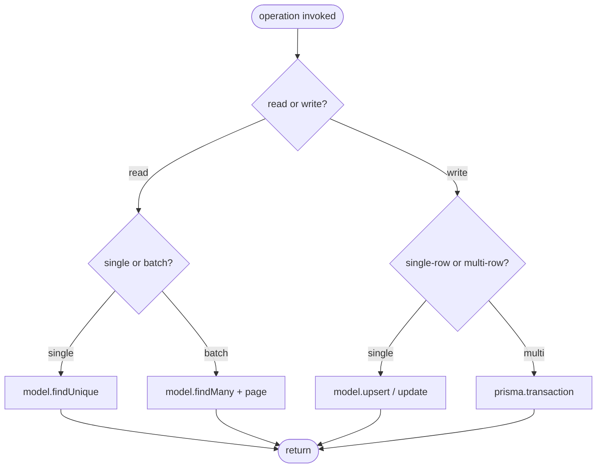

# @theriety/data-billing

> ARCHITECTURE = how it works. For usage, see README.md.

<br/>

📌 **Architectural shape:** `@theriety/data-billing` is a **Prisma-first, operation-per-file data controller**. The `prisma/schema.prisma` file is the source of truth for every entity and relation. Each Prisma delegate is wrapped by a repository-style model class under `src/prisma/models/<Entity>.ts`; each caller-visible verb is a single file under `src/operations/<verb-noun>.ts` that composes model calls inside a transaction when needed.

**Why this shape:** services routinely drift into reading a row in one place and writing a derived row elsewhere, producing hard-to-debug partial updates. Centralizing every entity behind a model class — and every verb behind a dedicated operation file — gives a single audit point for referential integrity and a single seam at which transactions are opened. There is no caching, no message bus, and no shadow schema; if the service wants billing data, it asks this package and the package asks Postgres.

<br/>
<div align="center">

•&emsp;&emsp;💡 [Concepts](#-core-concepts)&emsp;&emsp;•&emsp;&emsp;🌐 [Context](#-system-context)&emsp;&emsp;•&emsp;&emsp;🗃️ [Model](#-data-model)&emsp;&emsp;•&emsp;&emsp;🔄 [Flow](#-data-flow)&emsp;&emsp;•&emsp;&emsp;🔁 [Cycle](#-transaction-lifecycle)&emsp;&emsp;•&emsp;&emsp;🛡️ [Rules](#-invariants--contracts)&emsp;&emsp;•

</div>
<br/>

---

## 💡 Core Concepts

The six models below are the entire vocabulary of the controller. Every operation composes calls on these model classes; no operation touches a Prisma delegate directly.

| Concept | Role | Defined In |
| --- | --- | --- |
| `PaymentAccount` | customer's billing identity; the root entity for billing | `src/prisma/models/PaymentAccount.ts` |
| `Invoice` | a billable document; always owned by one account | `src/prisma/models/Invoice.ts` |
| `Purchase` | a line-item on an invoice; never orphan | `src/prisma/models/Purchase.ts` |
| `PaymentMethod` | tokenized card/bank attached to an account | `src/prisma/models/PaymentMethod.ts` |
| `Transaction` | ledger entry for a successful/failed charge | `src/prisma/models/Transaction.ts` |
| `Space` | tenant boundary; every account is scoped to exactly one space | `src/prisma/models/Space.ts` |

Operations are **repository + command**, exposed through a factory: `createBilling(config)` returns an instance whose methods are bound commands. The model classes are the repositories, and each `src/operations/<verb-noun>.ts` file is a command that composes one-to-many repository calls atomically.

---

## 🌐 System Context

The controller sits between the service layer and Postgres. Prisma is the only SDK it imports; there are no other stateful dependencies.



---

## 🗂️ Module Topology

```plain
src
├── prisma
│   ├── client.ts                # prisma client singleton
│   ├── index.ts                 # barrel
│   └── models                   # repository wrappers
│       ├── PaymentAccount.ts
│       ├── Invoice.ts
│       ├── Purchase.ts
│       ├── PaymentMethod.ts
│       └── Transaction.ts
├── operations
│   ├── initiate-payment-account.ts
│   ├── list-purchases.ts
│   ├── set-purchase.ts
│   ├── attach-payment-method.ts
│   └── detach-payment-method.ts
├── types
│   ├── account.ts
│   ├── invoice.ts
│   ├── payment.ts
│   └── purchase.ts
└── index.ts
```

| Module | Path | Responsibility | Key Exports |
| --- | --- | --- | --- |
| `prisma` | `src/prisma` | client singleton + repository-style model classes | `prisma`, `PaymentAccount`, `Invoice`, … |
| `operations` | `src/operations` | verb-noun operation files; bound as methods on the `createBilling()` instance | `initiatePaymentAccount`, `listPurchases`, … |
| `types` | `src/types` | pure domain types re-exported; no runtime | `AccountStatus`, `InvoiceStatus`, … |

---

## 🧩 Component Architecture

The three-layer split is deliberate: types carry no runtime, model classes carry persistence, operations carry composition. Nothing else.

- **Model Class** (`src/prisma/models/<Entity>.ts`): wraps `prisma.<delegate>` with domain-aware finders and guards; the only place a Prisma filter is authored
- **Operation Function** (`src/operations/<verb-noun>.ts`): orchestrates one-to-many model calls inside a transaction when needed; bound to the `createBilling()` instance and throws a domain-specific error on violation
- **Types Barrel** (`src/types`): pure domain types re-exported from the Prisma-generated types; consumed by services to avoid importing from `@prisma/client` directly

---

## 🗃️ Data Model

Five relations span six entities. The `Space` model is the tenant root; every other entity ultimately reaches back to a `Space` through its owning `PaymentAccount`.



---

## 🔄 Data Flow

The caller invokes an operation; the operation opens a transaction only when it composes multiple writes. Reads go straight through the model class.



---

## 🔁 Transaction Lifecycle

Multi-row writes run inside `prisma.$transaction`; a failure in any step rolls the whole transaction back.



---

## 🧭 Decision Tree

Every operation starts with a single decision: is this a read or a write? The rest of the tree follows from that.



---

## 🧠 Design Patterns

| # | Pattern | Intent | Implemented In |
| --- | --- | --- | --- |
| 1 | Repository | isolate Prisma calls behind a domain-aware model class so operations stay SQL-free | `src/prisma/models` |
| 2 | Command | each `src/operations/<verb-noun>.ts` is an atomic command; the file is the unit of review | `src/operations` |
| 3 | Unit of Work | `prisma.$transaction` as the uniform boundary for multi-row writes | every multi-write operation |

---

## 🔌 Extension Points

Adding an entity or a verb is a two-file change; the rest of the package discovers it automatically.

| Extension | Steps | Files Touched |
| --- | --- | --- |
| New entity | 1. add the model to `prisma/schema.prisma` 2. add a model class under `src/prisma/models/<Entity>.ts` 3. run `prisma migrate dev` | `prisma/schema.prisma`, `src/prisma/models/<Entity>.ts` |
| New operation | 1. add `src/operations/<verb-noun>.ts` 2. export from the operations barrel | `src/operations/<verb-noun>.ts`, `src/operations/index.ts` |

---

## 🛡️ Invariants & Contracts

| # | Rule | Why | Enforced By |
| --- | --- | --- | --- |
| 1 | referential integrity is enforced at the DB layer and mirrored in model-class guards | double-enforcement catches drift between the schema and the TypeScript types | foreign-key constraints + model-class assertions |
| 2 | multi-row writes always execute inside `prisma.$transaction` | partial writes leave the ledger in an unknown state | review rule + integration test that injects a failure mid-transaction |
| 3 | mutable models use optimistic locking via `updatedAt` / `version` | concurrent writers must not clobber each other silently | `update` calls include the version predicate; retries handled in service layer |

---

## 📦 Related Packages

- `@prisma/client`: generated client used by every model class
- [`@theriety/data-common`](../data-common): shared pagination and filter types consumed by every data controller

---
