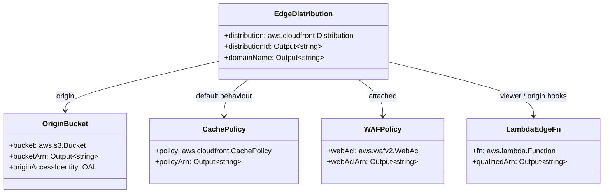
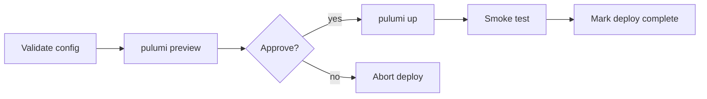
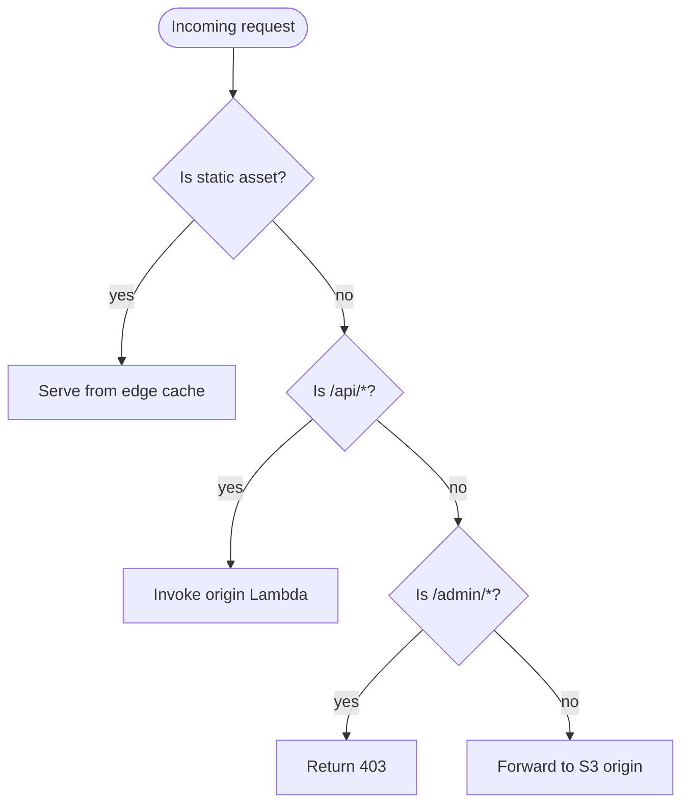
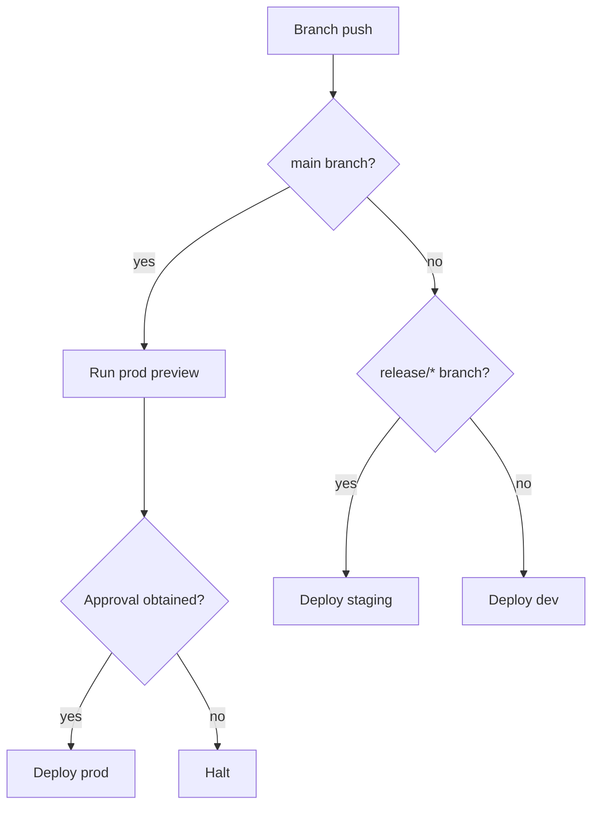
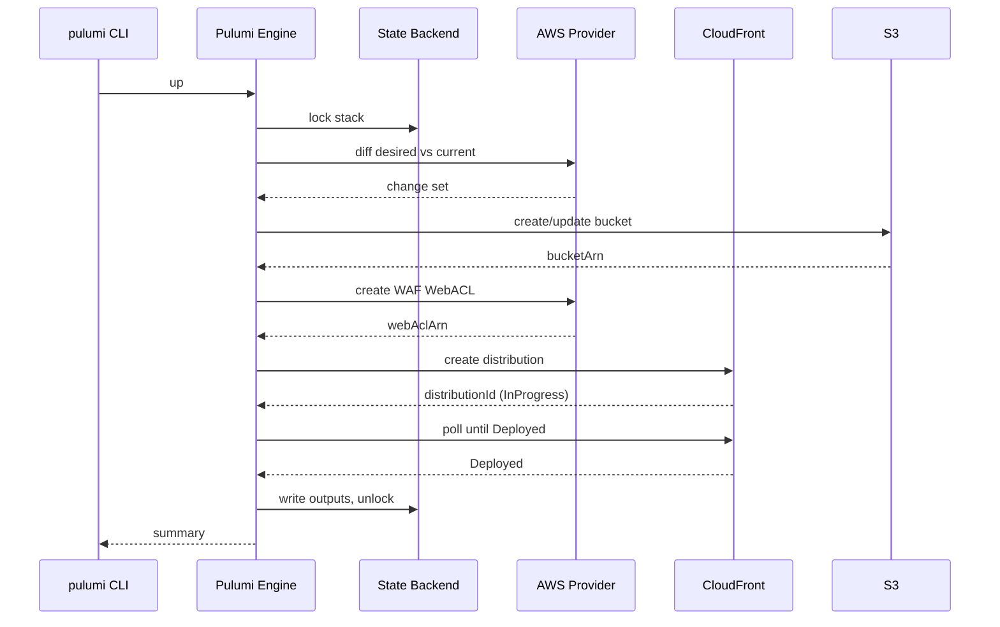

# @theriety/edge-cdn-stack

> ARCHITECTURE = how it works.

<br/>

📌 **Architectural shape:** `@theriety/edge-cdn-stack` is a **declarative resource graph** expressed as a Pulumi program. There is one TypeScript entrypoint per process, one stack per environment, and a fixed topology of `ComponentResource` nodes wrapping AWS primitives (CloudFront, S3, WAF, Lambda@Edge). No imperative wiring exists at deploy time — the engine diffs the desired graph against cloud state and performs the minimum set of create/update/replace operations.

**Why this shape:** edge delivery is a resource graph whose nodes rarely move but whose properties change often (TTLs, WAF rules, cache policies). Modelling it declaratively lets `pulumi preview` produce a human-readable diff before any mutation, and lets every environment share the same code path with different config values. The public CLI surface described in the sibling [`README.md`](./README.md) is intentionally narrow — three commands (`preview`, `up`, `destroy`) operating on the same stack graph.

<br/>
<div align="center">

•&emsp;&emsp;🌐 [Map](#-network-topology)&emsp;&emsp;•&emsp;&emsp;🔄 [Pipeline](#-deployment-pipeline)&emsp;&emsp;•&emsp;&emsp;🧭 [Routing](#-request-routing-decisions)&emsp;&emsp;•&emsp;&emsp;🔁 [Rollout](#-rollout-sequence)&emsp;&emsp;•&emsp;&emsp;🛡️ [Rules](#-invariants--contracts)&emsp;&emsp;•&emsp;&emsp;📊 [NFR](#-non-functional-matrix)&emsp;&emsp;•

</div>
<br/>

---

## 💡 Core Concepts

The five abstractions below are the entire vocabulary of the stack. Every file either defines one of them, validates one of them, or composes them.

| Concept | Role | Defined In |
| --- | --- | --- |
| `Pulumi Stack` | named instance of the program bound to one environment and one backend | `Pulumi.<stack>.yaml` |
| `ConfigSchema` | Zod schema validated at program start; the single source of truth for every `pulumi config` value | `src/config/schema.ts` |
| `ComponentResource` | Pulumi class that groups related AWS primitives behind one logical name | `src/resources/*.ts` |
| `ResourceTag` | immutable `{env, owner, costCenter}` record applied to every AWS resource | `src/resources/tags.ts` |
| `RolloutPhase` | named step in the deploy pipeline (`validate`, `preview`, `approve`, `up`, `smoke`) | `.github/workflows/deploy.yaml` |

Resource naming follows `<stackName>-<componentKind>-<slug>` (e.g. `edge-cdn-prod-origin-artefacts`). The slug is stable across deploys so CloudWatch metrics and IAM bindings keep working after every `pulumi up`.

---

## 🌐 Network Topology

End-user traffic enters at CloudFront edge locations, is classified by a Lambda@Edge viewer-request function, either resolved from the edge cache or forwarded to the S3 origin, and on writeback the response is cached according to the stack's cache policy. WAF evaluates every viewer request before Lambda@Edge runs.

```mermaid
flowchart LR
  User --> Edge[CloudFront Edge]
  Edge --> WAF[AWS WAF]
  WAF --> LambdaV[Lambda@Edge: viewer-request]
  LambdaV --> Cache[CloudFront Cache]
  Cache --> Origin[Lambda@Edge: origin-request]
  Origin --> S3[(S3 Origin Bucket)]
```

The primary region is `us-east-1` because Lambda@Edge functions must be registered there; the S3 origin may live in any region but latency is best when co-located.

---

## 🗂️ Module Topology

```plain
src
├── resources     # ComponentResources wrapping AWS primitives
│   ├── edge-distribution.ts
│   ├── origin-bucket.ts
│   ├── cache-policy.ts
│   ├── waf-policy.ts
│   └── tags.ts
├── policies      # reusable WAF rule groups and cache fragments
│   ├── managed-rules.ts
│   └── cache-behaviours.ts
├── environments  # per-stack config presets
│   ├── dev.ts
│   ├── staging.ts
│   └── prod.ts
├── lambdas       # Lambda@Edge handlers
│   ├── viewer-request.ts
│   └── origin-request.ts
├── config        # Zod schema + resolver
│   └── schema.ts
└── index.ts      # stack entrypoint
```

| Module | Path | Responsibility | Key Exports |
| --- | --- | --- | --- |
| `resources` | `src/resources/` | wrap AWS primitives as Pulumi ComponentResources | `EdgeDistribution`, `OriginBucket`, `CachePolicy`, `WAFPolicy` |
| `policies` | `src/policies/` | reusable WAF rule groups and cache-behaviour fragments | `managedRuleSet`, `defaultCacheBehaviour` |
| `environments` | `src/environments/` | per-environment config presets | `devPreset`, `stagingPreset`, `prodPreset` |
| `lambdas` | `src/lambdas/` | Lambda@Edge function handlers | `viewerRequest`, `originRequest` |
| `config` | `src/config/` | validated config schema | `ConfigSchema`, `resolveConfig` |

---

## 🧩 Component Architecture

The stack entrypoint composes four top-level ComponentResources. Each owns its child AWS primitives and exposes outputs that downstream components depend on; Pulumi derives the dependency graph from these references.



The component wiring lives in `src/index.ts`:

```ts
import * as aws from '@pulumi/aws';
import { resolveConfig } from './config/schema';
import { OriginBucket } from './resources/origin-bucket';
import { CachePolicy } from './resources/cache-policy';
import { WAFPolicy } from './resources/waf-policy';
import { EdgeDistribution } from './resources/edge-distribution';

const cfg = resolveConfig();
const bucket = new OriginBucket('origin', { env: cfg.env });
const cache = new CachePolicy('cache', { defaultTtl: cfg.cache.defaultTtl, maxTtl: cfg.cache.maxTtl });
const waf = new WAFPolicy('waf', { ruleset: cfg.waf.ruleset });

export const distribution = new EdgeDistribution('edge', {
  domain: cfg.cdnDomain,
  bucket: bucket.bucketArn,
  cachePolicyArn: cache.policyArn,
  webAclArn: waf.webAclArn,
});
```

---

## 🔄 Deployment Pipeline

Deploys run through a linear pipeline. Each phase is a distinct CI job so failures leave a clear audit trail; `approve` is a manual gate on `prod` only.



| Phase | Command | Gate |
| --- | --- | --- |
| Validate | `npm run lint && npm run typecheck` | hard |
| Preview | `pulumi preview --diff` | produces diff artefact for review |
| Approve | manual button on `prod`, auto on `dev`/`staging` | org policy |
| Up | `pulumi up --yes` | hard |
| Smoke | `npm run smoke -- --base $cdnUrl` | hard |

---

## 🧭 Request Routing Decisions

The viewer-request Lambda classifies every incoming request and routes it to the appropriate cache behaviour. The decision tree is deliberately shallow — three terminal outcomes, no nested cases — so failures are obvious.



Static assets are identified by extension (`.js`, `.css`, `.png`, `.webp`, `.woff2`); admin paths are blocked at the edge because the stack is public-by-default.

### Environment Gate



---

## 🔁 Rollout Sequence

The sequence below shows what happens inside a `pulumi up` for this stack. The engine talks to the Pulumi service for state locking and to the AWS provider for every mutation; CloudFront operations are eventually consistent so the engine polls until the distribution reports `Deployed`.



---

## 🗃️ Config Schema

Every value in `Pulumi.<stack>.yaml` is validated against `ConfigSchema`. Missing or malformed values abort the program before any provider call.

| Key | Type | Required | Default | Purpose |
| --- | --- | --- | --- | --- |
| `env` | `"dev" \| "staging" \| "prod"` | yes | — | selects the preset under `src/environments/` |
| `cdnDomain` | `string` | yes | — | apex or subdomain attached to the distribution |
| `originBucket` | `string` | no | `${stackName}-origin` | S3 origin bucket name |
| `cache.defaultTtl` | `number` (s) | yes | preset | cache policy default TTL |
| `cache.maxTtl` | `number` (s) | yes | preset | cache policy max TTL |
| `waf.ruleset` | `string[]` | yes | preset | list of managed rule group names to attach |
| `lambdaEdge.enabled` | `boolean` | no | `true` | disable to run without edge logic (testing only) |
| `tags` | `Record<string,string>` | no | `{}` | merged into `ResourceTag` for every resource |

A realistic `Pulumi.dev.yaml` showing nested keys:

```yaml
config:
  aws:region: us-east-1
  edge-cdn-stack:env: dev
  edge-cdn-stack:cdnDomain: cdn-dev.example.com
  edge-cdn-stack:cache:
    defaultTtl: 60
    maxTtl: 300
  edge-cdn-stack:waf:
    ruleset: basic
```

---

## 🧠 Design Patterns

| # | Pattern | Intent | Implemented In |
| --- | --- | --- | --- |
| 1 | Declarative Resource Graph | make the desired state machine-readable so diffs and drift detection are free | `src/index.ts` |
| 2 | Builder | compose cache policy and WAF policy fragments without inheritance | `src/resources/cache-policy.ts`, `src/resources/waf-policy.ts` |
| 3 | Policy-as-Code | keep WAF rules in version control and apply them through the same pipeline as the rest of the stack | `src/policies/managed-rules.ts` |
| 4 | Stack-per-Environment | one stack per env gives independent state, history, and blast radius | `Pulumi.<stack>.yaml` |
| 5 | Component Aggregate | group related primitives (bucket, OAI, policy) under one Pulumi name for readable state | `src/resources/origin-bucket.ts` |

---

## 🔌 Extension Points

Most changes land in `environments/` or `policies/`; the component boundary rarely moves. The extensions below are the typical customisations a consumer team reaches for.

| Extension | Steps | Files Touched | Tests |
| --- | --- | --- | --- |
| Add a WAF rule group | 1. import the managed rule in `src/policies/managed-rules.ts` 2. add the key to the environment preset 3. run `pulumi preview` on `dev` | `src/policies/managed-rules.ts`, `src/environments/*.ts` | `spec/policies/managed-rules.spec.ts` |
| Add a cache behaviour | 1. add a `CacheBehaviour` to `src/policies/cache-behaviours.ts` 2. wire it in `EdgeDistribution` 3. update the routing Lambda | `src/policies/cache-behaviours.ts`, `src/resources/edge-distribution.ts` | `spec/resources/edge-distribution.spec.ts` |
| Add an environment | 1. copy `environments/staging.ts` 2. add `Pulumi.<stack>.yaml` 3. run `pulumi stack init` | `src/environments/<name>.ts`, `Pulumi.<stack>.yaml` | `spec/environments/<name>.spec.ts` |

---

## 🛡️ Invariants & Contracts

| # | Rule | Why | Enforced By |
| --- | --- | --- | --- |
| 1 | every resource carries `env`, `owner`, `costCenter` tags | untagged resources break cost allocation and DR reporting | `ResourceTag` helper + `aws:defaultTags` provider config |
| 2 | config is validated before any AWS call | catching schema errors at preview time avoids half-applied stacks | Zod `ConfigSchema` runs at program start |
| 3 | changes must be zero-downtime for `prod` | viewers cannot tolerate a distribution replacement | review checklist + Pulumi `protect` on the distribution |
| 4 | IAM policies are least-privilege | CI upload roles must not reach outside the origin bucket | unit test asserts IAM document; CI linter on `aws.iam.Policy` |
| 5 | WAF must be attached to every distribution | open distributions are immediately attacked | `EdgeDistribution` constructor requires `webAclArn` |

---

## 📊 Non-Functional Matrix

| Concern | Target | Strategy | Instrumentation |
| --- | --- | --- | --- |
| Availability | 99.95% (`prod`), 99.9% (`staging`), 99.0% (`dev`) | CloudFront multi-PoP; S3 cross-region replication for `prod` origin | CloudWatch alarms on 5xx rate and origin-latency |
| Cache TTL bounds | default ≤ 300s, max ≤ 86400s (`prod`) | `CachePolicy` schema clamps values | Zod schema + `spec/resources/cache-policy.spec.ts` |
| Cost (per env/month) | `dev` ≤ \$50, `staging` ≤ \$200, `prod` ≤ \$2000 | short TTLs on dev, price class `PriceClass_100` on lower envs | AWS Cost Explorer tag filter on `env` |
| Security | WAF on all distributions, S3 origin private | `WAFPolicy` mandatory, OAI enforced | `spec/resources/origin-bucket.spec.ts` |
| Deploy time | ≤ 15 min on `pulumi up` | limit replacements; pre-warm distributions | CI duration metric |

---

## 📦 Related Packages

- [`@theriety/iac-common`](../iac-common): shared Pulumi helpers — `ComponentResource` base, tag composition, config resolver used by `resolveConfig`
- [`@theriety/edge-policies`](../edge-policies): versioned WAF rule groups and cache fragments imported by `src/policies`
- [`@theriety/lambda-router`](../lambda-router): routing library consumed by `src/lambdas/viewer-request.ts`

---
