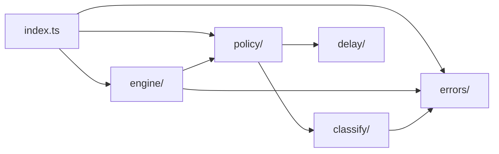
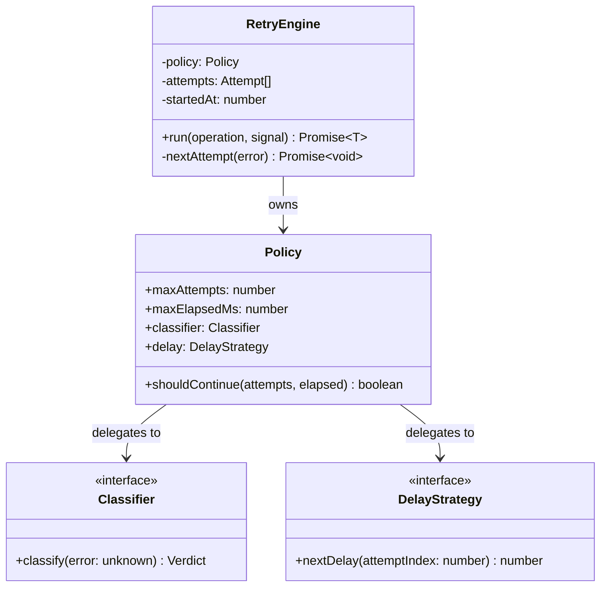
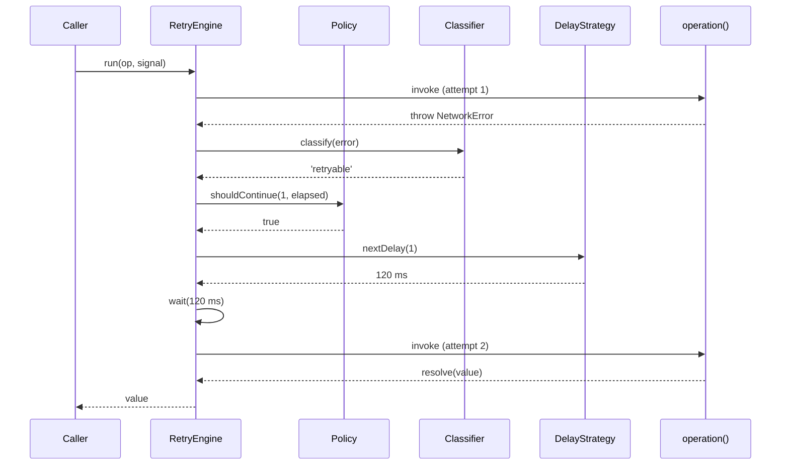
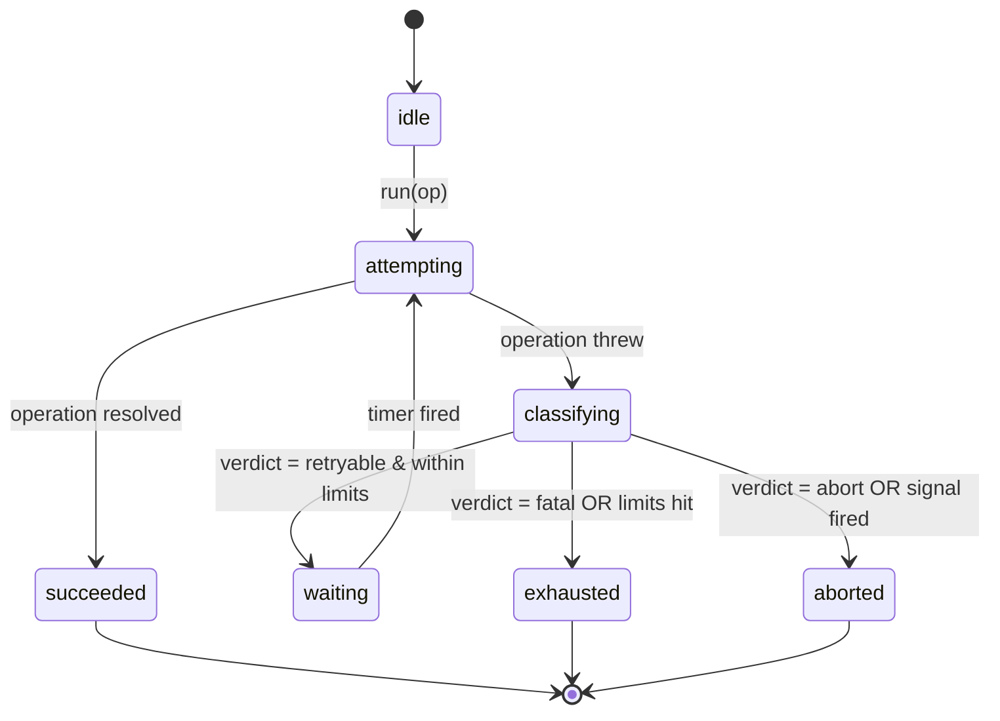

# @theriety/retry

<br/>

📌 **Architectural shape:** `@theriety/retry` is a **pipeline library** — a tiny orchestrator (`RetryEngine`) drives a fixed 4-phase loop (`Attempt → Classify → Delay → Decide`), with each phase exposed as a replaceable interface. The codebase has zero runtime dependencies and splits into five narrowly-scoped modules that fan out from a barrel entry.

**Why this shape:** retries are deceptively hard because the decision is contextual — an error that is retryable for a background job may be fatal for a user request. By isolating the decision (`Classifier`), the wait (`DelayStrategy`), and the limits (`Policy`) behind thin interfaces, the engine can stay under 150 lines and the test matrix stays tractable. The public API (documented in the sibling [`README.md`](./README.md)) is the `retry()` function plus a `createRetryPolicy()` builder; everything else is an internal collaboration.

<br/>
<div align="center">

•&emsp;&emsp;💡 [Concepts](#-core-concepts)&emsp;&emsp;•&emsp;&emsp;🗂️ [Modules](#-module-topology)&emsp;&emsp;•&emsp;&emsp;🔄 [Flow](#-data-flow)&emsp;&emsp;•&emsp;&emsp;🔁 [Cycle](#-state--lifecycle)&emsp;&emsp;•&emsp;&emsp;🔌 [Extend](#-extension-points)&emsp;&emsp;•&emsp;&emsp;🛡️ [Rules](#-invariants--contracts)&emsp;&emsp;•

</div>
<br/>

---

## 💡 Core Concepts

The four concepts below are the entire vocabulary of the package. If a contributor understands these, everything else in the source reads as collaboration between them.

| Concept | Role | Defined In |
| --- | --- | --- |
| `Attempt` | a single invocation record; holds `index`, `error`, `durationMs`, `startedAt` | `src/engine/attempt.ts` |
| `Classifier` | pure function mapping a thrown value to a `Verdict` of `retryable \| fatal \| abort` | `src/classify/classifier.ts` |
| `DelayStrategy` | pure function returning the wait in ms before attempt `n + 1` | `src/delay/strategy.ts` |
| `Policy` | frozen bundle of `maxAttempts`, `maxElapsedMs`, classifier, delay strategy | `src/policy/policy.ts` |

---

## 🗂️ Module Topology

```plain
src
├── engine    # pipeline orchestrator and Attempt record
├── policy    # Policy type + fluent builder
├── classify  # Classifier interface and default implementations
├── delay     # DelayStrategy interface and built-in strategies
├── errors    # RetryError and verdict discriminants
└── index.ts  # public barrel; re-exports retry, createRetryPolicy, RetryError
```



| Module | Path | Responsibility | Key Exports |
| --- | --- | --- | --- |
| `engine` | `src/engine/` | run the 4-phase loop, assemble `Attempt` records | `RetryEngine`, `retry` |
| `policy` | `src/policy/` | express limits and wire the classifier + delay strategy | `Policy`, `createRetryPolicy` |
| `classify` | `src/classify/` | map unknown errors to typed verdicts | `Classifier`, `defaultClassifier` |
| `delay` | `src/delay/` | compute the next wait with optional jitter | `DelayStrategy`, `exponential`, `decorrelatedJitter` |
| `errors` | `src/errors/` | thrown aggregate and verdict types | `RetryError`, `Verdict` |

---

## 🧩 Component Architecture

`RetryEngine` is the only stateful component; every other piece is a pure function or a frozen record. The engine holds the `Policy` by reference and calls into the `Classifier` and `DelayStrategy` behind interface boundaries, which keeps the engine trivially testable with fakes.



| Component | File | Role | Collaborators |
| --- | --- | --- | --- |
| `RetryEngine` | `src/engine/engine.ts` | orchestrates the 4-phase loop | `Policy` |
| `Policy` | `src/policy/policy.ts` | encapsulates limits + wiring; immutable | `Classifier`, `DelayStrategy` |
| `Classifier` | `src/classify/classifier.ts` | pure verdict mapping | `Verdict` |
| `DelayStrategy` | `src/delay/strategy.ts` | pure delay computation | — |
| `RetryError` | `src/errors/retry-error.ts` | aggregate error carrying attempt history | `Attempt` |

---

## 🔄 Data Flow

A typical failing-then-succeeding call walks through the engine twice before resolving. The sequence below shows attempt 1 failing with a retryable error and attempt 2 succeeding.



---

## 🔁 State & Lifecycle

The engine is modelled as a small state machine. Every transition is driven by the outcome of the previous phase; there are no hidden states and no state that survives a `run()` call.



---

## 🧠 Design Patterns

| # | Pattern | Intent | Implemented In |
| --- | --- | --- | --- |
| 1 | Strategy | swap classification logic without touching the engine | `src/classify/classifier.ts` |
| 2 | Template Method | `RetryEngine.run` fixes the 4-phase skeleton; subclass-equivalent hooks are the injected strategies | `src/engine/engine.ts` |
| 3 | Builder | step-by-step `Policy` construction with sensible defaults and `.build()` freezing | `src/policy/policy-builder.ts` |

---

## 🔌 Extension Points

The most common extension is a new `DelayStrategy`. The interface is one method, all built-ins are pure, and tests are table-driven — adding one is genuinely three steps.

| Extension | Steps | Files Touched | Tests |
| --- | --- | --- | --- |
| Add a new `DelayStrategy` | <br>1. implement `nextDelay(index: number): number` in `src/delay/<name>.ts`<br>2. export from `src/delay/index.ts`<br>3. add a row to the delay table in `spec/delay/strategies.spec.ts` | `src/delay/<name>.ts`, `src/delay/index.ts` | `spec/delay/strategies.spec.ts` |
| Add a new `Classifier` | <br>1. implement `classify(error: unknown): Verdict`<br>2. export from `src/classify/index.ts`<br>3. add case rows to `spec/classify/<name>.spec.ts` | `src/classify/<name>.ts`, `src/classify/index.ts` | `spec/classify/<name>.spec.ts` |

---

## 🛡️ Invariants & Contracts

| # | Rule | Why | Enforced By |
| --- | --- | --- | --- |
| 1 | the engine never catches non-`Error` throwables | assertion failures and `AbortError` must surface immediately for debuggability | `instanceof Error` guard in `engine.ts` + unit test |
| 2 | a `Classifier` is a pure function of its input | caching verdicts and replaying attempt logs both rely on determinism | type signature `(error: unknown) => Verdict` + lint rule banning side effects in `classify/` |
| 3 | `Policy` is frozen after `.build()` | two concurrent retries sharing a policy must not see mutation races | `Object.freeze` in `policy-builder.ts` |
| 4 | attempt count is 1-indexed in public surface, 0-indexed internally | humans read logs, machines compute delays | adapter in `engine.ts`; spec fixture `spec/engine/attempt-index.spec.ts` |
| 5 | abort wins over every verdict | callers expect `AbortSignal` to be authoritative | signal check at the top of `nextAttempt` in `engine.ts` |

---

## 📊 Non-Functional Matrix

| Concern | Target | Strategy | Instrumentation |
| --- | --- | --- | --- |
| Performance | ≤ 5 µs engine overhead per attempt (excluding user op) | zero allocations in the hot path; `Attempt` records pooled per-run | `bench/engine.bench.ts` |
| Security | no eval, no dynamic require, no network access | zero runtime dependencies; pure TS | `npm run lint` + `npm audit --omit=dev` in CI |
| Observability | per-attempt records accessible after failure | `RetryError.attempts` carries every `Attempt` record | consumer supplies logger |
| Reliability | no unhandled promise rejections across retry boundary | `try/catch` wraps every phase; rejections funnel through `RetryError` | `spec/engine/rejection-safety.spec.ts` |

---

## 📦 Related Packages

- [`@theriety/circuit-breaker`](../circuit-breaker): complements retry by short-circuiting calls to a known-bad downstream; the breaker's `OpenError` is the canonical fatal verdict in the default classifier
- [`@theriety/rate-limiter`](../rate-limiter): sits in front of retry to bound request volume; its `RateLimitError` is the canonical retryable verdict

---
