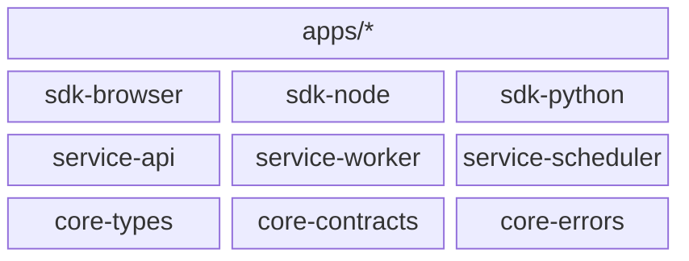
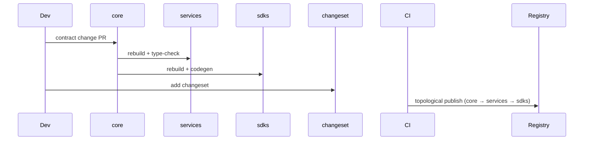

# @theriety/platform — ARCHITECTURE

<br/>

ARCHITECTURE = how it works. For usage/install, see README.md.

📌 **First paragraph:** This document is the **INDEX** for the `@theriety/platform` monorepo. The platform hosts three peer subsystems — **core**, **services**, and **sdks** — each large enough to warrant its own architecture document. This file explains the cross-cutting shape, invariants, and onboarding path; the per-subsystem deep dives live in sibling `ARCHITECTURE-*.md` files.

**Second paragraph:** The split exists because a single ARCHITECTURE.md would exceed 600 lines once each subsystem's topology, data flow, and invariants were drawn. Keeping them separate lets a reader go deep on one subsystem without scrolling past the other two, while the index below preserves the cross-subsystem story.

<br/>
<div align="center">

•&emsp;&emsp;💡 [Concepts](#-concepts)&emsp;&emsp;•&emsp;&emsp;🗂️ [Map](#-high-level-module-topology)&emsp;&emsp;•&emsp;&emsp;🧩 [Parts](#-parts)&emsp;&emsp;•&emsp;&emsp;📍 [Place](#-package-placement)&emsp;&emsp;•&emsp;&emsp;🧠 [Patterns](#-cross-cutting-patterns)&emsp;&emsp;•&emsp;&emsp;🛡️ [Rules](#-repo-wide-invariants)&emsp;&emsp;•

</div>
<br/>

---

### Why this split?

**Why 3 part files?** The platform crosses 3 distinct subsystems (core, services, sdks) and a single ARCHITECTURE.md would exceed ~600 lines. The document skill recommends splitting ARCHITECTURE.md whenever a project has 3+ top-level subsystems OR the draft exceeds ~600 lines. This INDEX carries cross-cutting concerns; each part goes deep on one subsystem.

---

## 💡 Concepts

The monorepo leans on three cross-cutting abstractions that every subsystem honors:

| Concept | Role | Defined In |
| --- | --- | --- |
| `Contract` | A Zod schema that declares a public interface; anything crossing a package boundary is validated against one | `packages/core/contracts/src/contract.ts` |
| `VersionPolicy` | Mapping from semver bump → allowed changes; enforced by `tools/release` so a patch never ships a contract change | `tools/release/src/policy.ts` |
| `DependencyTier` | Tier 0 is the floor (`core`), tier 1 is `services`, tier 2 is `sdks`. "Upward" imports — sdks → services → core — are forbidden by the import linter; downward imports are allowed. | `tools/lint-deps/src/tiers.ts` |

Contracts are the only artifact that crosses subsystem boundaries. Services and SDKs depend on `core`; they never depend on each other's internals.

---

## 🌐 Context



Apps consume SDKs; SDKs talk over the wire to services; services share contracts with SDKs via core. Core is the only subsystem every other subsystem imports; nothing imports upward.

---

## 🗂️ High-level Module Topology

```plain
platform
├── packages
│   ├── core      # see ARCHITECTURE-core.md
│   ├── services  # see ARCHITECTURE-services.md
│   └── sdks      # see ARCHITECTURE-sdks.md
├── apps
└── tools
```

Subsystems are only expanded to depth 2 here; each part file expands its own subsystem fully.

`tools/` is private root infrastructure (linters, codegen drivers, release scripts) — it's not publishable and has no dedicated `ARCHITECTURE-tools.md`.

---

## 🧩 Parts

| Subsystem | Responsibility | Part File |
| --- | --- | --- |
| `core` | Contracts, shared types, error taxonomy — zero runtime deps | [`ARCHITECTURE-core.md`](./ARCHITECTURE-core.md) |
| `services` | Long-running processes that implement contracts | [`ARCHITECTURE-services.md`](./ARCHITECTURE-services.md) |
| `sdks` | Client libraries published to consumers of the platform | [`ARCHITECTURE-sdks.md`](./ARCHITECTURE-sdks.md) |

> **Note**: In this bundled example the subsystem files carry an `.example.md`
> suffix for discoverability. In real projects the skill emits them as
> `ARCHITECTURE-<subsystem>.md` matching the links shown here.

---

## 📍 Package Placement

```mermaid
flowchart TD
  A[New package] --> B{Owns a runtime (HTTP/worker)?}
  B -->|yes| C[packages/services]
  B -->|no| D{Targets an external runtime (browser/node/edge)?}
  D -->|yes| E[packages/sdks]
  D -->|no| F[packages/core]
```

---

## 🧠 Cross-cutting Patterns

- **Monorepo tooling**: `pnpm` workspaces for linking, `turbo` for cached task graphs, `changesets` for versioning. Each tool owns one concern; none overlap.
- **CI strategy**: One pipeline per subsystem that gates on `turbo run build test lint --filter=...{subsystem}...`. A contract change fans out and reruns every downstream subsystem automatically.
- **Release train**: `changesets` accumulates version bumps; a weekly release commit runs `pnpm release` which calls `tools/release` to publish in topological order (core first, services next, sdks last).
- **Import linter**: `tools/lint-deps` fails CI when a `sdks/*` package imports from `services/*`, preserving the tier invariant.

### Release train



### CI gating per subsystem

| Subsystem | Pipeline | Gates |
| --- | --- | --- |
| `core` | lint → typecheck → test → build | 100% test coverage, no downward imports |
| `services` | lint → typecheck → test → integration-test → build | all public endpoints documented |
| `sdks` | lint → typecheck → test → size-check → build | bundle ≤ threshold, codegen fresh |

---

## 🛡️ Repo-wide Invariants

| # | Rule | Why | Enforced By |
| --- | --- | --- | --- |
| 1 | No upward imports across tiers | A leaf tier depending on a root tier creates release cycles | `tools/lint-deps` CI check |
| 2 | Every public symbol that crosses a package boundary has a Zod contract | Untyped wire formats break silently across SDK languages | `packages/core/contracts` review |
| 3 | `workspace:*` is rewritten at publish | Consumers must not see workspace-only ranges | `tools/release` `publish` phase |
| 4 | Every package has a README and either an ARCHITECTURE.md or a link to a subsystem ARCHITECTURE | Discoverability and split enforcement | skill audit step 8.w |

---

## 📦 Related External Packages

- [`pnpm`](https://pnpm.io): workspace manager
- [`turbo`](https://turbo.build): cached task runner
- [`changesets`](https://github.com/changesets/changesets): versioning and changelog

---
