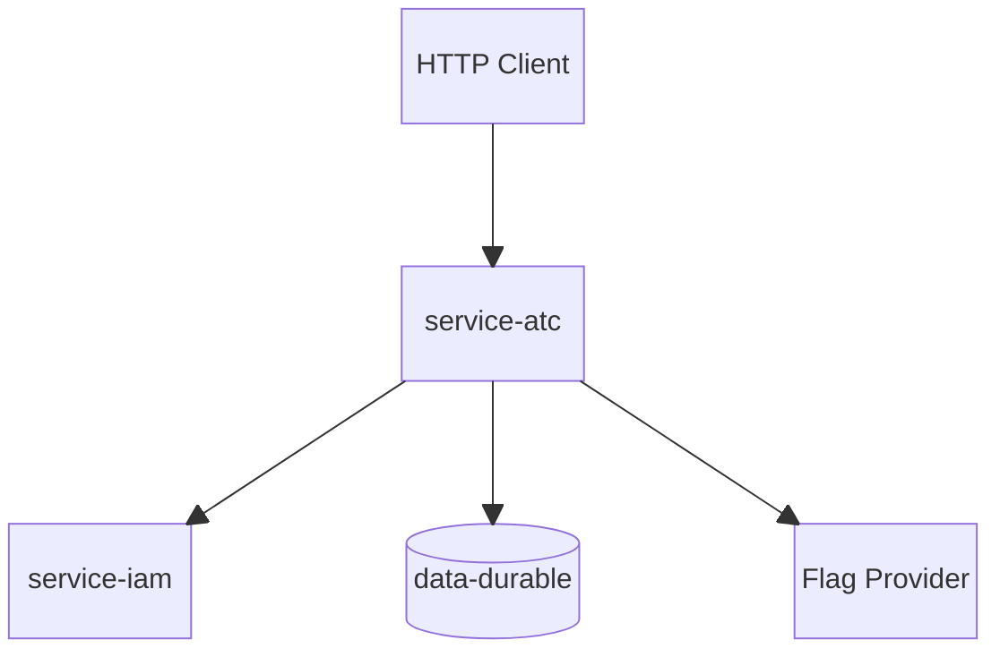
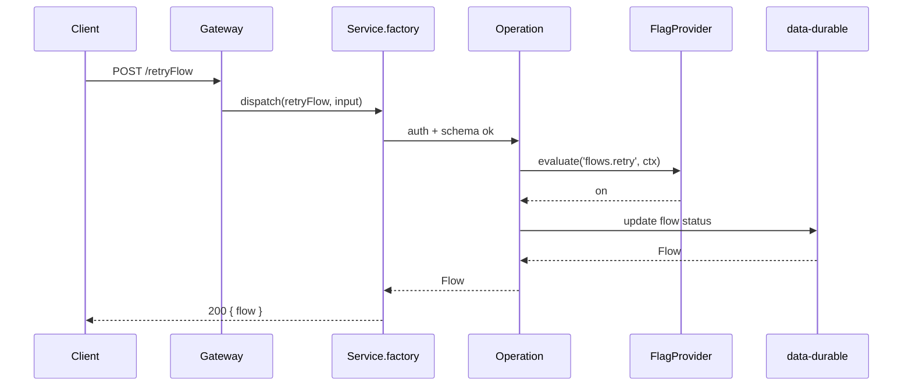
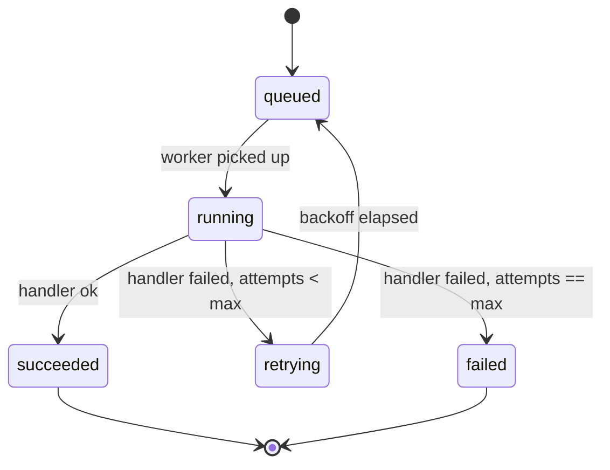
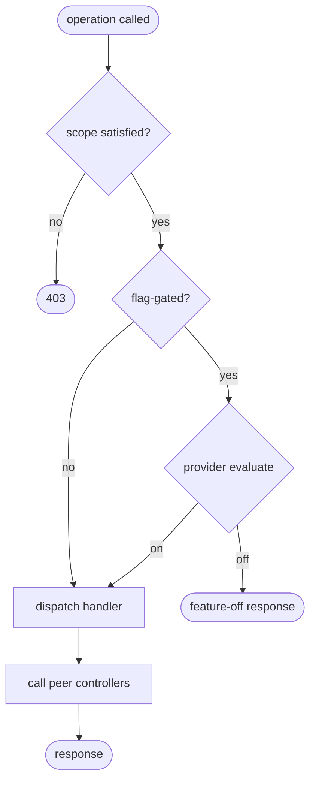

# @theriety/service-atc

> ARCHITECTURE = how it works. For usage, see README.md.

<br/>

📌 **Architectural shape:** `@theriety/service-atc` is a **stateless, manifest-driven hexagonal service**. Every operation is a single file under `src/operations/<name>/index.ts` that declares its auth scope, schema, and peer dependencies. The service layer holds zero state; all persistence is delegated to peer data controllers, and all flag evaluation is delegated to a `FlagProvider` adapter selected at boot.

**Why this shape:** automation control surfaces tend to grow a long tail of one-off endpoints, each with its own auth story and its own ad-hoc cache. Treating every endpoint as a manifest-declared operation with a uniform dispatcher collapses that long tail into a single code path that is easy to audit. Stateless compute means any replica can serve any request, and the adapter seam for flag providers means the same binary runs with `dummy` in tests, `env-only` in staging, and `launchdarkly` in production.

<br/>
<div align="center">

•&emsp;&emsp;🌐 [Context](#-system-context)&emsp;&emsp;•&emsp;&emsp;🗂️ [Modules](#-module-topology)&emsp;&emsp;•&emsp;&emsp;🔄 [Flow](#-data-flow)&emsp;&emsp;•&emsp;&emsp;🔁 [Cycle](#-state--lifecycle)&emsp;&emsp;•&emsp;&emsp;🔌 [Extend](#-extension-points)&emsp;&emsp;•&emsp;&emsp;🛡️ [Rules](#-invariants--contracts)&emsp;&emsp;•

</div>
<br/>

---

## 💡 Core Concepts

The six abstractions below are the entire vocabulary of the service. If a contributor internalizes them, the rest of the code reads as glue.

| Concept | Role | Defined In |
| --- | --- | --- |
| `Service` | the runnable bound to adapters and peers; the public entry surface | `src/factory.ts` |
| `Operation` | a manifest entry: name, scope, schema, handler | `src/operations/<name>/index.ts` |
| `Handler` | the function executed for an operation; receives typed input + `OpContext` | `src/operations/<name>/index.ts` |
| `FlagProvider` | adapter interface — `evaluate(key, context) → boolean \| variant` | `src/flag/base.ts` |
| `PeerResolver` | resolves peer service URLs at boot; surfaces health to `/health` | `src/peer.ts` |
| `AuthGuard` | scope chain applied before handler dispatch; sources scopes from IAM | `src/auth/guard.ts` |

The **operation lifecycle** is: `receive → auth → flag gate (optional) → handler → peer calls → response`. The service writes nothing to local storage; every persistence side effect is a peer call.

**Why one file per operation**: testability (each op has an isolated spec file), tree-shaking (unused operations drop from the bundle), and scope isolation (each op declares its required scope at the top of the file).

> **Pick this over a microservice when** your service is pure compute + routing over peer data (no internal state to persist, no adapters to DBs/brokers) and your operations are idempotent function calls the service framework can invoke. Pick the microservice template when you need the hexagonal adapter + state-machine story.

---

## 🌐 System Context

The service sits between HTTP clients and two classes of peers: data controllers (state), and IAM (identity). The flag provider is an out-of-process dependency reached through its own adapter.



---

## 🗂️ Module Topology

```plain
src
├── operations          # one folder per operation
│   ├── listFlows
│   │   └── index.ts
│   ├── retryFlow
│   │   └── index.ts
│   ├── pauseFlow
│   │   └── index.ts
│   └── resumeFlow
│       └── index.ts
├── flag                # flag provider adapters
│   ├── base.ts
│   ├── dummy.ts
│   └── vercel.ts
├── auth
│   └── guard.ts        # scope chain applied before handler dispatch
├── registry.ts         # operation registry + dispatcher
├── client.ts           # service client factory
├── factory.ts          # service factory
├── config.ts           # config loader
├── peer.ts             # peer resolver
└── index.ts            # public barrel
```

| Module | Path | Responsibility | Key Exports |
| --- | --- | --- | --- |
| `operations` | `src/operations` | one folder per operation manifest entry | per-operation handlers |
| `flag` | `src/flag` | adapter interface + first-party implementations | `FlagProvider`, `dummyProvider`, `vercelProvider` |
| `factory` | `src/factory.ts` | compose adapters, peers, and operations into a `Service` | `createService` |
| `client` | `src/client.ts` | generated client factory bound to the manifest | `createClient` |
| `config` | `src/config.ts` | read + validate env vars at boot | `loadConfig` |
| `peer` | `src/peer.ts` | resolve peer URLs, run liveness probes | `PeerResolver` |

---

## 🧩 Component Architecture

`ServiceFactory` is the only component that sees the whole composition. It pulls config, picks the flag-provider adapter, resolves peers, registers operations, and binds them to an HTTP dispatcher. No component outside the factory sees raw env vars.

- **ServiceFactory** (`src/factory.ts`): constructs a `Service` instance bound to adapters; lazy — opens no connections until `.start()`
- **OperationRegistry** (`src/registry.ts`): maps operation name → handler fn; rebuilt from the manifest at boot
- **FlagProvider** (`src/flag/base.ts`): adapter interface — `evaluate(key, context) → boolean | variant`; side-effect free
- **PeerResolver** (`src/peer.ts`): resolves peer service URLs at boot and reports each peer's health to `/health`
- **AuthGuard** (`src/auth/guard.ts`): scope chain applied before handler dispatch; refuses the call if a required scope is missing

---

## 🔄 Data Flow

A successful `retryFlow` call touches auth, the flag provider, and the data controller exactly once each. The sequence below is identical for every manifest-declared operation.



---

## 🔁 State & Lifecycle

Flows themselves are stateful, but the state lives in `@theriety/data-durable`. The service only drives transitions; the diagram below is the `Flow` state machine as seen by this service.



---

## 🧭 Decision Tree

Every dispatched operation flows through the same gate sequence. Flag gating is optional per operation; the dispatcher reads the manifest to decide whether to evaluate at all.



---

## 🧠 Design Patterns

| # | Pattern | Intent | Implemented In |
| --- | --- | --- | --- |
| 1 | Adapter | swap flag provider backends without touching operation handlers | `src/flag` |
| 2 | Factory | compose adapters + peers + operations into a runnable service | `src/factory.ts`, `src/client.ts` |
| 3 | Chain of Responsibility | layered auth guards (session → scope → flag) run before each handler | `src/registry.ts` |
| 4 | Manifest-driven routing | a single declarative table drives dispatch, schema validation, and client generation | `src/operations` + manifest |

---

## 🔌 Extension Points

The service is designed to be extended by adding a new file under `src/operations/<name>/index.ts` or a new file under `src/flag/<provider>.ts`. Both are discovered automatically.

| Extension | Steps | Files Touched |
| --- | --- | --- |
| Custom flag provider | 1. implement the `FlagProvider` contract 2. register the adapter in `src/flag` 3. accept it as a valid `ATC_FLAG_PROVIDER` value | `src/flag/<name>.ts`, `src/config.ts` |
| New operation | 1. add `src/operations/<name>/index.ts` 2. export a manifest entry with scope + schema 3. regenerate the client | `src/operations/<name>`, manifest file |

---

## 🛡️ Invariants & Contracts

| # | Rule | Why | Enforced By |
| --- | --- | --- | --- |
| 1 | every operation is idempotent | replays under retry storms must not corrupt downstream state | contract test per operation; peer controllers use upserts |
| 2 | every operation declares its required scope; dispatcher refuses the call without it | untyped scope checks drift as the service grows | manifest validator runs at boot |
| 3 | the service writes nothing to local storage | local writes would break horizontal scaling and replay safety | code review + absence of storage adapters in `src` |
| 4 | `FlagProvider.evaluate` is side-effect-free | flag evaluation happens on the hot path and must not perturb the system | contract test forbids writes during `evaluate` |

---

## 📦 Related Packages

- [`@theriety/data-durable`](../data-durable): peer data controller that owns flow records and transition logs
- [`@theriety/service-iam`](../service-iam): session + scope enrichment consumed by every operation
- [`@theriety/adapter-vercel-flags`](../adapter-vercel-flags): first-party `FlagProvider` implementation
- [`@theriety/adapter-launchdarkly`](../adapter-launchdarkly): first-party `FlagProvider` implementation

---
