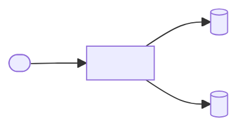
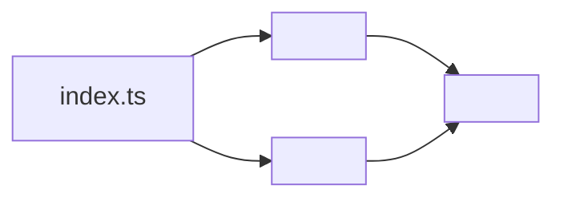
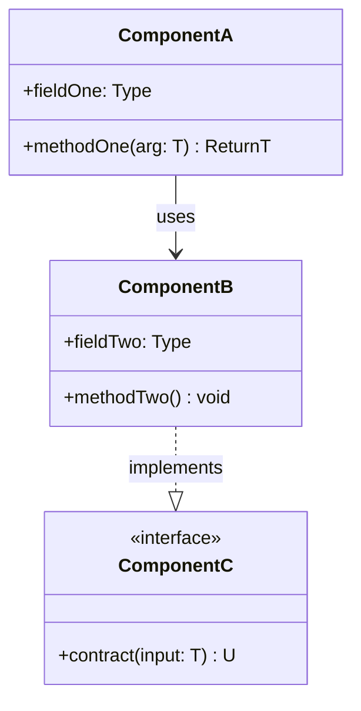
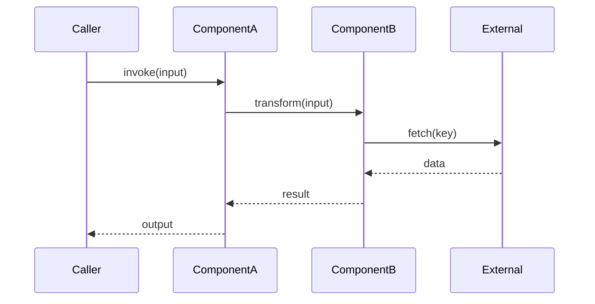
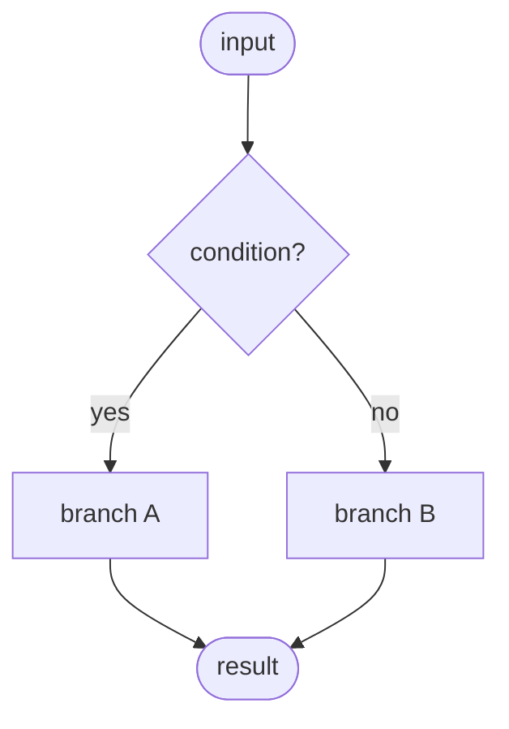
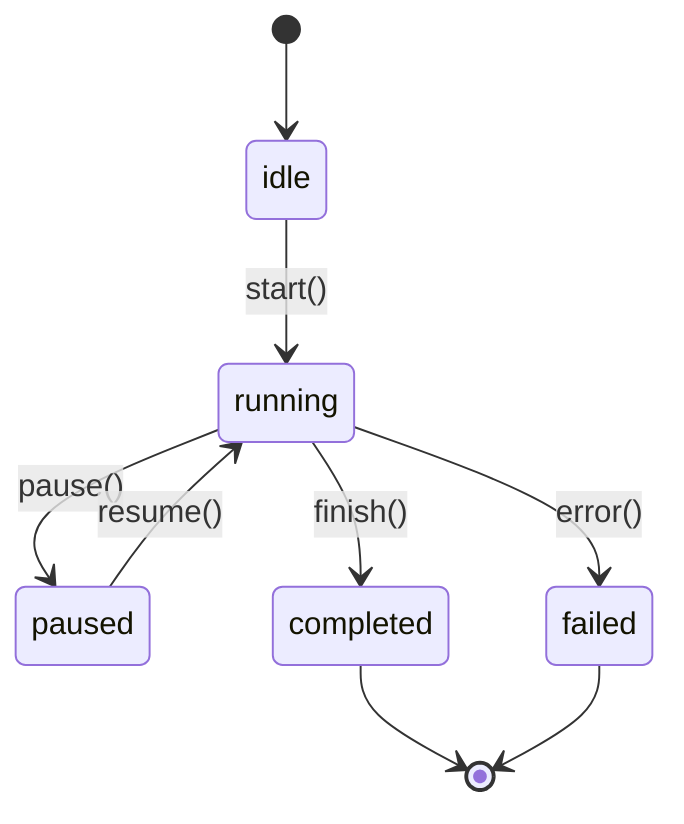
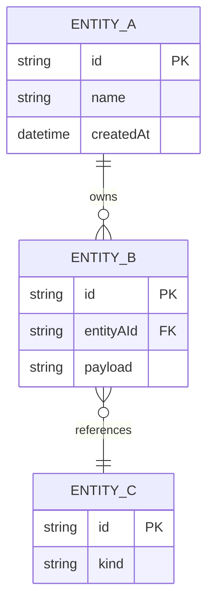
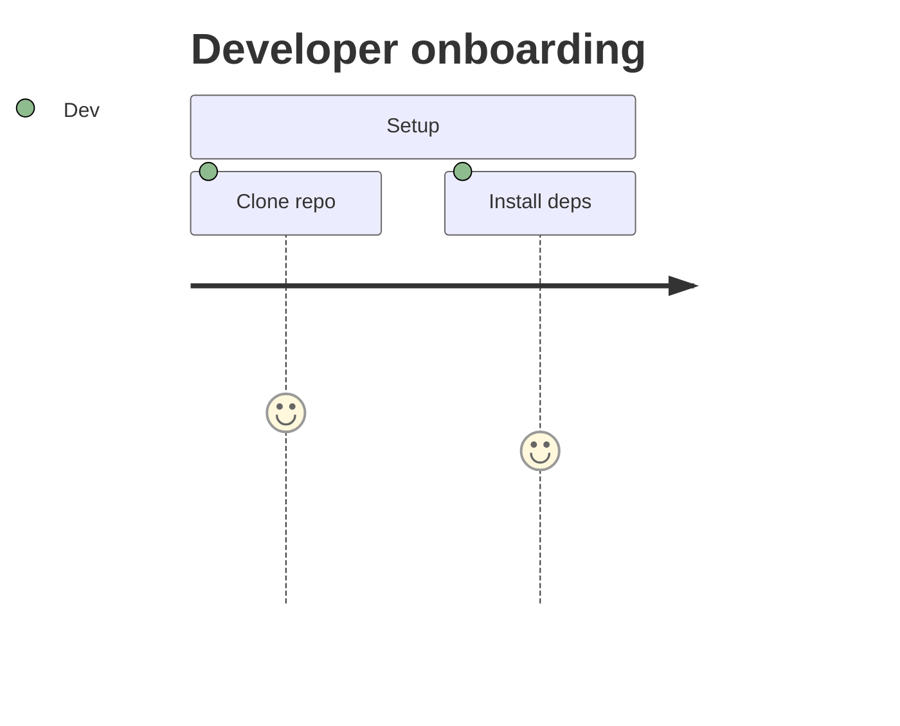
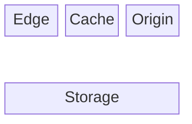

# <project name from package.json>

<!--
SCOPE BANNER:
ARCHITECTURE = how it works. For usage/install, see README.md.
This document explains internal shape, data flow, and design rationale. The
reader may not have read the README — re-establish name and one-line purpose,
then go deep. Never duplicate README usage examples or install steps here.
-->

<!--
ARCHITECTURE TEMPLATE INSTRUCTIONS:
This template produces an ARCHITECTURE.md that complements the README.md. Where the
README answers "how do I use this package", this doc answers "how is this package
built and why". When authoring:

1. Replace every <placeholder> with real content drawn from the actual source tree.
2. Strip ALL HTML comments (including this one) from the final output — they are
   author-facing scaffolding only.
3. Remove OPTIONAL sections that the package genuinely does not have. Do not leave
   empty headings.
4. Every Mermaid diagram must reference only nodes it defines. Validate by pasting
   into https://mermaid.live before shipping.
5. Match the sibling README.template.md vibe:
   - 📌 for the overview
   - emoji-prefixed H2 headings
   - centered TOC with `&emsp;&emsp;` separators and bullets (•)
   - `---` dividers between every major section
   - code fences always language-tagged (mermaid, ts, plain, yaml)
   - comments inside file trees and tables are lowercase

EMOJI PALETTE (do not swap, do not duplicate):
  📌 Overview          💡 Core Concepts      🌐 System Context
  🚶 User Journey      🛰️ Network Topology   🗂️ Module Topology
  🧩 Component          🔄 Data Flow          🔁 State & Lifecycle
  🗃️ Data Model         🧠 Design Patterns    🔌 Extension Points
  🛡️ Invariants         📊 Non-Functional     🧭 Roadmap
  📦 Related Packages
-->

<br/>

📌 **First paragraph:** What is the architectural shape of this package? Name the
central pattern in one sentence (pipeline, layered adapter, state machine, plugin
host, DI container, …) and state what it optimizes for.

**Second paragraph:** Why this architecture? What forces shaped it (performance,
isolation, testability, ecosystem fit)? How does it relate to the package's public
API surface described in the sibling `README.md`?

<!--
TABLE OF CONTENTS — DISCIPLINE:
  • The link row itself must stay on ONE line.
  • Blank lines inside the centering `<div>` are REQUIRED for GitHub's markdown
    parser to render inline links — they do NOT count as multi-line.
  • **TOC budget**: Keep the TOC under 110 **displayed** characters — count emojis, caption text, `• ` separators, and the leading/trailing bullets. Exclude the `<div align="center">` wrapper and markdown link syntax (`[`, `]`, `(#anchor)`). Count each `&emsp;&emsp;•&emsp;&emsp;` separator as 5 displayed chars (`• ` plus two em-spaces on each side), NOT 30 raw source chars. For example, `<div align="center">\n\n•&emsp;&emsp;🔑 [Env](#-env)&emsp;&emsp;•&emsp;&emsp;🧰 [Matrix](#-matrix)&emsp;&emsp;•\n\n</div>` has a displayed length of ~25 chars (`•  🔑 Env  •  🧰 Matrix  •`).
  • Prefer hard-to-spot / high-value anchors.
  • One-word captions where meaning is preserved (Architecture → Topology,
    Component Architecture → Components).
  • Mirror the sibling README.template.md TOC format: centered <div> with a
    blank line on each side of the link row, `&emsp;&emsp;•&emsp;&emsp;` separators,
    leading `•&emsp;&emsp;` + trailing `&emsp;&emsp;•` wrap, one space between emoji and link text.

Sample block (copy & edit, stay under the 110 displayed-char budget):

  <div align="center">

  •&emsp;&emsp;💡 [Concepts](#-concepts)&emsp;&emsp;•&emsp;&emsp;🔄 [Flow](#-flow)&emsp;&emsp;•

  </div>
-->

<br/>
<div align="center">

•&emsp;&emsp;💡 [Concepts](#-core-concepts)&emsp;&emsp;•&emsp;&emsp;🌐 [Context](#-system-context)&emsp;&emsp;•&emsp;&emsp;🔄 [Flow](#-data-flow)&emsp;&emsp;•&emsp;&emsp;🔁 [Cycle](#-state--lifecycle)&emsp;&emsp;•&emsp;&emsp;🗃️ [Model](#-data-model)&emsp;&emsp;•&emsp;&emsp;🛡️ [Rules](#-invariants--contracts)&emsp;&emsp;•

</div>
<br/>

---

<!--
💡 CORE CONCEPTS — ALWAYS include.

Define the vocabulary the rest of the document leans on. Each row is one abstraction
that appears as a type, class, or named role in the source. Keep definitions
one-sentence; deeper explanation belongs in Component Architecture.
-->

## 💡 Core Concepts

<1-sentence intro anchoring the mental model, bold the key abstraction.>

| Concept | Role | Defined In |
| --- | --- | --- |
| `<Concept A>` | <what it represents in the domain> | `<src/file.ts>` |
| `<Concept B>` | <…> | `<src/file.ts>` |
| `<Concept C>` | <…> | `<src/file.ts>` |

---

<!--
🌐 SYSTEM CONTEXT — OPTIONAL — include only when the package is a service,
runner, or library that meaningfully talks to external systems (DBs, queues,
other services, browsers, users). Skip for pure in-process libraries.

The diagram below is a C4-Level-1 context diagram: one box for "this package",
surrounding boxes for every external actor/system, edges labelled with the
protocol or intent.
-->

## 🌐 System Context

<One paragraph describing where this package sits in a larger system.>

<!--
Mermaid only. Use defaults only. No `style`, `fill:`, `stroke:`, hex, or
named colors — GitHub auto-adapts to light/dark theme.
-->



---

<!--
🗂️ MODULE TOPOLOGY — ALWAYS include.

Two artifacts:
  1. A file-tree (depth 2–3) using `plain` fence, with lowercase inline comments.
     Align comments 2 spaces after the longest path WITHIN each directory level
     (not globally). Exclude node_modules, dist, coverage, .turbo, .next, build.
  2. A module dependency graph in Mermaid flowchart LR. Each node is a module
     (directory or index file), edges are import directions. Only include edges
     that genuinely exist in the source; a cycle here is a red flag worth calling
     out in the Invariants section.
  3. A module table — the canonical column order is fixed.
-->

## 🗂️ Module Topology

```plain
src
├── <module-a>   # <what this module owns>
├── <module-b>   # <what this module owns>
├── <utilities>  # <shared helpers, leaf-only>
└── index.ts     # <barrel; re-exports public surface>
```

<!--
Mermaid only. Use defaults only. No `style`, `fill:`, `stroke:`, hex, or
named colors — GitHub auto-adapts to light/dark theme.
-->



| Module | Path | Responsibility | Key Exports |
| --- | --- | --- | --- |
| `<module-a>` | `src/<module-a>` | <one-line responsibility> | `<Export1>`, `<Export2>` |
| `<module-b>` | `src/<module-b>` | <…> | `<Export3>` |
| `<utilities>` | `src/<utilities>` | <…> | — |

---

<!--
🧩 COMPONENT ARCHITECTURE — ALWAYS include.

Draw the internal class/interface relationships. Use Mermaid classDiagram because
it renders cleanly on GitHub and shows inheritance, composition, and method
signatures in one view. For functional codebases, model each top-level function
as a class-like node with its signature as a method (this is idiomatic in Mermaid
and reads fine).

Follow the diagram with a Component table (fixed column order).
-->

## 🧩 Component Architecture

<Paragraph explaining how the components fit together; reference the diagram.>

<!--
Mermaid only. Use defaults only. No `style`, `fill:`, `stroke:`, hex, or
named colors — GitHub auto-adapts to light/dark theme.
-->



| Component | File | Role | Collaborators |
| --- | --- | --- | --- |
| `ComponentA` | `src/<path>.ts` | <one-line role> | `ComponentB` |
| `ComponentB` | `src/<path>.ts` | <…> | `ComponentC` |
| `ComponentC` | `src/<path>.ts` | <…> | — |

---

<!--
🔄 DATA FLOW / PIPELINES — CONDITIONAL.
Include when the package processes input through multiple stages (request
pipeline, ETL, compiler passes, middleware chain). Skip for pure utility
collections with no pipeline shape.

Pick ONE of the two diagram styles:
  • flowchart TD — when the flow has branches/joins and is not a strict
    sequence of actors (e.g. a compiler with parallel passes). Flowchart
    also supports decision trees via diamond-shape nodes: `Q{question?}`.
  • sequenceDiagram — when you want to highlight inter-component messages
    with a clear time axis (e.g. request → classifier → delay → retry).

Use the sequenceDiagram form by default; it reads better for per-request flows.
-->

## 🔄 Data Flow

<Paragraph naming the phases in order; link each phase to the file that owns it.>

<!--
Mermaid only. Use defaults only. No `style`, `fill:`, `stroke:`, hex, or
named colors — GitHub auto-adapts to light/dark theme.
-->



<!--
DECISION FLOWCHART — OPTIONAL.
Include when a phase branches on classified input (severity, routing,
retry eligibility). Diamond nodes (`Q{text?}`) mark the decision points.
Mermaid only. Use defaults only. No `style`, `fill:`, `stroke:`, hex, or
named colors — GitHub auto-adapts to light/dark theme.
-->



---

<!--
🔁 STATE & LIFECYCLE — CONDITIONAL.
Include only if any entity in the package has observable states that consumers
must reason about (connection, transaction, session, retry attempt, job, file
handle). Skip for stateless libraries.

Always use stateDiagram-v2 for GitHub compatibility.
-->

## 🔁 State & Lifecycle

<Paragraph naming the states and the trigger for each transition.>

<!--
Mermaid only. Use defaults only. No `style`, `fill:`, `stroke:`, hex, or
named colors — GitHub auto-adapts to light/dark theme.
-->



---

<!--
🗃️ DATA MODEL — CONDITIONAL.
Include when the package owns a persistent schema (Prisma, SQL, document store)
or a non-trivial in-memory data structure worth drawing. Use erDiagram for
relational schemas; switch to classDiagram for in-memory object graphs.
-->

## 🗃️ Data Model

<Paragraph naming the entities and their relationships.>

<!--
Mermaid only. Use defaults only. No `style`, `fill:`, `stroke:`, hex, or
named colors — GitHub auto-adapts to light/dark theme.
-->



---

<!--
🚶 USER JOURNEY — CONDITIONAL.
Include when the package has a user-facing flow across screens, CLI steps,
or onboarding stages. Use `journey` to show the happy path with per-step
affect scores (1–5) so the reader can spot friction.

Mermaid only. Use defaults only. No `style`, `fill:`, `stroke:`, hex, or
named colors — GitHub auto-adapts to light/dark theme.
-->

## 🚶 User Journey

<Paragraph naming the flow and the primary actor.>



---

<!--
🌐 NETWORK / TOPOLOGY — CONDITIONAL.
Include for services and IaC stacks where the reader needs to see deployment
boxes, network tiers, or regional layout. Prefer `block-beta` for deployment
boxes and `C4Context` for system-context framing. These read better than
plain flowcharts for topology.

Mermaid only. Use defaults only. No `style`, `fill:`, `stroke:`, hex, or
named colors — GitHub auto-adapts to light/dark theme.
-->

## 🛰️ Network Topology

<Paragraph naming the tiers and trust boundaries.>



---

<!--
🧠 DESIGN PATTERNS — ALWAYS include.

List only patterns that are deliberately applied, not accidental similarities.
Intent column must explain the local motivation — not a textbook definition.
-->

## 🧠 Design Patterns

| # | Pattern | Intent | Implemented In |
| --- | --- | --- | --- |
| 1 | `<Pattern Name>` | <why we picked it here> | `<src/file.ts>` |
| 2 | `<Pattern Name>` | <…> | `<src/file.ts>` |
| 3 | `<Pattern Name>` | <…> | `<src/file.ts>` |

---

<!--
🔌 EXTENSION POINTS — CONDITIONAL.
Include if consumers can plug in new behavior (strategies, adapters, plugins,
middleware). Omit for closed libraries.

The Steps column is a short numbered recipe; keep it imperative and grounded
in real file paths.
-->

## 🔌 Extension Points

<Paragraph framing the package as extensible and listing the extension seams.>

| Extension | Steps | Files Touched | Tests |
| --- | --- | --- | --- |
| `<Add a new X>` | 1. <step> 2. <step> 3. <step> | `<file-a>`, `<file-b>` | `<spec-path>` |
| `<Add a new Y>` | <…> | <…> | <…> |

---

<!--
🛡️ INVARIANTS & CONTRACTS — ALWAYS include.

The rules that MUST hold for the system to be correct. Each row answers:
  Rule (what must always be true) → Why (failure mode if violated) →
  Enforced By (where/how the invariant is guarded: types, asserts, tests).

Keep the list small (3–8 entries). If you can't explain the "why", it isn't
a real invariant.
-->

## 🛡️ Invariants & Contracts

| # | Rule | Why | Enforced By |
| --- | --- | --- | --- |
| 1 | <rule in plain english> | <failure mode> | `<type / assert / test>` |
| 2 | <…> | <…> | <…> |
| 3 | <…> | <…> | <…> |

---

<!--
📊 NON-FUNCTIONAL MATRIX — OPTIONAL.
Include for packages that have quantified non-functional goals (latency
targets, bundle size caps, throughput SLAs, security posture, observability
hooks). Omit for pure utilities where every row would be "n/a".
-->

## 📊 Non-Functional Matrix

| Concern | Target | Strategy | Instrumentation |
| --- | --- | --- | --- |
| Performance | <e.g. p99 ≤ 5ms> | <algorithm, caching, pooling> | <metric / trace / benchmark> |
| Security | <threat model summary> | <defense in depth> | <audit hook> |
| Observability | <logs / metrics / traces> | <structured events> | <exporter> |
| Reliability | <error budget> | <retries, idempotency> | <alert> |

---

<!--
🧭 ROADMAP — OPTIONAL.
Include only if the team maintains a public-facing architectural backlog. If
the roadmap lives in an issue tracker, link there and skip the section.
-->

## 🧭 Roadmap

- **<Short-term item>** — <rationale / acceptance>
- **<Mid-term item>** — <…>
- **<Long-term item>** — <…>

---

<!--
📦 RELATED PACKAGES — ALWAYS include.
Link workspace-internal siblings only. Use relative paths. Keep each line
to "what is it + what is the relationship".
-->

## 📦 Related Packages

- [`@scope/<sibling-a>`](../<sibling-a>): <relationship in one line>
- [`@scope/<sibling-b>`](../<sibling-b>): <relationship in one line>

---

<!--
WHEN TO SPLIT — author guidance, not a section consumers read.
If this ARCHITECTURE grows beyond ~600 lines or spans 3+ distinct subsystems,
shard it instead of shipping one mega-doc. Pattern below.
-->

## When to Split

If this ARCHITECTURE exceeds ~600 lines or covers 3+ distinct subsystems
(e.g. `src/api`, `src/worker`, `src/db`), split into:
- `ARCHITECTURE.md` — index + cross-cutting concerns + system context diagram
- `ARCHITECTURE-<subsystem>.md` — one per subsystem, deep on its internals

The top-level ARCHITECTURE.md links to each part file.

---

<!--
FOOTER NOTES:
- Do not add License / Contributing / Support — these live at the monorepo root.
- Keep the document scannable: a reader should grok the architecture in 5 minutes.
- Diagrams are the primary payload; prose exists to frame them.
-->
