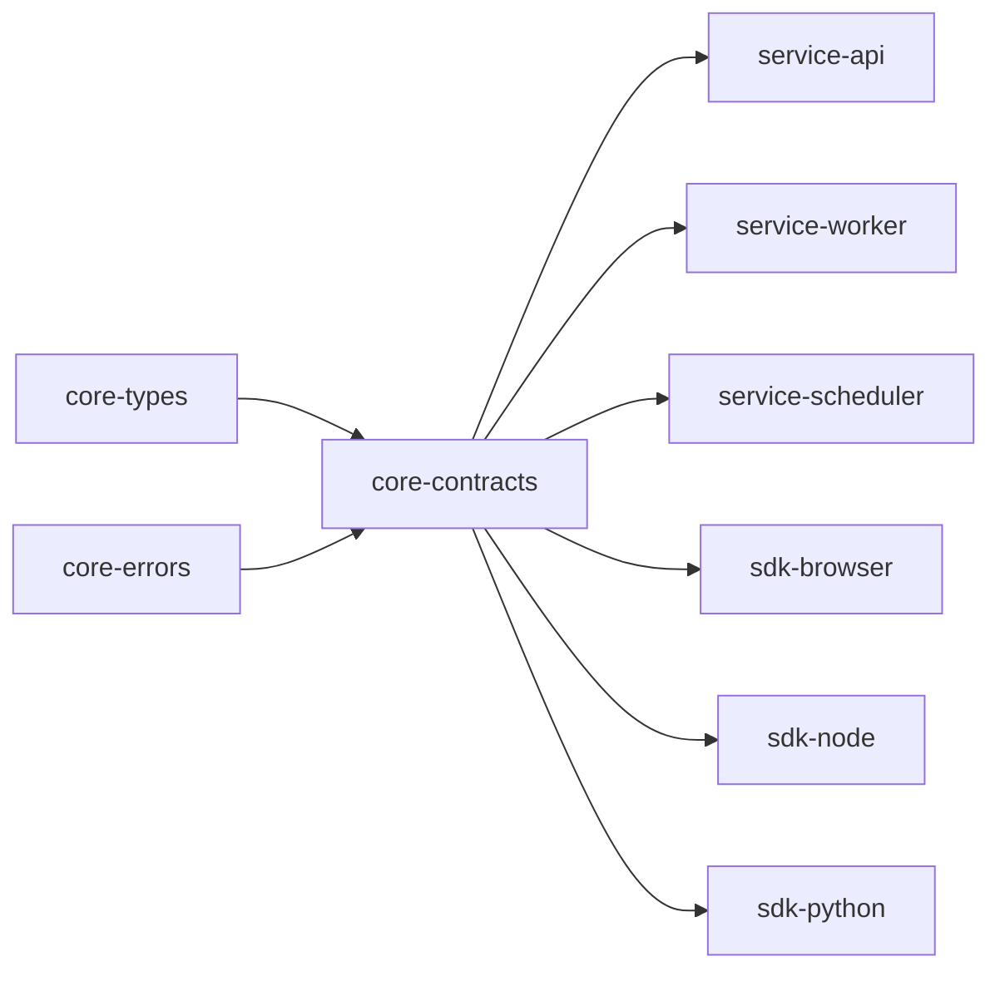

# @theriety/platform

<br/>
📌 `@theriety/platform` is the monorepo root for the Theriety developer platform — a federated set of TypeScript packages that share a single toolchain, release train, and type system. It solves the "three-repo drift" problem: when domain types, runtime services, and client SDKs live in separate repos, they drift out of sync and cross-team changes become archaeology.

This workspace ships three peer subsystems — **core** (domain types, contracts, errors), **services** (queue worker, api gateway, scheduler), and **sdks** (browser, node, python) — under one `pnpm` workspace so a breaking change in `core` immediately surfaces as a CI failure in every dependent service and SDK. The root is intentionally thin: it owns tooling, CI, and release orchestration only; every package stays self-contained with its own README, tests, and version.

<br/>
<div align="center">

•&emsp;&emsp;🗂️ [Layout](#-layout)&emsp;&emsp;•&emsp;&emsp;📦 [Packages](#-packages)&emsp;&emsp;•&emsp;&emsp;📖 [Flows](#-workflows)&emsp;&emsp;•&emsp;&emsp;🔗 [Graph](#-graph)&emsp;&emsp;•&emsp;&emsp;📐 [Arch](#-architecture)&emsp;&emsp;•&emsp;&emsp;📦 [Related](#-related-external-packages)&emsp;&emsp;•

</div>
<br/>

---

## 🗂️ Layout

```plain
platform
├── packages
│   ├── core      # domain types, contracts, errors — zero runtime deps
│   ├── services  # long-running processes (api, worker, scheduler)
│   └── sdks      # client libraries published to consumers
├── apps          # internal example/demo apps that dogfood the SDKs
├── tools         # build, release, and codegen scripts
└── pnpm-workspace.yaml
```

Every top-level folder under `packages` is a *subsystem*; every nested folder under a subsystem is a publishable package. The workspace holds 14 packages today; the monorepo root itself is private and never published.

---

## 📦 Packages

| Package | Purpose | Status |
| --- | --- | --- |
| [`@theriety/core-types`](./packages/core/types) | Shared domain types (User, Tenant, Job) | stable |
| [`@theriety/core-errors`](./packages/core/errors) | Error taxonomy and classification | stable |
| [`@theriety/core-contracts`](./packages/core/contracts) | Zod schemas for public API surfaces | stable |
| [`@theriety/service-api`](./packages/services/api) | REST + GraphQL gateway | stable |
| [`@theriety/service-worker`](./packages/services/worker) | Background job runner | stable |
| [`@theriety/service-scheduler`](./packages/services/scheduler) | Cron and delayed job dispatch | beta |
| [`@theriety/sdk-browser`](./packages/sdks/browser) | Browser client with fetch adapter | stable |
| [`@theriety/sdk-node`](./packages/sdks/node) | Node client with pooling | stable |
| [`@theriety/sdk-python`](./packages/sdks/python) | Python client (codegen from contracts) | beta |
| [`@theriety/tools-release`](./tools/release) | Changesets-driven release orchestrator | internal |

---

## 📖 Workflows

### Quick Start

```sh
pnpm install          # bootstrap all workspaces
pnpm build            # build every package in topological order
pnpm test             # run unit tests across the workspace
```

### Adding a package

1. Decide the subsystem (`core`, `services`, `sdks`) based on what the package depends on: a package that ships types belongs in `core`; one that runs a process belongs in `services`; one consumed by end users belongs in `sdks`.
2. Create `packages/<subsystem>/<name>` with `package.json`, `tsconfig.json`, `src/index.ts`, and a `README.md` seeded from the monorepo template.
3. Run `pnpm install` from the root so the new workspace is linked.
4. Add the package to the relevant ARCHITECTURE subsystem file (`ARCHITECTURE-<subsystem>.md`).

### Running one service

```sh
pnpm --filter @theriety/service-worker dev    # start worker with hot reload
pnpm --filter @theriety/service-api dev       # start api gateway
```

The `--filter` flag scopes any script to a single workspace; `--filter ...worker` would also include packages the worker depends on.

### Cross-package linking

`pnpm` handles symlinks automatically. When `@theriety/service-worker` declares a dependency on `@theriety/core-types` with the `workspace:*` protocol, `pnpm install` symlinks the local copy so changes are picked up without publish. The release tool rewrites `workspace:*` to real version ranges at publish time.

---

## 🔗 Graph



Edges are import direction. Inter-service communication happens via the shared Queue, not imports — see [`ARCHITECTURE-services.md`](./ARCHITECTURE-services.md) for the queue-mediated runtime flow. Every service and SDK pins the same `core-contracts` version, so a contract bump triggers coordinated updates across the dependency graph.

---

## 📐 Architecture

Three peer subsystems (`packages/core`, `packages/services`, `packages/sdks`) under one toolchain; the architecture is sharded into an index plus one part file per subsystem.

See [`ARCHITECTURE.md`](./ARCHITECTURE.md) for the subsystem index and cross-cutting patterns.

---

## 📦 Related External Packages

- [`pnpm`](https://pnpm.io): the workspace manager that underpins the root; chosen over npm/yarn for strict peer resolution and disk-efficient linking
- [`changesets`](https://github.com/changesets/changesets): version and changelog orchestration used by `@theriety/tools-release`
- [`turbo`](https://turbo.build): task runner that caches build/test output across the workspace

---
