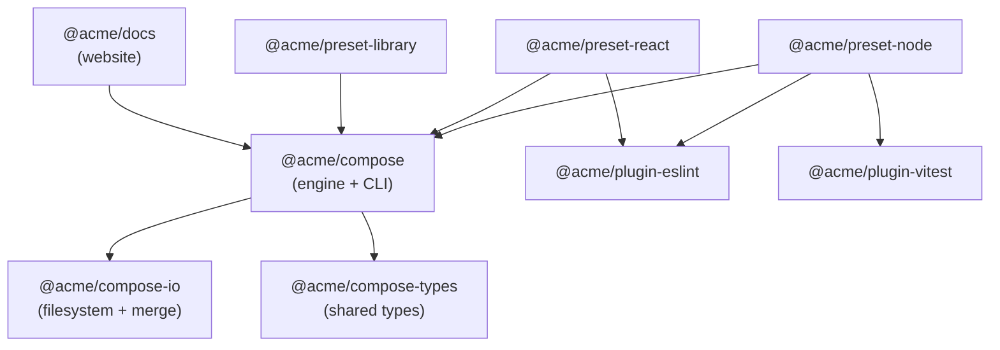
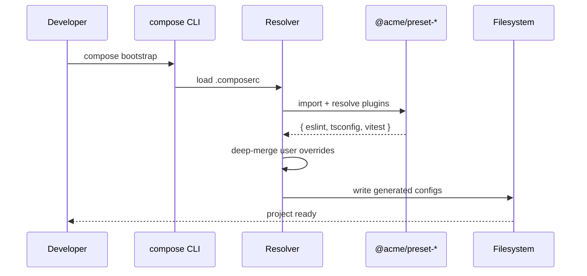

<div align="center">

<!-- insert logo here: docs/logo.svg (200x200) -->


# @acme/compose

**Composable workspace configuration for modern JavaScript projects.**
_Stop copy-pasting configs. Extend a preset. Override what you need. Ship._

[](https://www.npmjs.com/package/@acme/compose)
[](https://github.com/acme/compose/actions)
[](https://codecov.io/gh/acme/compose)
[](./LICENSE)
[](https://www.npmjs.com/package/@acme/compose)
[](https://discord.gg/acme-compose)

</div>

<!-- insert hero image showing before/after or architecture diagram -->

<br/>
<div align="center">

•&emsp;&emsp;⚡ [Start](#-quick-start)&emsp;&emsp;•&emsp;&emsp;🏗️ [Structure](#️-monorepo-structure)&emsp;&emsp;•&emsp;&emsp;📦 [Packages](#-packages)&emsp;&emsp;•&emsp;&emsp;🔍 [How](#-how-it-works)&emsp;&emsp;•&emsp;&emsp;🛠️ [Usage](#-usage)&emsp;&emsp;•&emsp;&emsp;📖 [Docs](#-documentation)&emsp;&emsp;•

</div>
<br/>

---

## ⚡ Quick Start

Install the engine and a preset that matches your stack:

```bash
npm install --save-dev @acme/compose @acme/preset-node
```

Add a minimal `.composerc` to your project root:

```jsonc
{
  "preset": "@acme/preset-node",
  "config": {
    "tsconfig": { "compilerOptions": { "target": "ES2023" } },
    "eslint": { "rules": { "no-console": "off" } }
  }
}
```

Bootstrap your workspace:

```bash
npx compose bootstrap
```

Done. You now have a curated `tsconfig.json`, `eslint.config.js`, `prettier.config.js`, and `vitest.config.ts` — all driven from a single source of truth.

---

## 🏗️ Monorepo Structure



The repo is a pnpm workspace organised into four layers:

- **`packages/core/*`** — the engine, CLI, shared types, and filesystem helpers. Pure logic, zero opinions.
- **`packages/presets/*`** — opinionated, publishable bundles that compose plugins into ready-to-use setups (Node service, React app, library).
- **`packages/plugins/*`** — single-tool adapters (ESLint, Prettier, Vitest, TypeScript). Each owns its own merge logic and templates.
- **`apps/docs`** — the public documentation site built with Next.js, deployed from `main`.

---

## 📦 Packages

### Foundation

| Package | Description | Link |
| --- | --- | --- |
| `@acme/compose` | Engine + CLI that resolves presets and writes config files | [packages/core/compose](./packages/core/compose) |
| `@acme/compose-types` | Shared TypeScript interfaces for presets and plugins | [packages/core/types](./packages/core/types) |
| `@acme/compose-io` | Filesystem utilities and deep-merge strategies | [packages/core/io](./packages/core/io) |

### Runtime presets

| Package | Description | Link |
| --- | --- | --- |
| `@acme/preset-node` | Node 20+ service preset (TypeScript, ESLint, Vitest) | [packages/presets/node](./packages/presets/node) |
| `@acme/preset-react` | React + Vite app preset | [packages/presets/react](./packages/presets/react) |
| `@acme/preset-library` | Dual-CJS/ESM library preset with API extractor | [packages/presets/library](./packages/presets/library) |

### Extension plugins

| Package | Description | Link |
| --- | --- | --- |
| `@acme/plugin-eslint` | Flat-config ESLint bundle with sensible defaults | [packages/plugins/eslint](./packages/plugins/eslint) |
| `@acme/plugin-vitest` | Vitest config with coverage thresholds and JUnit output | [packages/plugins/vitest](./packages/plugins/vitest) |
| `@acme/plugin-prettier` | Prettier config + ignore file generator | [packages/plugins/prettier](./packages/plugins/prettier) |
| `@acme/plugin-typescript` | Strict `tsconfig` base with project-reference helpers | [packages/plugins/typescript](./packages/plugins/typescript) |

### Integrations

| Package | Description | Link |
| --- | --- | --- |
| `@acme/compose-turbo` | Turborepo task graph integration | [packages/integrations/turbo](./packages/integrations/turbo) |
| `@acme/compose-changesets` | Changesets-powered release flow for presets | [packages/integrations/changesets](./packages/integrations/changesets) |

---

## 🔍 How It Works

`@acme/compose` is a two-phase engine: **resolve** (load preset graph, merge configs) and **materialise** (write files to disk as symlinks or generated artefacts).



Presets declare _what_ plugins they need; plugins declare _how_ to build a config artefact. The engine handles resolution, merging, and file I/O — nothing else. This keeps the core small (~6 KB gzipped) and plugins independently testable.

---

## 🛠️ Usage

### Basic

Point `.composerc` at a preset and run `compose bootstrap`. That is the entire happy path.

```jsonc
{ "preset": "@acme/preset-node" }
```

### Advanced customisation

Extend multiple presets and override fields inline. Objects deep-merge; arrays concatenate unless you opt into `"$replace": true`.

```jsonc
{
  "preset": ["@acme/preset-library", "@acme/preset-react"],
  "config": {
    "tsconfig": {
      "compilerOptions": { "paths": { "~/*": ["./src/*"] } }
    },
    "eslint": {
      "rules": { "@typescript-eslint/no-explicit-any": "error" }
    },
    "vitest": { "test": { "coverage": { "lines": 90 } } }
  }
}
```

### CLI

```bash
compose bootstrap          # generate all config files
compose bootstrap --dry    # preview without writing
compose update             # bump preset versions safely
compose doctor             # diagnose drift between preset and disk
compose eject <plugin>     # materialise a plugin's config into the repo
```

---

## 🏢 Monorepo Development

Requires **Node 20+** and **pnpm 9+**.

```bash
# clone and bootstrap
git clone https://github.com/acme/compose.git
cd compose
pnpm install

# build all packages in topological order
pnpm build

# run the full test suite
pnpm test

# link the CLI locally for smoke-testing on another repo
pnpm --filter @acme/compose link --global
```

Useful filtered commands:

```bash
pnpm --filter @acme/preset-node test
pnpm --filter "./packages/plugins/*" build
pnpm --filter @acme/docs dev
```

---

## 📖 Documentation

- **Docs site:** <https://compose.acme.dev>
- **Getting started guide:** <https://compose.acme.dev/guide>
- **API reference:** <https://compose.acme.dev/api>
- **Examples gallery:** [`examples/`](./examples) — 12 runnable sample repos covering Node services, React apps, Electron, libraries, and more.
- **RFCs:** [`docs/rfcs/`](./docs/rfcs) — accepted and in-flight design proposals.

---

## 🤝 Contributing

We welcome contributors of every experience level. Start with [CONTRIBUTING.md](./CONTRIBUTING.md), then:

1. Pick an issue labelled [`good first issue`](https://github.com/acme/compose/labels/good%20first%20issue).
2. Fork, branch, and run `pnpm changeset` to describe your change.
3. Open a draft PR early — we review design before code.
4. Ensure `pnpm verify` (lint + typecheck + test + build) passes.

Join the [Discord](https://discord.gg/acme-compose) to chat with maintainers and other contributors.

---

## ❓ FAQ

**Does `@acme/compose` replace Turborepo / Nx / Lerna?**
No. It focuses on _configuration composition_. Pair it with Turbo or Nx for task orchestration — we ship a first-party Turbo integration.

**How is this different from `tsconfig/bases` or shareable ESLint configs?**
Those solve one tool at a time. Compose treats your entire toolchain (TS, ESLint, Prettier, Vitest, Prettier, bundlers) as a single composable graph, so a single preset update keeps everything consistent.

**Can I use it without a monorepo?**
Yes. A single-package repo works identically — just install the engine and a preset.

**What happens when I eject?**
`compose eject <plugin>` copies the generated file into your repo and removes it from the managed set. You own it from then on.

**Is it production-ready?**
We use it across 40+ internal repos at Acme, and it powers several mid-sized OSS projects. Semver discipline is enforced via Changesets.

**How do I write my own preset?**
See [guide/authoring-presets](https://compose.acme.dev/guide/authoring-presets). A preset is a package that exports a `PresetDefinition` — roughly 30 lines of TypeScript.

---

## 🌟 Philosophy

1. **Composition over configuration.** Every layer should be a small, replaceable function — never a monolith.
2. **Presets are code, not JSON.** Types, logic, and testability matter more than a clever config format.
3. **Drift is a bug.** If your preset and your repo disagree, `compose doctor` should tell you exactly where and how to fix it.
4. **The engine is small and stable.** Features live in plugins and presets so the core rarely needs to change.
5. **Boring defaults, bold escape hatches.** The easy path should be trivially correct; the hard path should always be reachable.

---

## 📄 License

[MIT](./LICENSE) © Acme Contributors
