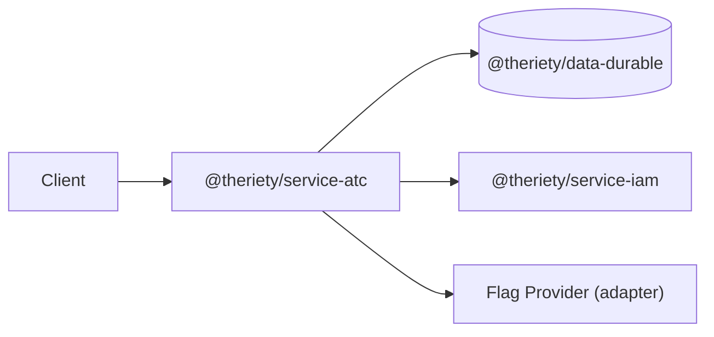

# @theriety/service-atc

<br/>

📌 ATC = Air Traffic Control — an automation flow orchestration service and feature-flag broker. It is a stateless compute layer that coordinates automation retries, pauses, and resumes via idempotent operations. It solves the "where does flag logic live?" problem by making feature flags a first-class service dependency instead of a library import scattered across every call site.

The `@theriety/service-atc` package is **manifest-driven**: each operation (`listFlows`, `retryFlow`, `pauseFlow`, `resumeFlow`) is declared with its auth scope, input/output schema, and peer dependencies. The service layer holds zero state — all persistence is delegated to `@theriety/data-durable`, and all flag evaluation is delegated to a pluggable flag provider (`dummy`, `vercel-flags`, `launchdarkly`, `env-only`). Teams adopt it to get a single, auditable surface for automation control without having to embed a flag SDK in every client.

<br/>
<div align="center">

•&emsp;&emsp;💡 [Concept](#-core-concept)&emsp;&emsp;•&emsp;&emsp;🔑 [Env](#-environment-variables)&emsp;&emsp;•&emsp;&emsp;🔌 [Ops](#-operations)&emsp;&emsp;•&emsp;&emsp;🧰 [Matrix](#-capability-matrix)&emsp;&emsp;•&emsp;&emsp;🔗 [Deps](#-service-dependencies)&emsp;&emsp;•&emsp;&emsp;📖 [Usage](#-usage)&emsp;&emsp;•

</div>
<br/>

---

## 💡 Core Concept

The service is **stateless** in the strict sense: every operation is idempotent compute with no internal storage and no observable side effect other than those delegated to peer controllers. This lets the runtime scale horizontally, restart freely, and be tested without fixtures.

- **Idempotent compute**: replaying a request with the same input produces the same observable result
- **No internal storage**: no caches, no session maps, no in-memory queues — all reads and writes go through peer data controllers (`@theriety/data-durable`)
- **Operation contract**: `(input) → (output)` with side effects bounded by declared peers; any state change is a peer call, never a local mutation
- **Manifest-first**: the operation manifest is the single source of truth for routing, schema validation, and auth-scope enforcement

The manifest itself is a small declarative file at the service package root, consumed by the `@theriety/service` framework to register operations and bind scope guards:

```typescript
// manifest.ts (declarative spec consumed by @theriety/service)
export default {
  name: 'atc',
  operations: import('#operations/index'),
  scopes: { 'control:process:*:retry': 'retryFlow' }
};
```

> **Pick this over a microservice when** your service is pure compute + routing over peer data (no internal state to persist, no adapters to DBs/brokers) and your operations are idempotent function calls the service framework can invoke. Pick the microservice template when you need the hexagonal adapter + state-machine story.

The deeper rationale — including the adapter contract for flag providers and the auth chain — lives in the sibling [`ARCHITECTURE.md`](./ARCHITECTURE.md).

---

## 🔑 Environment Variables

Configuration is read from the process environment at boot. Invalid values abort startup with a descriptive error so misconfigured deployments never serve traffic.

- `ATC_FLAG_PROVIDER`: which flag provider adapter to load — one of `dummy`, `vercel-flags`, `launchdarkly`, `env-only`; required
- `ATC_DATA_DURABLE_URL`: base URL of the peer `@theriety/data-durable` controller; required
- `ATC_AUTH_JWKS`: JWKS endpoint the service uses to verify caller scopes; required
- `ATC_DEFAULT_SCOPE_ENFORCE`: `strict` or `permissive`; defaults to `strict`. In `permissive` mode missing scopes log a warning instead of rejecting the call — intended for staging only
- `ATC_VERCEL_FLAGS_TOKEN`: read-only token for the Vercel Flags SDK; required when `ATC_FLAG_PROVIDER=vercel-flags`
- `ATC_LAUNCHDARKLY_SDK_KEY`: server-side SDK key; required when `ATC_FLAG_PROVIDER=launchdarkly`

---

## 🔌 Operations

The manifest exposes four operations. Each is gated by an authorization scope and returns a typed `Flow` value object; inputs and outputs are validated at the boundary.

| Operation | Scope required | Input | Returns |
| --- | --- | --- | --- |
| `listFlows` | `control:process:*:read` | `{ workspaceId }` | `Flow[]` |
| `retryFlow` | `control:process:*:retry` | `{ flowId, maxAttempts? }` | `Flow` |
| `pauseFlow` | `control:process:*:pause` | `{ flowId, reason }` | `Flow` |
| `resumeFlow` | `control:process:*:resume` | `{ flowId }` | `Flow` |

Scopes use the grammar `<domain>:<resource>:<wildcard>:<verb>` — `*` matches any resource id.

Adding a new operation is a three-line change to the manifest plus one file under `src/operations/<name>/index.ts` — the dispatcher picks it up automatically.

---

## 🧰 Support Matrix

Flag evaluation is delegated to one of four providers. The matrix below lists which evaluation features each provider supports; pick the provider whose row matches the product requirements.

| Provider | Live-update | Targeting rules | Rollout % | Overrides |
| --- | --- | --- | --- | --- |
| `dummy` | ❌ | ❌ | ❌ | ✅ |
| `vercel-flags` | ✅ | ✅ | ✅ | ✅ |
| `launchdarkly` | ✅ | ✅ | ✅ | ✅ |
| `env-only` | ❌ | ⚠️ single-tier | ❌ | ✅ |

Legend: ✅ Supported &nbsp; ⚠️ Partial &nbsp; ❌ Unsupported &nbsp; 🔜 Planned

---

## 🔗 Service Dependencies

The service has three runtime peers; all three are wired through URL-based discovery at boot and health-checked on `/health`.



- `@theriety/data-durable`: peer data controller that owns all flow state
- `@theriety/service-iam`: enriches the caller context with session, tenant, and scope chain
- Flag Provider: the adapter selected by `ATC_FLAG_PROVIDER` (see Support Matrix)

---

## 📖 Usage

### Example: Register a handler via the service factory

Handlers are bound to the manifest by the factory; the factory returns a typed `Service` whose method names match the manifest entries one-to-one.

```ts
import { createService } from '@theriety/service-atc';

const service = createService({
  flagProvider: 'vercel-flags',
  durableUrl: process.env.ATC_DATA_DURABLE_URL!,
  jwksUrl: process.env.ATC_AUTH_JWKS!,
});

await service.start();
```

### Example: Call `retryFlow` from a client context

The generated client mirrors the manifest; scope checks happen on the server side, but the client refuses to send a request missing a required input field.

```ts
import { createClient } from '@theriety/service-atc/client';

const atc = createClient({ baseUrl: 'https://atc.example.com' });

const flow = await atc.retryFlow({
  flowId: 'flow_42',
  maxAttempts: 3,
});

console.log(flow.status);
```

---

## 📐 Architecture

A stateless hexagonal service: operations live under `src/operations`, flag-provider adapters under `src/flag`, and `src/factory.ts` wires them into a runnable service bound to peer URLs.

```plain
src                # key files; see ARCHITECTURE for full layout
├── operations     # one folder per operation manifest entry
├── flag           # flag provider adapters (dummy, vercel, env-only)
├── client.ts      # generated client factory
├── factory.ts     # service factory
└── index.ts
```

See [`ARCHITECTURE.md`](./ARCHITECTURE.md) for the operation lifecycle, auth chain, and flag adapter contract.

---

## 📦 Related Packages

- [`@theriety/data-durable`](../data-durable): peer state store — owns flow records and transition logs
- [`@theriety/service-iam`](../service-iam): session and scope enrichment used by every operation
- [`@theriety/adapter-vercel-flags`](../adapter-vercel-flags): first-party `FlagProvider` backed by Vercel Flags
- [`@theriety/adapter-launchdarkly`](../adapter-launchdarkly): first-party `FlagProvider` backed by LaunchDarkly

---
