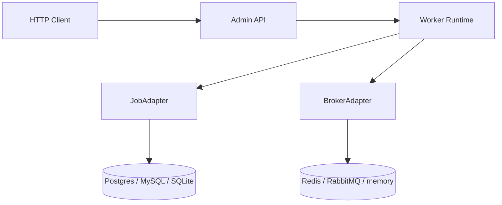
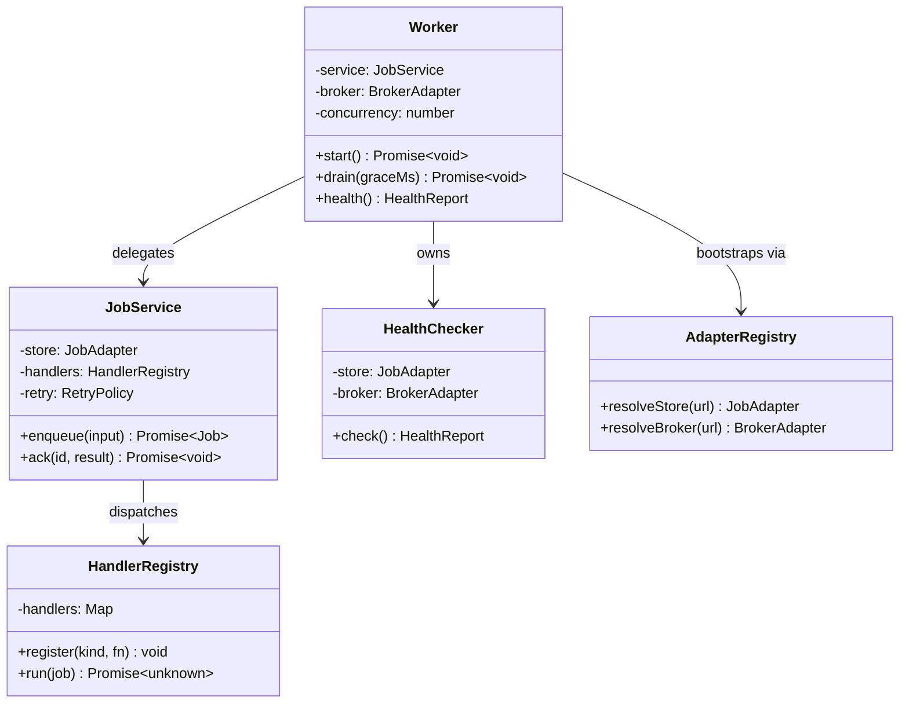

# @theriety/queue-worker

> ARCHITECTURE = how it works. For usage, see readme.md.

<br/>

📌 **Architectural shape:** `@theriety/queue-worker` is a **hexagonal (ports & adapters) microservice**. A thin domain core owns job lifecycle rules and delegates every I/O concern — durable storage, broker dispatch, admin HTTP — to a port whose implementation is chosen at boot. The core compiles with zero runtime dependencies; all vendor SDKs (`pg`, `mysql2`, `ioredis`, `amqplib`) live behind adapter packages.

**Why this shape:** background workers accrete tribal knowledge fast — one team picks Redis + BullMQ, another picks Postgres-only polling, a third wants SQLite for local development. Treating storage and dispatch as independent ports means the domain rules (idempotency, retry, at-least-once delivery, safe drain) are written once and audited in one place, while the integration-testing surface shrinks to a single contract test per adapter. The public API described in [`readme.md`](../../readme.md) is the narrowest possible surface that still expresses these rules.

<br/>
<div align="center">

•&emsp;&emsp;🌐 [Context](#-system-context)&emsp;&emsp;•&emsp;&emsp;🗂️ [Modules](#-module-topology)&emsp;&emsp;•&emsp;&emsp;🔄 [Flow](#-data-flow)&emsp;&emsp;•&emsp;&emsp;🔁 [Cycle](#-state--lifecycle)&emsp;&emsp;•&emsp;&emsp;🗃️ [Model](#-data-model)&emsp;&emsp;•&emsp;&emsp;🛡️ [Rules](#-invariants--contracts)&emsp;&emsp;•

</div>
<br/>

---

## 💡 Core Concepts

The six abstractions below are the entire vocabulary of the worker. Everything in the source tree is collaboration between them; if a contributor understands these, the rest reads as glue.

| Concept | Role | Defined In |
| --- | --- | --- |
| `Job` | durable record of work to do; has `kind`, `payload`, `status`, `idempotencyKey` | `src/domain/job.ts` |
| `Attempt` | one execution of a job; carries `startedAt`, `endedAt`, `error`, `durationMs` | `src/domain/attempt.ts` |
| `Handler` | user-registered function that executes a specific `kind`; receives typed payload and `JobContext` | `src/domain/handler.ts` |
| `JobAdapter` | port for durable storage; implementations talk to Postgres, MySQL, SQLite, or memory | `src/adapters/job-adapter.ts` |
| `BrokerAdapter` | port for dispatch hints; Redis streams, RabbitMQ, or memory | `src/adapters/broker-adapter.ts` |
| `IdempotencyKey` | optional unique tag on a `Job`; second enqueue with the same key returns the first job | `src/domain/idempotency.ts` |

The **job lifecycle** is: `queued → running → {succeeded | failed | retrying}` with a terminal `dead_letter` for exhausted retries. The **adapter contract** promises at-least-once delivery — handlers must be idempotent, and the `idempotencyKey` is the seam that makes this cheap.

---

## 🌐 System Context

The worker sits between producer services (which enqueue jobs over HTTP or in-process) and downstream systems (which the handlers call). Storage and broker are the only stateful external dependencies; everything else is ephemeral.



---

## 🗂️ Module Topology

```plain
src
├── api         # fastify admin HTTP surface
│   ├── routes  # /jobs, /health, /admin/drain
│   └── server.ts
├── worker      # pull loop, lease, drain coordination
│   ├── worker.ts
│   ├── lease.ts
│   └── health.ts
├── adapters    # port interfaces and built-in implementations
│   ├── job-adapter.ts
│   ├── broker-adapter.ts
│   ├── postgres
│   ├── mysql
│   ├── sqlite
│   └── memory
├── domain      # pure lifecycle rules, no I/O
│   ├── job-service.ts
│   ├── handler-registry.ts
│   ├── retry-policy.ts
│   └── idempotency.ts
└── index.ts    # public barrel
```

| Module | Path | Responsibility | Key Exports |
| --- | --- | --- | --- |
| `api` | `src/api` | expose admin endpoints over HTTP | `createAdminServer` |
| `worker` | `src/worker` | run the pull loop, manage leases and drain | `Worker`, `createWorker` |
| `adapters` | `src/adapters` | define ports and ship built-in implementations | `JobAdapter`, `BrokerAdapter` |
| `domain` | `src/domain` | enforce lifecycle rules with zero I/O | `JobService`, `HandlerRegistry` |

---

## 🧩 Component Architecture

`JobService` is the only component that sees the whole lifecycle; it composes a `JobAdapter` for durability, a `HandlerRegistry` for dispatch, and a `RetryPolicy` for attempt scheduling. `Worker` wraps `JobService` with a pull loop and a `BrokerAdapter` for low-latency dispatch.



| Component | File | Role | Collaborators |
| --- | --- | --- | --- |
| `Worker` | `src/worker/worker.ts` | pull loop, concurrency, drain | `JobService`, `BrokerAdapter` |
| `JobService` | `src/domain/job-service.ts` | enforces lifecycle rules | `JobAdapter`, `HandlerRegistry`, `RetryPolicy` |
| `HandlerRegistry` | `src/domain/handler-registry.ts` | typed dispatch table | `Handler` |
| `HealthChecker` | `src/worker/health.ts` | aggregate adapter status | `JobAdapter`, `BrokerAdapter` |
| `AdapterRegistry` | `src/adapters/registry.ts` | URL → adapter resolution at boot | — |

---
