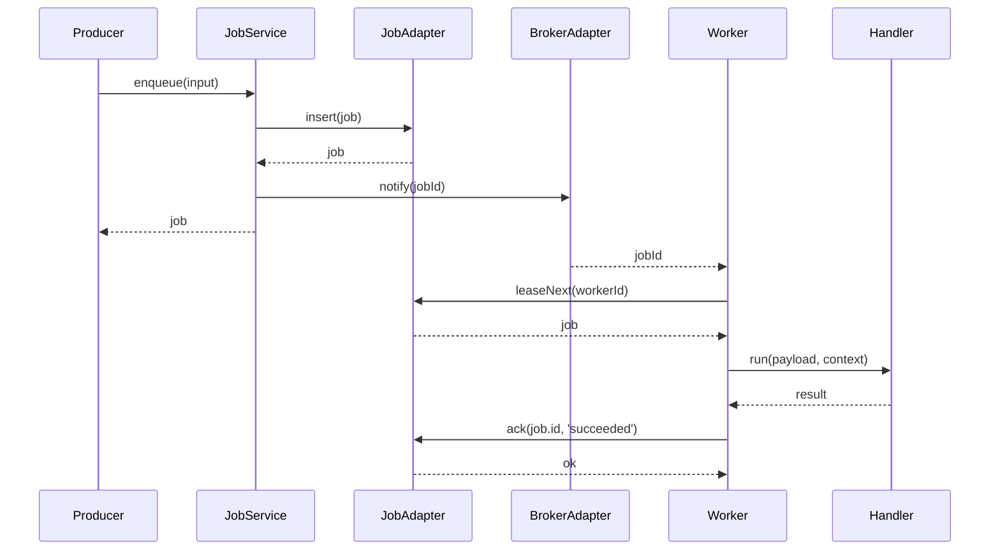
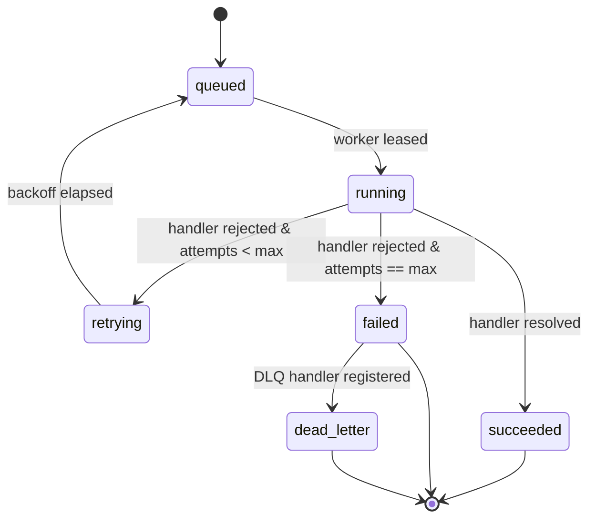
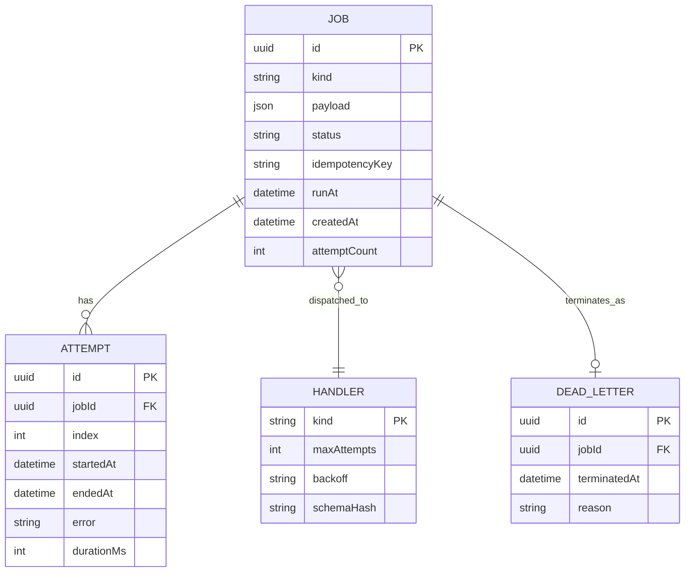
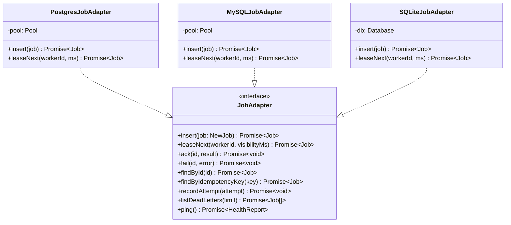

## 🔄 Data Flow

The sequence below shows a successful enqueue-through-ack. Producer and worker may run in the same process or on different hosts; the flow is identical.

---

## 🔁 State & Lifecycle

Every job is modelled as a small state machine. Transitions are gated by `JobService` so the set of legal moves is centralised; adapters never mutate state directly.

---

## 🗃️ Data Model

The schema is four tables; there are no cross-table joins in the hot path, so every supported database reaches comparable throughput.

---

## 🧩 Adapter Interface

Every storage adapter implements the same `JobAdapter` contract. The interface is nine methods; built-in implementations inherit from nothing, composition only.

---
