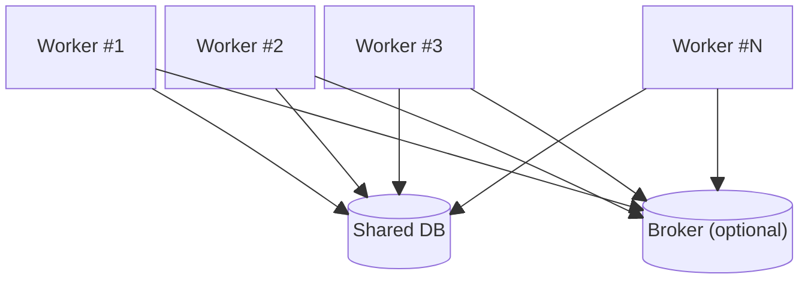

## 🧠 Design Patterns

| # | Pattern | Intent | Implemented In |
| --- | --- | --- | --- |
| 1 | Ports & Adapters (Hexagonal) | isolate lifecycle rules from storage and broker concerns so the core tests stay I/O-free | `src/domain`, `src/adapters` |
| 2 | Strategy | swap retry shape (`exponential`, `linear`, `fixed`) without touching the worker | `src/domain/retry-policy.ts` |
| 3 | Circuit Breaker | stop hammering a broker that has been failing for `resetMs` so restart storms cannot form | `src/worker/broker-breaker.ts` |
| 4 | Registry | resolve `QUEUE_DB_URL` to the correct adapter and cache the instance for the process lifetime | `src/adapters/registry.ts` |
| 5 | Lease | cooperative visibility timeout gives crashed workers' jobs back to the pool without global locks | `src/worker/lease.ts` |

---

## 🔌 Extension Points

The worker is explicitly designed to be extended by dropping a new adapter or handler into place. All extension seams are typed and covered by shared contract tests.

| Extension | Steps | Files Touched | Tests |
| --- | --- | --- | --- |
| Add a new `JobAdapter` | 1. implement the nine-method `JobAdapter` interface 2. add the URL scheme to `AdapterRegistry.resolveStore` 3. run the shared contract test suite | `src/adapters/<name>`, `src/adapters/registry.ts` | `spec/contract/job-adapter.spec.ts` |
| Add a new `BrokerAdapter` | 1. implement `publish` and `subscribe` 2. add the URL scheme to `AdapterRegistry.resolveBroker` 3. run the shared contract test suite | `src/adapters/<name>`, `src/adapters/registry.ts` | `spec/contract/broker-adapter.spec.ts` |
| Add a new Handler | 1. call `defineJob` with a Zod schema 2. call `worker.register(def, fn)` 3. add a spec driving the handler | `<consumer>/jobs/<kind>.ts` | `<consumer>/jobs/<kind>.spec.ts` |

---

## 🛡️ Invariants & Contracts

| # | Rule | Why | Enforced By |
| --- | --- | --- | --- |
| 1 | every `Job` is persisted before any broker notification fires | a broker crash between `notify` and `insert` would lose the job | transactional boundary in `JobService.enqueue` + integration test |
| 2 | handlers run under at-least-once semantics; consumers must be idempotent | leases can expire under GC pauses and be re-delivered | documented in `JobContext`; `idempotencyKey` column + unique index |
| 3 | lifecycle transitions only happen inside `JobService` | scattered state updates produce ghost states that are impossible to reason about | `JobAdapter` has no generic `setStatus` / `update` method; status transitions happen only via the specific verbs `insert`, `ack`, `fail`, `recordAttempt` |
| 4 | drain never cancels in-flight handlers before `graceMs` elapses | cutting a running handler leaves the downstream in an unknown state | timer + `AbortSignal` wired in `Worker.drain` |
| 5 | adapter `ping()` is side-effect-free | `/health` is called frequently and must not perturb the system | contract test forbids writes during `ping()` |

### Concurrency & Back-pressure

`QUEUE_CONCURRENCY` gates both the pull rate and the count of inflight handlers — the worker will not lease a new job while `inflight >= QUEUE_CONCURRENCY`. The circuit breaker (Design Pattern #3) trips the `BrokerAdapter` on repeated failures so restart storms cannot form; pulls pause until the breaker resets. Drain composes cleanly with concurrency: `Worker.drain` stops new pulls immediately, and the concurrency cap continues to apply to in-flight handlers so the invariants above never violate during shutdown.

---

## 📊 Observability

Every production deployment exposes the same three signal surfaces; dashboards and alerts can therefore be built once and reused across adapters.

### Metrics

Prometheus-compatible names; all metrics carry `kind`, `adapter`, and `workerId` labels unless noted.

| Kind | Name | Purpose |
| --- | --- | --- |
| counter | `queue_jobs_enqueued_total` | jobs accepted by `JobService.enqueue` |
| counter | `queue_jobs_succeeded_total` | handler resolutions |
| counter | `queue_jobs_failed_total` | terminal failures after retries exhausted |
| counter | `queue_jobs_retried_total` | scheduled retry attempts |
| histogram | `queue_job_duration_seconds` | handler wall-clock time |
| histogram | `queue_job_latency_seconds` | enqueue-to-start latency |
| gauge | `queue_inflight` | handlers currently running on this worker |
| gauge | `queue_depth` | visible `queued` rows per `kind` |

### Log fields

Every log line emitted by the runtime is JSON with at least these keys: `jobId`, `kind`, `attempt`, `workerId`, `adapter`, `latencyMs`, `outcome`. The `outcome` field takes one of `succeeded | retrying | failed | dead_letter`.

### Trace spans

OpenTelemetry spans are emitted per phase; the parent span carries `jobId` so the whole lifecycle stitches together in a trace backend:

- `queue.enqueue` — producer-side insertion (child of the HTTP span that triggered it)
- `queue.lease` — worker pull + visibility lease
- `queue.handler` — user handler execution
- `queue.ack` — status transition + adapter write

---

## 🚢 Deployment Topology

The worker runtime is stateless; all state lives in the `JobAdapter`. Horizontal scale is achieved by running N identical replicas that all point at the same database; an optional broker fans dispatch hints out so replicas do not need to poll.

**Scale properties:**
- any replica can lease any job; the visibility lease prevents double-execution
- adding replicas increases throughput until DB connection pool or broker becomes the bottleneck
- rolling deploys drain each replica via `SIGTERM` → `Worker.drain(graceMs)` before terminating

**Single-writer caveat:** the `@theriety/adapter-sqlite` adapter serialises all writes through one file; running more than one replica against the same SQLite file will contend on the write lock. Use SQLite only for local development or single-replica deployments; use Postgres or MySQL for horizontal scale.

---

## 📦 Related Packages

- [`@theriety/queue-client`](../queue-client): thin enqueue-only client for services that should not embed the worker runtime
- [`@theriety/adapter-postgres`](../adapter-postgres): first-party `JobAdapter` implementation; reference for new adapters
- [`@theriety/adapter-redis-broker`](../adapter-redis-broker): first-party `BrokerAdapter` implementation
- [`@theriety/retry`](../retry): underlying retry engine reused by `RetryPolicy`

---
