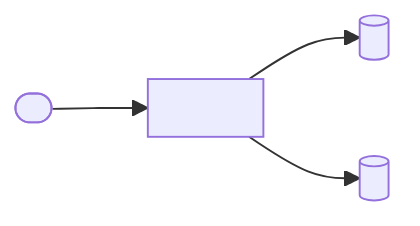
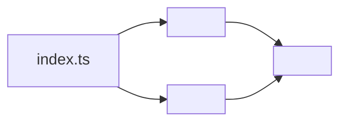

# <project name from package.json>

<!--
SCOPE BANNER:
ARCHITECTURE = how it works. For usage/install, see readme.md.
This document explains internal shape, data flow, and design rationale. The
reader may not have read the README — re-establish name and one-line purpose,
then go deep. Never duplicate README usage examples or install steps here.
-->

<!--
ARCHITECTURE TEMPLATE INSTRUCTIONS:
This template produces `docs/architecture/<architecture-slug>.md` and complements the package README. Where the
README answers "how do I use this package", this doc answers "how is this package
built and why". When authoring:

1. Replace every <placeholder> with real content drawn from the actual source tree.
2. Strip ALL HTML comments (including this one) from the final output — they are
   author-facing scaffolding only.
3. Remove OPTIONAL sections that the package genuinely does not have. Do not leave
   empty headings.
4. Every Mermaid diagram must reference only nodes it defines. Validate by pasting
   into https://mermaid.live before shipping.
5. Match the sibling `../README.template.md` vibe:
   - 📌 for the overview
   - emoji-prefixed H2 headings
   - centered TOC with `&emsp;&emsp;` separators and bullets (•)
   - `---` dividers between every major section
   - code fences always language-tagged (mermaid, ts, plain, yaml)
   - comments inside file trees and tables are lowercase

EMOJI PALETTE (do not swap, do not duplicate):
  📌 Overview          💡 Core Concepts      🌐 System Context
  🚶 User Journey      🛰️ Network Topology   🗂️ Module Topology
  🧩 Component          🔄 Data Flow          🔁 State & Lifecycle
  🗃️ Data Model         🧠 Design Patterns    🔌 Extension Points
  🛡️ Invariants         📊 Non-Functional     🧭 Roadmap
  📦 Related Packages
-->

<br/>

📌 **First paragraph:** What is the architectural shape of this package? Name the
central pattern in one sentence (pipeline, layered adapter, state machine, plugin
host, DI container, …) and state what it optimizes for.

**Second paragraph:** Why this architecture? What forces shaped it (performance,
isolation, testability, ecosystem fit)? How does it relate to the package's public
API surface described in the package `readme.md`?

<!--
TABLE OF CONTENTS — DISCIPLINE:
  • The link row itself must stay on ONE line.
  • Blank lines inside the centering `<div>` are REQUIRED for GitHub's markdown
    parser to render inline links — they do NOT count as multi-line.
  • **TOC budget**: Keep the TOC under 110 **displayed** characters — count emojis, caption text, `• ` separators, and the leading/trailing bullets. Exclude the `<div align="center">` wrapper and markdown link syntax (`[`, `]`, `(#anchor)`). Count each `&emsp;&emsp;•&emsp;&emsp;` separator as 5 displayed chars (`• ` plus two em-spaces on each side), NOT 30 raw source chars. For example, `<div align="center">\n\n•&emsp;&emsp;🔑 [Env](#-env)&emsp;&emsp;•&emsp;&emsp;🧰 [Matrix](#-matrix)&emsp;&emsp;•\n\n</div>` has a displayed length of ~25 chars (`•  🔑 Env  •  🧰 Matrix  •`).
  • Prefer hard-to-spot / high-value anchors.
  • One-word captions where meaning is preserved (Architecture → Topology,
    Component Architecture → Components).
  • Mirror the sibling `../README.template.md` TOC format: centered <div> with a
    blank line on each side of the link row, `&emsp;&emsp;•&emsp;&emsp;` separators,
    leading `•&emsp;&emsp;` + trailing `&emsp;&emsp;•` wrap, one space between emoji and link text.

Sample block (copy & edit, stay under the 110 displayed-char budget):

  <div align="center">

  •&emsp;&emsp;💡 [Concepts](#-concepts)&emsp;&emsp;•&emsp;&emsp;🔄 [Flow](#-flow)&emsp;&emsp;•

  </div>
-->

<br/>
<div align="center">

•&emsp;&emsp;💡 [Concepts](#-core-concepts)&emsp;&emsp;•&emsp;&emsp;🌐 [Context](#-system-context)&emsp;&emsp;•&emsp;&emsp;🔄 [Flow](#-data-flow)&emsp;&emsp;•&emsp;&emsp;🔁 [Cycle](#-state--lifecycle)&emsp;&emsp;•&emsp;&emsp;🗃️ [Model](#-data-model)&emsp;&emsp;•&emsp;&emsp;🛡️ [Rules](#-invariants--contracts)&emsp;&emsp;•

</div>
<br/>

---

<!--
💡 CORE CONCEPTS — ALWAYS include.

Define the vocabulary the rest of the document leans on. Each row is one abstraction
that appears as a type, class, or named role in the source. Keep definitions
one-sentence; deeper explanation belongs in Component Architecture.
-->

## 💡 Core Concepts

<1-sentence intro anchoring the mental model, bold the key abstraction.>

| Concept | Role | Defined In |
| --- | --- | --- |
| `<Concept A>` | <what it represents in the domain> | `<src/file.ts>` |
| `<Concept B>` | <…> | `<src/file.ts>` |
| `<Concept C>` | <…> | `<src/file.ts>` |

---

<!--
🌐 SYSTEM CONTEXT — OPTIONAL — include only when the package is a service,
runner, or library that meaningfully talks to external systems (DBs, queues,
other services, browsers, users). Skip for pure in-process libraries.

The diagram below is a C4-Level-1 context diagram: one box for "this package",
surrounding boxes for every external actor/system, edges labelled with the
protocol or intent.
-->

## 🌐 System Context

<One paragraph describing where this package sits in a larger system.>

<!--
Mermaid only. Use defaults only. No `style`, `fill:`, `stroke:`, hex, or
named colors — GitHub auto-adapts to light/dark theme.
-->



---

<!--
🗂️ MODULE TOPOLOGY — ALWAYS include.

Two artifacts:
  1. A file-tree (depth 2–3) using `plain` fence, with lowercase inline comments.
     Align comments 2 spaces after the longest path WITHIN each directory level
     (not globally). Exclude node_modules, dist, coverage, .turbo, .next, build.
  2. A module dependency graph in Mermaid flowchart LR. Each node is a module
     (directory or index file), edges are import directions. Only include edges
     that genuinely exist in the source; a cycle here is a red flag worth calling
     out in the Invariants section.
  3. A module table — the canonical column order is fixed.
-->

## 🗂️ Module Topology

```plain
src
├── <module-a>   # <what this module owns>
├── <module-b>   # <what this module owns>
├── <utilities>  # <shared helpers, leaf-only>
└── index.ts     # <barrel; re-exports public surface>
```

<!--
Mermaid only. Use defaults only. No `style`, `fill:`, `stroke:`, hex, or
named colors — GitHub auto-adapts to light/dark theme.
-->



| Module | Path | Responsibility | Key Exports |
| --- | --- | --- | --- |
| `<module-a>` | `src/<module-a>` | <one-line responsibility> | `<Export1>`, `<Export2>` |
| `<module-b>` | `src/<module-b>` | <…> | `<Export3>` |
| `<utilities>` | `src/<utilities>` | <…> | — |

---

<!--
🧩 COMPONENT ARCHITECTURE — ALWAYS include.

Draw the internal class/interface relationships. Use Mermaid classDiagram because
it renders cleanly on GitHub and shows inheritance, composition, and method
signatures in one view. For functional codebases, model each top-level function
as a class-like node with its signature as a method (this is idiomatic in Mermaid
and reads fine).

Follow the diagram with a Component table (fixed column order).
-->
