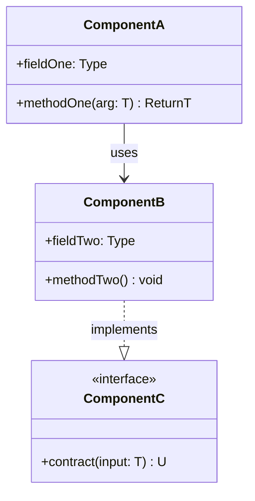
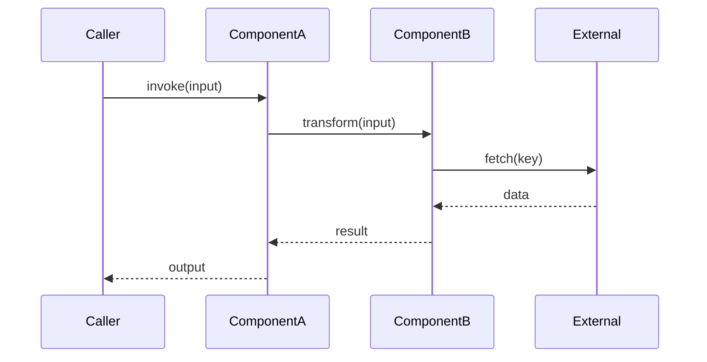
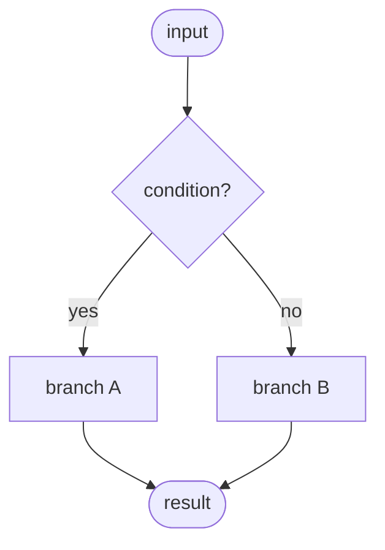
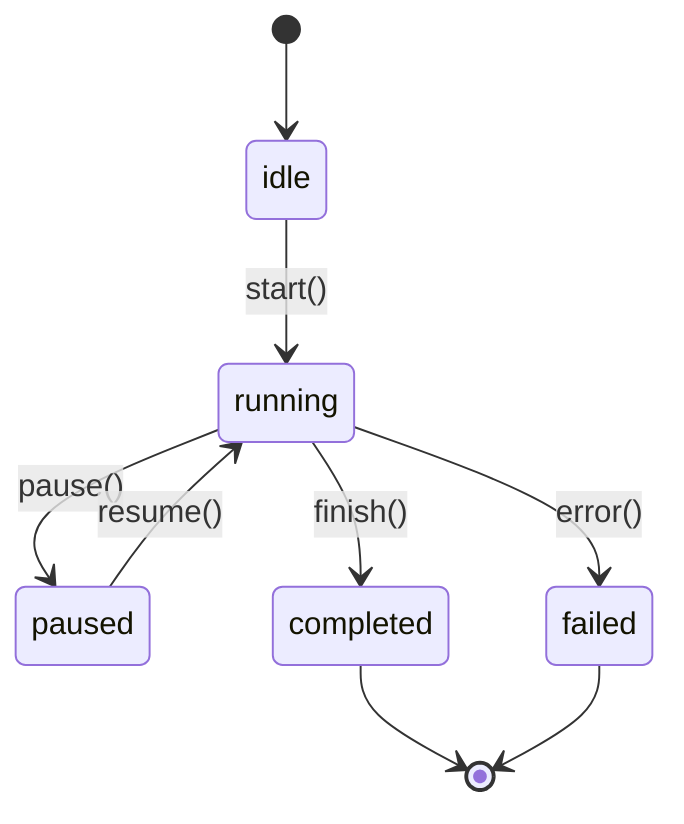
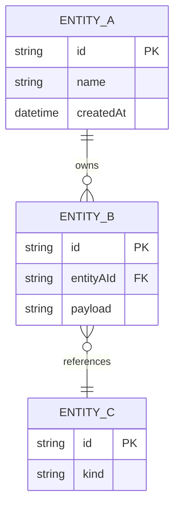
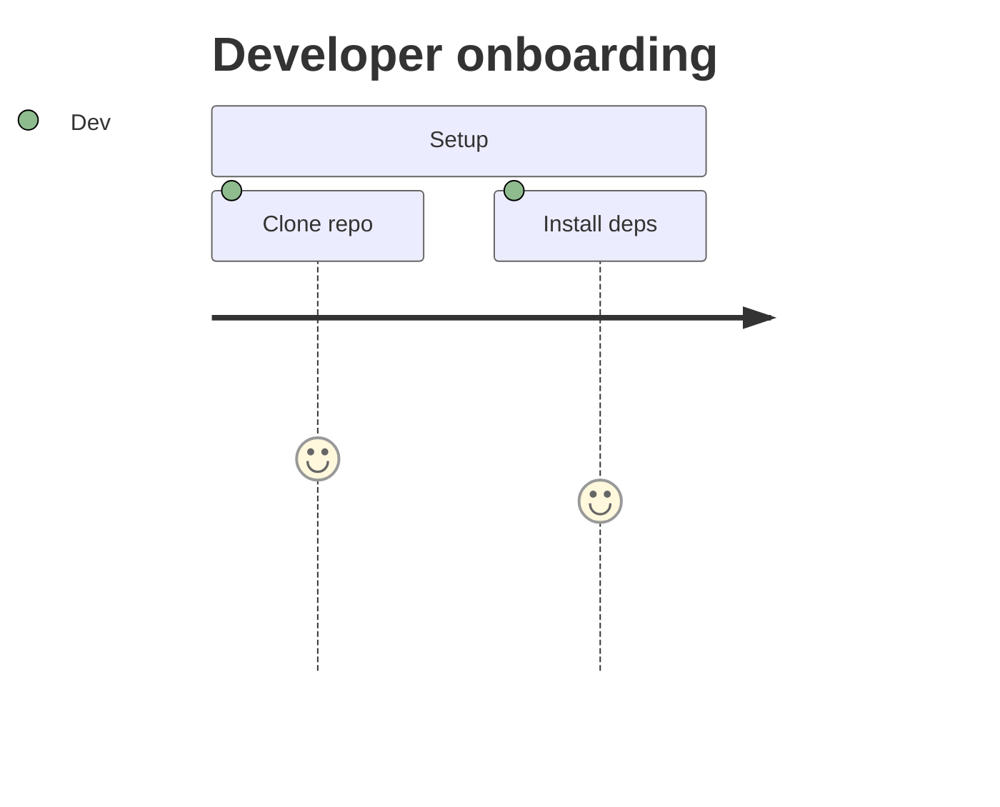
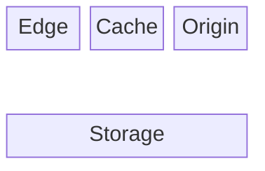

## 🧩 Component Architecture

<Paragraph explaining how the components fit together; reference the diagram.>

<!--
Mermaid only. Use defaults only. No `style`, `fill:`, `stroke:`, hex, or
named colors — GitHub auto-adapts to light/dark theme.
-->

| Component | File | Role | Collaborators |
| --- | --- | --- | --- |
| `ComponentA` | `src/<path>.ts` | <one-line role> | `ComponentB` |
| `ComponentB` | `src/<path>.ts` | <…> | `ComponentC` |
| `ComponentC` | `src/<path>.ts` | <…> | — |

---

<!--
🔄 DATA FLOW / PIPELINES — CONDITIONAL.
Include when the package processes input through multiple stages (request
pipeline, ETL, compiler passes, middleware chain). Skip for pure utility
collections with no pipeline shape.

Pick ONE of the two diagram styles:
  • flowchart TD — when the flow has branches/joins and is not a strict
    sequence of actors (e.g. a compiler with parallel passes). Flowchart
    also supports decision trees via diamond-shape nodes: `Q{question?}`.
  • sequenceDiagram — when you want to highlight inter-component messages
    with a clear time axis (e.g. request → classifier → delay → retry).

Use the sequenceDiagram form by default; it reads better for per-request flows.
-->

## 🔄 Data Flow

<Paragraph naming the phases in order; link each phase to the file that owns it.>

<!--
Mermaid only. Use defaults only. No `style`, `fill:`, `stroke:`, hex, or
named colors — GitHub auto-adapts to light/dark theme.
-->

<!--
DECISION FLOWCHART — OPTIONAL.
Include when a phase branches on classified input (severity, routing,
retry eligibility). Diamond nodes (`Q{text?}`) mark the decision points.
Mermaid only. Use defaults only. No `style`, `fill:`, `stroke:`, hex, or
named colors — GitHub auto-adapts to light/dark theme.
-->

---

<!--
🔁 STATE & LIFECYCLE — CONDITIONAL.
Include only if any entity in the package has observable states that consumers
must reason about (connection, transaction, session, retry attempt, job, file
handle). Skip for stateless libraries.

Always use stateDiagram-v2 for GitHub compatibility.
-->

## 🔁 State & Lifecycle

<Paragraph naming the states and the trigger for each transition.>

<!--
Mermaid only. Use defaults only. No `style`, `fill:`, `stroke:`, hex, or
named colors — GitHub auto-adapts to light/dark theme.
-->

---

<!--
🗃️ DATA MODEL — CONDITIONAL.
Include when the package owns a persistent schema (Prisma, SQL, document store)
or a non-trivial in-memory data structure worth drawing. Use erDiagram for
relational schemas; switch to classDiagram for in-memory object graphs.
-->

## 🗃️ Data Model

<Paragraph naming the entities and their relationships.>

<!--
Mermaid only. Use defaults only. No `style`, `fill:`, `stroke:`, hex, or
named colors — GitHub auto-adapts to light/dark theme.
-->

---

<!--
🚶 USER JOURNEY — CONDITIONAL.
Include when the package has a user-facing flow across screens, CLI steps,
or onboarding stages. Use `journey` to show the happy path with per-step
affect scores (1–5) so the reader can spot friction.

Mermaid only. Use defaults only. No `style`, `fill:`, `stroke:`, hex, or
named colors — GitHub auto-adapts to light/dark theme.
-->

## 🚶 User Journey

<Paragraph naming the flow and the primary actor.>

---

<!--
🌐 NETWORK / TOPOLOGY — CONDITIONAL.
Include for services and IaC stacks where the reader needs to see deployment
boxes, network tiers, or regional layout. Prefer `block-beta` for deployment
boxes and `C4Context` for system-context framing. These read better than
plain flowcharts for topology.

Mermaid only. Use defaults only. No `style`, `fill:`, `stroke:`, hex, or
named colors — GitHub auto-adapts to light/dark theme.
-->

## 🛰️ Network Topology

<Paragraph naming the tiers and trust boundaries.>

---

<!--
🧠 DESIGN PATTERNS — ALWAYS include.

List only patterns that are deliberately applied, not accidental similarities.
Intent column must explain the local motivation — not a textbook definition.
-->
