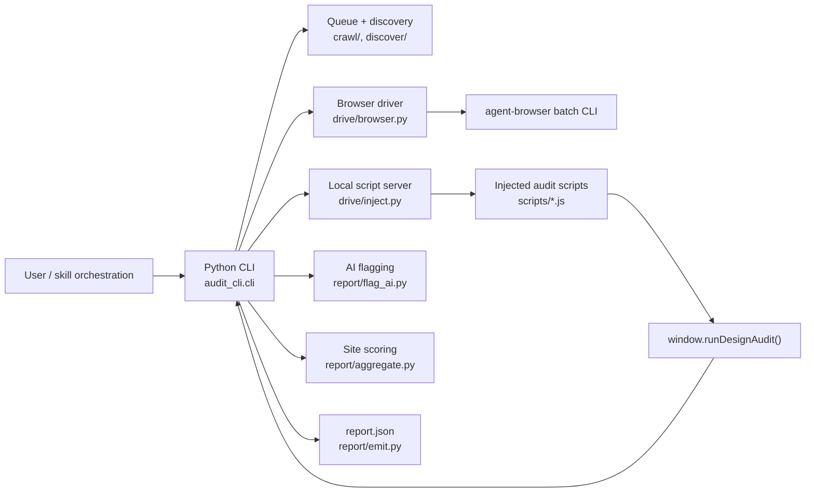
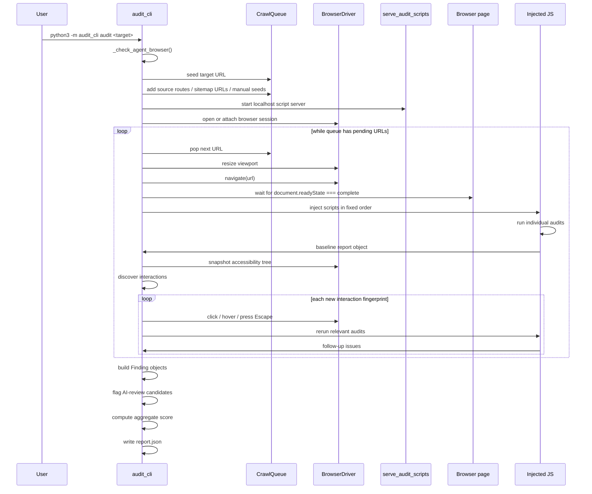
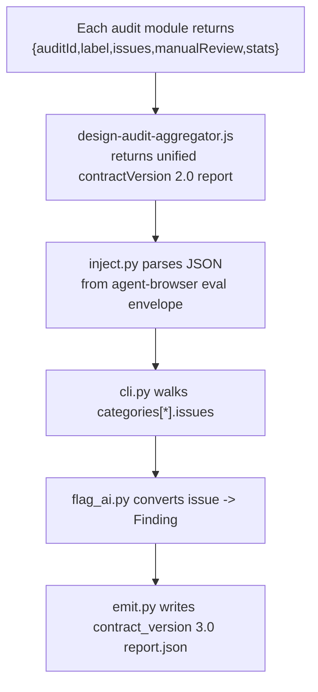

# 🧭 Audit Skill Architecture

## 🎯 Purpose

`plugins/web/skills/audit` is a hybrid audit system:

- A Python CLI owns crawl planning, browser control, interaction replay, deduplication, report shaping, and JSON emission.
- Injected browser-side JavaScript owns the actual DOM/CSS/layout audits.
- `agent-browser` is the execution substrate for page control and JavaScript evaluation.

The overall design is intentionally split so that:

- Python can coordinate a site-level crawl and normalize outputs.
- JavaScript can inspect real rendered DOM, CSSOM, geometry, and computed styles inside the page.

## 🧱 Top-Level Shape



## 🗂️ Directory Map

| Path | Responsibility |
| --- | --- |
| [`cli/audit_cli/cli.py`](/Users/alvis/Repositories/.claude/plugins/web/skills/audit/cli/audit_cli/cli.py) | CLI entrypoint, crawl orchestration, report assembly |
| [`cli/audit_cli/crawl/page.py`](/Users/alvis/Repositories/.claude/plugins/web/skills/audit/cli/audit_cli/crawl/page.py) | Per-page, per-viewport runtime pipeline |
| [`cli/audit_cli/crawl/queue.py`](/Users/alvis/Repositories/.claude/plugins/web/skills/audit/cli/audit_cli/crawl/queue.py) | Same-origin BFS queue and interaction dedup |
| [`cli/audit_cli/discover/interactions.py`](/Users/alvis/Repositories/.claude/plugins/web/skills/audit/cli/audit_cli/discover/interactions.py) | AX snapshot based interaction planning |
| [`cli/audit_cli/discover/routes.py`](/Users/alvis/Repositories/.claude/plugins/web/skills/audit/cli/audit_cli/discover/routes.py) | Source route discovery across frameworks |
| [`cli/audit_cli/discover/sitemap.py`](/Users/alvis/Repositories/.claude/plugins/web/skills/audit/cli/audit_cli/discover/sitemap.py) | `sitemap.xml` and `robots.txt` discovery |
| [`cli/audit_cli/drive/browser.py`](/Users/alvis/Repositories/.claude/plugins/web/skills/audit/cli/audit_cli/drive/browser.py) | Thin `agent-browser batch` wrapper |
| [`cli/audit_cli/drive/inject.py`](/Users/alvis/Repositories/.claude/plugins/web/skills/audit/cli/audit_cli/drive/inject.py) | Hosts and injects JS scripts |
| [`cli/audit_cli/report/*.py`](/Users/alvis/Repositories/.claude/plugins/web/skills/audit/cli/audit_cli/report) | Scoring, AI routing, JSON emission |
| [`cli/audit_cli/types.py`](/Users/alvis/Repositories/.claude/plugins/web/skills/audit/cli/audit_cli/types.py) | Contract dataclasses |
| [`scripts/*.js`](/Users/alvis/Repositories/.claude/plugins/web/skills/audit/scripts) | In-browser audit modules |

## 🛣️ End-to-End Runtime Flow



## 🧪 CLI Runtime Architecture

### 🔌 Entrypoint And Process Model

[`cli.py`](/Users/alvis/Repositories/.claude/plugins/web/skills/audit/cli/audit_cli/cli.py) exposes:

- `python3 -m audit_cli`
- `audit-cli`

The only implemented subcommand is `audit`.

Startup does a hard preflight:

1. Run `agent-browser --version`.
2. Exit with code `2` if the binary is missing or broken.

This requirement is enforced in code, not just in the skill doc.

### 🌱 Crawl Seeding

The crawl queue is seeded from multiple sources:

1. The target URL itself.
2. Source-discovered routes from `--project`.
3. URLs found in `sitemap.xml` or sitemap entries declared in `robots.txt`.
4. Explicit `--seeds`.

This means the CLI is designed to combine runtime discovery with source-derived reachability hints.

### 📐 Viewports

The code currently defines four default viewports, not three:

| Kind | Label | Size |
| --- | --- | --- |
| `mobile` | `Mobile 390x844` | `390x844` |
| `tablet` | `Tablet 820x1180` | `820x1180` |
| `desktop` | `Desktop 1440x900` | `1440x900` |
| `wide` | `Wide 1920x1080` | `1920x1080` |

`--viewport all` runs all four.

### 🧭 Queue Semantics

[`queue.py`](/Users/alvis/Repositories/.claude/plugins/web/skills/audit/cli/audit_cli/crawl/queue.py) implements:

- Same-origin BFS URL storage
- URL normalization
- Cross-origin URL collection
- Global interaction fingerprint deduplication

The queue has two separate dedup planes:

- URL dedup: prevents revisiting equivalent pages
- Interaction dedup: prevents replaying the same logical control fingerprint multiple times across pages

That interaction-level dedup is important because the crawler tries to avoid re-clicking repeated UI controls such as identical nav toggles or repeated “Add to cart” buttons.

### 🧼 URL Normalization

`normalize_url()` canonicalizes URLs by:

- lowercasing scheme and host
- removing fragments
- stripping trailing slashes except for `/`
- preserving query strings

This keeps crawl identity stable without over-normalizing dynamic query-based pages.

## 🌐 Browser Control Layer

### 🤖 `BrowserDriver`

[`drive/browser.py`](/Users/alvis/Repositories/.claude/plugins/web/skills/audit/cli/audit_cli/drive/browser.py) is deliberately thin. It does not maintain a persistent REPL. Instead, every action shells out to:

```bash
agent-browser batch --bail --json
```

The driver wraps these primitives:

- `navigate`
- `snapshot`
- `click`
- `hover`
- `wait_for_fn`
- `screenshot`
- `evaluate`
- `resize`
- `press`
- `reload`
- `get_url`
- `close`

### 🔗 External CDP Ownership Model

The driver has two ownership modes:

- Local-session mode: `navigate(url)` sends `open <url>` and the driver later closes the session.
- External-session mode: when `cdp_url` is provided, `navigate(url)` sends `connect <cdp_url>` and does not close the session.

That means the current implementation optimizes for browser-session ownership boundaries, not for fully browser-managed multi-page navigation when attached to an external session.

Tests in [`test_browser_cdp_url.py`](/Users/alvis/Repositories/.claude/plugins/web/skills/audit/cli/tests/test_browser_cdp_url.py) and [`test_cli_cdp_url.py`](/Users/alvis/Repositories/.claude/plugins/web/skills/audit/cli/tests/test_cli_cdp_url.py) pin this behavior.

## 🚚 Script Serving And Injection

### 🖥️ Localhost Script Server

[`drive/inject.py`](/Users/alvis/Repositories/.claude/plugins/web/skills/audit/cli/audit_cli/drive/inject.py) starts a temporary `ThreadingHTTPServer` rooted at the shared `scripts/` directory.

This exists for a concrete reason:

- large browser scripts are not shoved through a giant inline `eval`
- the code avoids `agent-browser eval` payload size limits
- each audit module is loaded as a `<script src="http://127.0.0.1:<port>/...">`

### 📥 Injection Order

The server injects scripts in a fixed order:

1. `wcag-text-audit.js`
2. `semantic-structure-audit.js`
3. `interaction-audit.js`
4. `mobile-layout-audit.js`
5. `visual-layout-audit.js`
6. `design-tokens-audit.js`
7. `typography-audit.js`
8. `spatial-layout-audit.js`
9. `unused-css-audit.js`
10. `modal-audit.js`
11. `design-audit-aggregator.js`

For each file, the injector:

1. appends a `<script>` tag
2. waits until the expected global `window.run...` function exists
3. moves on to the next script

Only after all modules are ready does it call:

```js
window.runDesignAudit({ viewport, viewportLabel })
```

### 🧰 Dormant And Legacy Files

Two script-side files are not part of the current active path:

- [`scripts/navigation-audit.js`](/Users/alvis/Repositories/.claude/plugins/web/skills/audit/scripts/navigation-audit.js): implemented, but not injected and not referenced by the aggregator
- [`scripts/serve.py`](/Users/alvis/Repositories/.claude/plugins/web/skills/audit/scripts/serve.py): a standalone legacy file server; current CLI uses `serve_audit_scripts()` instead

## 📄 Per-Page Audit Pipeline

[`crawl/page.py`](/Users/alvis/Repositories/.claude/plugins/web/skills/audit/cli/audit_cli/crawl/page.py) is the runtime heart of the system.

For each page and each viewport it performs:

1. Resize viewport.
2. Navigate.
3. Wait for `document.readyState === 'complete'`.
4. Inject all audit scripts and run the baseline aggregator.
5. Collect anchor `href`s directly from the DOM.
6. Take an accessibility snapshot.
7. Derive an interaction plan.
8. Replay new interactions.
9. Run extra hover and modal checks.

### 🧠 Why Baseline And Follow-Up Runs Both Exist

The baseline run catches page state at initial render.

The follow-up runs are for UI that only exists after interaction, such as:

- opened disclosures
- flyouts and menus
- hover-only feedback
- modals

The Python layer therefore behaves like a small state explorer wrapped around deterministic JS audits.

## 🫳 Interaction Discovery And Replay

### 🪪 Snapshot-Driven Discovery

[`discover/interactions.py`](/Users/alvis/Repositories/.claude/plugins/web/skills/audit/cli/audit_cli/discover/interactions.py) does not inspect DOM directly. It works from the `agent-browser snapshot -i --json` accessibility tree.

This makes interaction planning resilient to framework differences and aligns with `agent-browser`’s element addressing model (`@e<uid>`).

It recognizes a fixed interactive-role set, including:

- `button`
- `link`
- `tab`
- `radio`
- `textbox`
- `combobox`
- `switch`
- `treeitem`

### 🧬 Fingerprints

Each candidate interaction is deduplicated by a SHA-1 fingerprint built from:

- role
- name
- expanded state
- ancestor role/name chain

This is why ten identical “Add to cart” buttons collapse to a single interaction plan entry in tests.

### 🌍 Cross-Origin Handling

Links are bucketed into:

- same-origin
- cross-origin
- social denylist

Social hosts such as `x.com`, `instagram.com`, and `github.com` are dropped silently.

Non-denylisted cross-origin links are surfaced as `cross_origin_candidates`.

When `all_pages=False`:

- same-origin links are crawl targets, not click targets
- cross-origin links are collected, not exercised

When `all_pages=True`:

- link-role interactions are retained in the interaction plan

## 🖱️ Hover, Modal, And Dismissal Logic

### ✨ Hover Pass

The hover pass is separate from the baseline audit scripts.

Python:

1. captures a bundle of computed style values
2. hovers the element
3. captures the same style values again
4. flags a finding if none of the tracked properties changed

Tracked properties include:

- colors
- border widths/colors
- outline
- shadow
- text decoration
- transform
- opacity
- filter
- font weight
- cursor

This synthetic finding becomes `DES-STAT-01`.

### 🪟 Modal Pass

For each click replay, Python compares visible modal count before and after the click.

If the count increases:

1. it runs `window.runModalAudit({ modalUids: [] })`
2. it enriches findings with the triggering control metadata
3. it presses `Escape`
4. if the modal still exists, it emits `DES-MODA-03`

If dismissal still fails, `_dismiss()` escalates:

1. try `Escape`
2. click a likely close/dismiss affordance via injected DOM script
3. reload the page as a final reset

## 🧩 Browser-Side Audit Modules

All active audit modules expose a global `window.run...` function and return the same general shape:

```js
{
  auditId,
  label,
  issueCount,
  issues,
  manualReview,
  stats
}
```

That uniform contract is what allows the aggregator to stay generic.

## 🔬 Active Injected Modules

### 📝 `wcag-text-audit.js`

Primary job:

- audit rendered leaf text and navbar controls using real computed colors and geometry

Key checks:

- WCAG contrast ratio
- collapsed-width text wrapping
- narrow heading width
- tight frame / label spacing
- navbar control geometry
- cramped pill/search control patterns
- inconsistent navbar control heights

Important trait:

- it includes a manual-review lane for complex surfaces where contrast sampling is unreliable, such as gradients or image-backed text

### 🏗️ `semantic-structure-audit.js`

Primary job:

- validate semantic document structure and baseline accessibility

Key checks:

- missing or underspecified `<title>`
- missing or off-length meta description
- missing or duplicated `main`
- missing skip link
- missing / multiple `h1`
- heading level jumps
- duplicate IDs
- missing image `alt`
- nameless controls
- unlabeled form fields

### 🖱️ `interaction-audit.js`

Primary job:

- assess action clarity and interactive affordance quality

Key checks:

- touch target size
- repeated generic CTA labels such as “learn more”

This script does not handle hover states or modal accessibility. Those are layered in later by Python plus `modal-audit.js`.

### 📱 `mobile-layout-audit.js`

Primary job:

- catch mobile-specific structural failures

Key checks:

- missing viewport meta tag
- zoom-disabled viewport config
- horizontal overflow
- small body text on mobile
- oversized fixed/sticky overlays

### 🎨 `visual-layout-audit.js`

Primary job:

- inspect composition-level visual rhythm

Key checks:

- hero artwork overpowering copy
- detached desktop TOC
- mobile boxed-fragmentation

This module also emits manual-review candidates when the geometry is borderline rather than clearly failing.

### 🧱 `design-tokens-audit.js`

Primary job:

- detect design-token drift and consistency problems

Key checks:

- low CSS variable adoption for colors
- excessive unique colors
- border radius inconsistency
- spacing off-grid and arbitrary spacing values
- box-shadow inconsistency
- hardcoded colors in inline styles

### 🔠 `typography-audit.js`

Primary job:

- evaluate type system consistency and readability

Key checks:

- too many typefaces
- inconsistent type-scale ratios
- overused or monotone font weights
- body and heading line-height issues
- overly wide or narrow line length
- heading size progression issues

### 📏 `spatial-layout-audit.js`

Primary job:

- find positional and spacing defects at the box-geometry level

Key checks:

- element overlap
- vertical misalignment in centered containers
- child misalignment inside interactive elements
- boundary proximity
- excessive sibling padding variance
- left/right asymmetry in gaps, margins, or padding

### 🧹 `unused-css-audit.js`

Primary job:

- identify dead or redundant CSS

Key checks:

- unused stylesheet selectors
- inline style overrides of class rules
- duplicate inline styles
- empty `style=""`
- unused custom properties

### 🪟 `modal-audit.js`

Primary job:

- inspect currently visible modals

Key checks:

- missing accessible name
- missing visible close affordance

Escape dismissal is intentionally not implemented here; Python determines that by observing runtime behavior after pressing `Escape`.

### 🧮 `design-audit-aggregator.js`

Primary job:

- orchestrate loaded category scripts
- normalize their outputs
- deduplicate issues
- compute category scores
- compute overall score and risk

Its active `CATEGORY_MAP` currently includes only these categories:

- `text`
- `structure`
- `interaction`
- `mobile`
- `visual`
- `tokens`
- `typography`
- `spatial`
- `css`

So even though `modal-audit.js` is injected, it is not part of the baseline category sweep. It is a replay-only helper invoked directly by Python.

## 🔗 Python ↔ JavaScript Contract Boundary



There are two report contracts in play:

### 🟨 JS Aggregator Contract

Returned by `window.runDesignAudit()`:

- `contractVersion: "2.0"`
- viewport metadata
- `summary`
- `categories`
- `allIssues`
- `manualReview`
- warnings/skips

### 🟦 Python Emitted Contract

Written by [`types.Report`](/Users/alvis/Repositories/.claude/plugins/web/skills/audit/cli/audit_cli/types.py):

- `contract_version: "3.0"`
- `target`
- `generated_at`
- `overall_score`
- `risk`
- `pages`
- `findings`
- `recurring_elements`
- `cross_origin_candidates`
- `warnings`

The Python contract is richer in shape but only partially populated today.

## 📦 Report Data Model

### 🧊 Immutable Core Types

[`types.py`](/Users/alvis/Repositories/.claude/plugins/web/skills/audit/cli/audit_cli/types.py) defines frozen dataclasses for:

- `Finding`
- `Evidence`
- `Recommendation`
- `AiVerdict`
- `Page`
- `Viewport`
- `RecurringElement`
- `Report`

These are meant to be stable wire-contract objects, not mutable runtime accumulators.

### 🧪 Mutable Runtime Type

`PageAuditResult` is the exception. It is mutable because the crawl loop appends:

- baseline viewport reports
- triggered follow-up reports
- hover findings
- modal findings
- discovered URLs

## 🏷️ Finding Translation And AI Flagging

### 🔄 Raw Issue To `Finding`

`build_finding_from_issue()` maps JS issue objects into typed findings:

- JS severity `critical|high|medium|low|info` becomes `p0|p1|p2`
- evidence fields are normalized
- recommendations are synthesized from issue payloads

### 🤔 AI Review Routing

[`flag_ai.py`](/Users/alvis/Repositories/.claude/plugins/web/skills/audit/cli/audit_cli/report/flag_ai.py) marks findings for subjective review if any of these are true:

1. The rule is one of the 11 AI-grounded design rules.
2. The issue confidence is below `0.7`.
3. A heuristic indicates text over a background image / complex surface.

This is policy-only routing. The current CLI flags `needs_ai_review`, `ai_prompt`, and `hypothesis`, but it does not itself execute the AI review loop.

## 📊 Scoring Architecture

### ⚖️ Shared Scoring Formula

Both the JS aggregator and Python port implement the same scoring model:

- severity weights:
  - `critical=22`
  - `high=14`
  - `medium=8`
  - `low=4`
  - `info=0`
- repeated occurrences of the same rule get diminishing penalty
- each severity has a cap
- each category has a max penalty of `45`
- category score is `round(100 - penalty)`
- overall score is the average of category scores

Parity is enforced by [`test_aggregate_score_parity.py`](/Users/alvis/Repositories/.claude/plugins/web/skills/audit/cli/tests/test_aggregate_score_parity.py).

### 🧮 Current Python Aggregation Caveat

The Python CLI does not aggregate directly from the JS category summaries.

Instead it:

1. flattens typed page findings
2. converts them back into JS-like issues via `_viewport_payload()`
3. assigns them all to a synthetic `mixed` category
4. feeds that into `aggregate_report()`

So:

- the scoring math matches the JS implementation
- the final site-level aggregate is currently based on flattened findings, not preserved per-category viewport summaries

That is the actual current behavior.

## 🧭 Source Discovery Architecture

[`discover/routes.py`](/Users/alvis/Repositories/.claude/plugins/web/skills/audit/cli/audit_cli/discover/routes.py) supports framework-specific route harvesting for:

- Next.js App Router and Pages Router
- Vite + React Router
- Remix
- SvelteKit
- Astro
- Nuxt
- static HTML trees

Dynamic segments are replaced with `sample-slug` and annotated with the warning:

`dynamic route — supply real id via --seeds`

Tests in [`test_discover_routes.py`](/Users/alvis/Repositories/.claude/plugins/web/skills/audit/cli/tests/test_discover_routes.py) pin that behavior.

## 🧪 Test Strategy

The test suite mostly protects contracts rather than end-to-end browser behavior.

Key covered invariants:

- JS and Python scoring parity
- report serialization and pruning
- AI flag routing logic
- interaction dedup and cross-origin classification
- route discovery behavior
- external CDP ownership semantics

That means the architecture is validated most strongly at seams:

- parser/contract seams
- scoring seams
- browser ownership seams

## 🚧 Current Gaps And Reserved Surfaces

Several parts of the type system or skill design exist ahead of the current implementation:

- `RecurringElement` exists in the contract but is not populated.
- `Page.title` is currently emitted as `None`.
- `Page.areas` is currently empty.
- `Finding.pages` and `Finding.viewports` are defined but not filled.
- `AiVerdict` exists but the CLI does not merge real AI verdicts during execution.
- `copy_crop()` exists in `emit.py`, but the current CLI path does not capture or copy crop assets.
- `navigation-audit.js` is implemented but not wired into injection or aggregation.

These are important because the skill-level narrative in [`SKILL.md`](/Users/alvis/Repositories/.claude/plugins/web/skills/audit/SKILL.md) describes a fuller human-review workflow than the current CLI code alone performs.

## 🧠 Design Intent

The architecture is built around one central idea:

- keep deterministic inspection in browser-executed JavaScript
- keep crawl/state orchestration in Python

That split is defensible because rendered UI defects depend on:

- computed styles
- resolved colors
- real geometry
- actual DOM and accessibility trees

Those are expensive or lossy to reconstruct outside the page. The Python layer therefore acts as a coordinator, not as an auditor of layout itself.

## 🔭 Practical Mental Model

The cleanest way to think about the system is:

1. `cli.py` decides where to go.
2. `BrowserDriver` decides how to manipulate the live page.
3. `inject.py` loads the browser-side auditors.
4. `scripts/*.js` decide what is wrong with the rendered page.
5. `crawl/page.py` explores state changes the baseline missed.
6. `flag_ai.py` marks uncertain or subjective findings.
7. `aggregate.py` scores the resulting finding set.
8. `emit.py` writes the contract to disk.

If you keep that division in mind, the codebase is easy to navigate.
